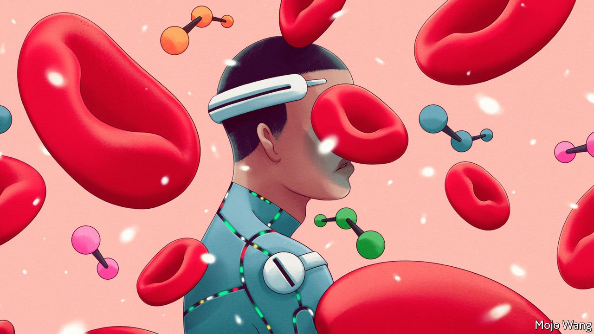

###### The pulse of the people

# Data from wearable devices are changing disease surveillance and medical research 

##### This is giving new insights into the health of millions of people 

 

> May 1st 2022 

AS SOON AS the covid-19 pandemic began, several research institutes around the world set up studies asking people to share data from their wearable fitness trackers. On most devices, signing up involved just a few clicks, and people did so enthusiastically. The biggest study, the Corona Data Donation project set up by the Robert Koch Institute in Germany, enrolled more than 500,000 people. Over 30,000 signed up for DETECT, a study by the Scripps Research Institute in California.

When it comes to disease surveillance, the most useful biomarker is fever, a direct sign of infection. But most wearables do not measure temperature, because accurate readings are hard to do. So a proxy had to be created using the standard things they do measure, such as heart rate, sleep and activity level. Resting heart rate, measured when people are sitting still, varies a lot from person to person—anything between 50 and 100 beats per minute counts as normal—but each person’s rate is generally stable. When the body fights an infection, however, the rate goes up, often dramatically. With covid-19, data from wearable devices showed that this uptick happened four days before people felt any symptoms. By one estimate 63% of covid cases could be detected from changes in resting heart rate before the onset of symptoms.


Before covid came along, a team from Scripps led by Jennifer Radin had shown that, in America, weekly changes in the proportion of people with abnormal results in heart rate, sleep and activity—all measured from wearables—align neatly with the prevalence of flu-like symptoms as measured by established surveillance systems. These track flu outbreaks by canvassing doctors’ offices to find out if more people with such symptoms are starting to show up. Because people usually seek care 3-8 days after symptoms appear, by the time these data are collated, an epidemic is usually at a different stage, possibly requiring different public-health measures. More timely insights are sorely needed.

That said, data from wearables have quirks of their own. One day the Koch Institute team saw a sudden peak in the measurement derived from step count and heart rate they were developing as a proxy for fever. It turned out that Apple had changed the algorithm that calculates resting heart rate on its devices. Such software updates have been a headache for the team because their data come from about a dozen different devices. They also have to sort out various gaps. Apple Watches are usually charged at night, which means that they give no sleep data. Once through its teething problems, though, the project proved a success. “It is not 100% accurate but it does a pretty good job,” says Dirk Brockmann, who leads the team.

Other research teams have taken a different approach to population-based surveillance with wearable devices. They have developed algorithms that examine deviations in each individual’s metrics, based on whatever data their particular device collects. They establish the person’s baseline levels of various biomarkers and then look for changes that suggest he may be experiencing some sort of anomaly in physiology. When lots of such changes occur all of a sudden, different as they may be from person to person, it is reasonable to suspect that lots of people are falling ill, and probably from the same thing.

One thing researchers now need to work out is whether the disease-surveillance algorithms based on wearable devices might systematically miss what is happening with some types of people, says Leo Wolansky from the Rockefeller Foundation’s Pandemic Prevention Institute. For example, algorithms might unwittingly be optimised for spotting outbreaks in wealthy areas where people are more likely to have been using high-end wearables for longer. In poorer areas, where people may have different underlying health conditions (which often affect digital-biomarker measurements), the algorithm for wearables might be a lot more likely to miss an outbreak. “As they often say in this field, ‘Garbage in, garbage out’, and we still have to better understand whether the data we’ve captured has some garbage in it,” says Mr Wolansky.

Medical scans that look for a particular problem routinely turn up other things, known as incidental findings. Something similar has occurred with the mass scan of human bodies that has taken place thanks to all these data from wearables. The German team found that resting heart rate was higher in areas that had been in East Germany than those in former West Germany. “We still don’t know why this is,” says Mr Brockmann. “Is it because women work more in East Germany? Or is it because people eat differently?”

Another mysterious finding is that Germans in all parts of the country are sleeping less in 2022 than in 2020 and the resting heart rate of the nation has gone up. One guess is that this may have to do with the extra weight that people put on during lockdowns, but nobody really knows for sure. The data from wearables has been “a question generator”, says Mr Brockmann, raising queries about health that would not have been asked otherwise.

The ability to examine lots of human bodies as they go about their daily lives is also changing how clinical studies of new drugs are done. According to IQVIA, a research firm, 10% of late-stage clinical trials in 2020 used connected devices to monitor people, up from 3% in 2016. A catalogue by the Digital Medicine Society, an American organisation, lists more than 300 examples of digital biomarkers that are used in trials.

Activity measures, such as step count, for example, are a formal outcome in drug trials for asthma, arthritis, heart failure, Parkinson’s disease and cystic fibrosis. Measuring how much a person walks can provide a more objective, or at least complementary, picture of a drug’s effect on pain or mood than the standard practice of asking people to give a rating on a scale.

Most important, devices that unobtrusively monitor patients as they go about their lives have allowed medical researchers to see, for the first time, how patients experience a given disease and treatment in their natural habitat. Nobody sleeps well in a pharmaceutical company’s sleep lab. The most widely used test of cardiovascular and physical fitness is the “six-minute-walk test”, which is the distance that someone can walk in the span of six minutes. It involves a patient pacing up and down a hospital corridor while a nurse with a clipboard records the result.

This has been simplified by fitness trackers, some of which have added the six-minute test to their repertoire of movement metrics. An Apple Watch, for example, makes its estimates using multiple metrics from its sensors that are passively observed over long periods of a user’s normal behaviour (rather than a single six-minute walk). Validation studies in people over 65 show that this algorithmic estimate is highly accurate.

The inclusion in drug trials of measures that reflect patients’ quality of life might help people choose treatments that best suit their priorities. At the moment, new cancer drugs are considered a success even if they prolong patients’ lives by just a few months. Many cancer patients, however, care much more about what they can do in the months that they survive the disease than about stretching their lives a little longer.

They would choose a treatment that might promise fewer extra days but a greater chance that they would be able to do what matters to them, such as being able to lift up their grandchildren. Pharmaceutical companies are starting to include such metrics among the goalposts they set for new drugs.

Wearable sensors have also opened clinical trials to patients who would otherwise be excluded from them, says Andy Coravos from HumanFirst, an organisation which helps drug companies deploy connected devices for monitoring trial participants at home. She raises the example of Duchenne muscular dystrophy, a muscle-wasting disease. The typical primary outcomes for medicines developed for the disease are a six-minute-walk test and a four-stair climb test. But 60% of sufferers are in wheelchairs, which means that they cannot participate. So it is unclear what the treatments can do for them. An armband tracking upper-body motion makes it possible to include them in trials.

Academic studies of non-drug interventions, such as behavioural nudges to increase physical activity, are also using more data from fitness trackers rather than asking participants to keep a diary or fill in a questionnaire. One analysis of clinical trials registered in America found that the number using connected devices grew from 88 in 2007 to more than 1,100 in 2017. The majority of those trials have not been by pharmaceutical companies, but by research organisations such as the group led by Euan Ashley at Stanford University which focuses on precision medicine.

Dr Ashley’s group was among the first to run, in 2019, a fully digital trial in which participants never met a researcher face-to-face. Not long ago, he says, recruiting trial participants involved putting up posters with tear-off bits of paper listing a number for them to call. They would then need to go to the hospital and sit down with a nurse to go over 17 pages of consent forms to sign up. “If you could get 200 people in a few months, you’d be pretty happy,” he says.


Now, people can download the app for a study and sign up while waiting in line for their coffee. The first time Dr Ashley’s team used this method for a study on physical activity 40,000 people enrolled in just two weeks and results were ready in a matter of months. That was not an unalloyed benefit. Though the study was very easy to join, it was also very easy to leave and about 80% of participants had dropped out before the end, which was just two weeks in. Even so, the final group was about ten times the usual size for this line of research.

The quantified life

This report has argued that wearable health and fitness trackers can change the way people try to stay healthy and alleviate illness, the way their doctors care for them, and the way population-level health interventions are deployed. The digital health care that wearables enable could make treatment more efficient, personalised and effective. In America digital therapies are used by lots of people who might otherwise not receive care at all. Mental-health care from an AI-therapist may not always be as good as from a human being. But it can be accessed a lot more easily by people who cannot afford the payment or time off to see a doctor, or where there is a shortage of mental-health specialists.

Automated, round-the-clock monitoring of patients with chronic conditions (the biggest users of health care) can greatly improve their treatment and outcomes. Done right, it can also help doctors treat more of them without being overstretched. This model of care can make a big difference in poor countries, where there are not enough specialists.

About a third of deaths globally are from cardiovascular disease and more than three-quarters of those deaths are in low- and middle-income countries. It may seem hard to imagine that wearable devices with heart-monitoring functions will become widespread in developing countries like India. But look at smartphones. In 2021, 54% of Indians already owned one. Deloitte, a consulting firm, reckons that by 2026, the country will have 1bn smartphone users, and will be the world’s second-biggest manufacturer of the devices. Many African countries have skipped developing a personal-banking sector by establishing mobile-phone payment systems that are now used for almost everything.

But even in a developed country like America, a digital divide exists whereby many people cannot afford internet access or lack the digital literacy needed to make use of new health technology. The new sensors and wearables technology are all very exciting, says Yuri Maricich of Pear Therapeutics, but “how can we reduce that to something that [works for] a single mom in the state of Kentucky who is in a very difficult life situation, or a trucker who is always on the road and trying to make ends meet?”

This sort of question is, all too often, an afterthought when new consumer technologies are being developed. To ignore it with digital-health products would be squandering a big opportunity to improve health care for all. ■

