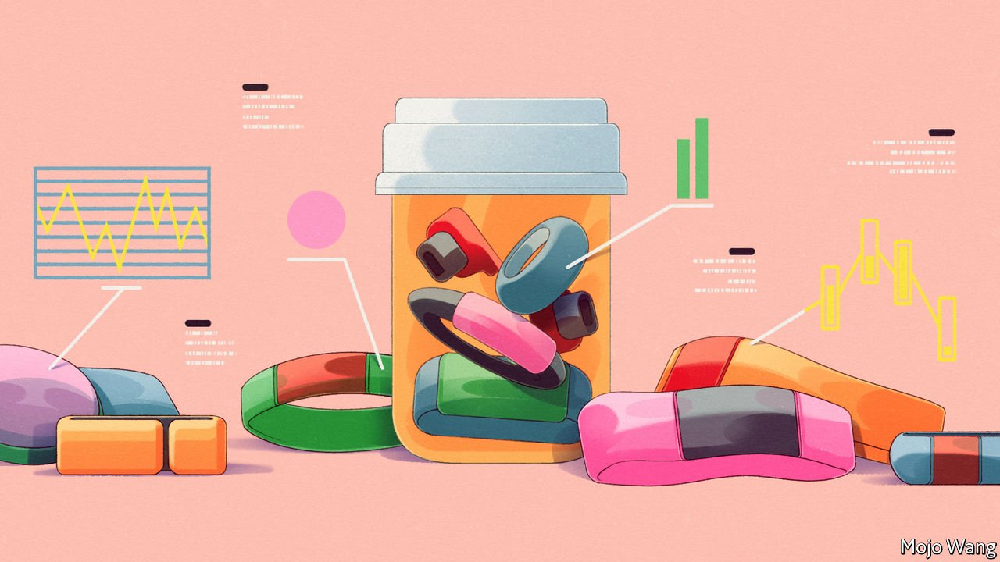
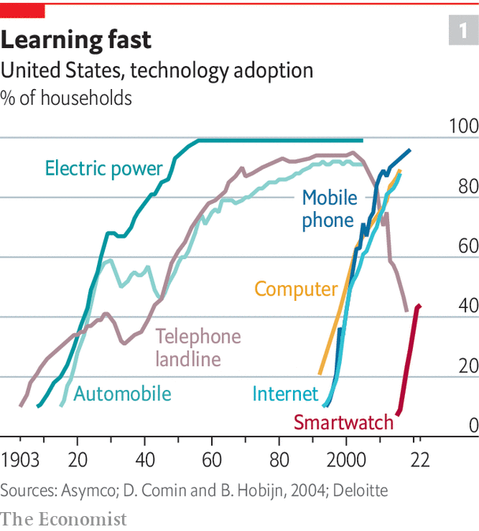
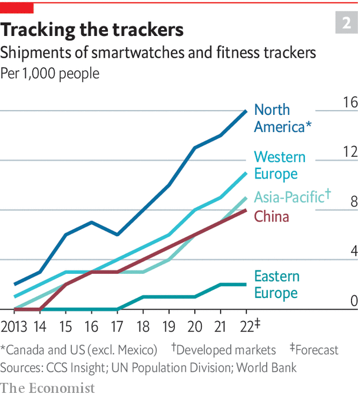

###### The quantified self

# Wearable devices are connecting health care to daily life 

##### This will transform how people look after themselves 

 

> May 1st 2022 

BRYAN JOHNSON has just spent another weekend being examined. “On Saturday the sonographer was measuring…my ankles and knees and hips and shoulders and elbows, assessing what is the age of my tendons and ligaments,” he says. It is part of a mission to have all 70-plus organs of his body measured in exhaustive detail so he can see whether, and to what extent, his healthy lifestyle is rejuvenating them.

Mr Johnson, a tech entrepreneur in California, says he has undergone more than 300 tests of various sorts to that end. At one point he had one to check for damage to his arteries from all the blood drawn for other tests. His diet is also entirely determined by tests which have looked at how his body reacts to some 150 foods. “My conscious mind never decides what to eat,” he says. The main meal every day is the same green veggie mush, with a side of strictly regimented sleep, exercise and meditation.


By some measures, Mr Johnson reckons, eight months of living like this has left his body five years younger. Be that as it may, he is certainly pushing at the boundaries of what, in 2007, Wired magazine dubbed the “quantified self” movement: the meticulous collection and analysis of data about bodies and lifestyle that people do to hack their way to better health.

Systematic measurements of people’s physical attributes and records of their behaviour came into their own with the Enlightenment and the development of statistics. For the most part, they were used to understand and control populations, organising them into classes and seeking out the sick, the different and the “inferior” in order to segregate, encourage or punish them. What is striking about the current quantification of the self is the inward-looking individualism of its standardised scrutiny.

As it becomes more mainstream, the technology in smart wristbands, watches, rings and patches—collectively called “wearables”—is measuring ever more aspects of wearers’ lives more accurately and subtly. An Apple Watch collects millions of data points per day. People are seeing into themselves in ways not possible before and are finding new ways to act on what they learn. The effect on health and lifestyle is likely to be profound.

Natasha Schüll, a cultural anthropologist at New York University who is writing a book, “Keeping Track”, about the quantified-self movement, began lurking in meetings of its devotees around 2011. The attendees back then were “geeky techno enthusiasts”, mostly men, who brought data they had collected about themselves and shared what they had learned from it. Soon, though, Dr Schüll says, other types began to show up: people who just sat at the back taking notes. They were the entrepreneurs who would turn what they learned from these meetings into consumer products: apps and gadgets that put such data to use in various ways.

By 2015, when Apple launched its first Watch, Fitbit’s fitness trackers had already been on sale for six years, and there were more than 500 health-related wearables on the market. Sales of smartwatches and fitness trackers amounted to $8bn, according to CCS Insight, a market-research firm. By 2021, $29bn was spent globally—more than half the amount spent on sporting goods.

 


In America smartwatches are catching on as fast as did early mobile phones (see chart 1). In 2021 about one in four Americans was estimated to own a smartwatch or fitness tracker. The rate is similar in leading European adopters such as Britain and Finland. The number shipped in North America more than doubled from 2015 to 2021. In western Europe and China it more than tripled (see chart 2). In 2019, Apple sold more watches than the entire Swiss watch industry. Some 400m devices a year (of all brands) are expected to be sold globally by 2026, up from 200m in 2020.

 


There has long been a gap between the parts of Western societies and economies that look after people when they are sick and the parts that help them stay healthy. Wearable devices—and the technologies that they enable—are starting to bridge that divide in two ways. On the one hand, they are making life more medicalised, with people, for the first time, keeping an eye on things like their nocturnal heart rate. On the other hand, they are ushering in a shift in the balance of responsibility between medical treatment provided by clinicians and what patients do to improve their health.

The covid-19 pandemic accelerated the process. Wearables entered the lives of more people and took on new roles. With gyms closed, exercise shifted outdoors and many people bought them for the first time, to keep track of how much they walked, ran and pedalled. A parallel trend was that lots of consumers began to see these devices as tracking specific areas of their health, not merely their activity level. Before covid, wearables were often “what we might call disposable”, says Ranjit Atwal from Gartner, a research firm. People would buy them for no particular reason, wear them for a short time and put them into a drawer. It was unclear how, or indeed whether, the market for such devices would mature. The pandemic changed that because many people had to be monitored at home for health reasons. Doctors in America and Europe started seeing more elderly patients with smartwatches that relatives have bought for them in order to track their health and send alerts of any problems.

All this is assisted by the fact that people are more used to having technology help monitor and manage their lives. AI-assistants like Siri and Alexa are no longer a novelty used by a brave techie minority. Things that reflect how intimately a device knows you, like personalised playlists, are starting to feel less creepy.

The benefits are noticeable. A round-up by researchers in Denmark of more than 120 studies of personal-activity trackers, which included healthy people and those with various health conditions, concluded that wearing the devices makes people move more. The improvements are modest: about 1,200 more steps (around 800 metres, or half a mile) daily, 49 more minutes of vigorous exercise per week and 10 minutes less sedentary time per day. But physical activity is so important that even small changes can matter a lot. Studies that have followed people for 4-10 years have found that increasing steps by an extra 1,000 per day reduces mortality by between 6% and 36%, with the biggest impact among those who are most sedentary.

Such results have convinced some American health insurers to give away fitness trackers and smartwatches to their customers. UnitedHealthcare, one of the biggest, says that 59% of takers log exercise for at least six months. For comparison, gym-membership retention rates drop off a cliff after two or three months.

Doctors in America and Europe are starting to warm up to the idea that wearables can help them take better care of their patients. Profit-oriented health-care systems, like America’s, smell greater efficiency. Instead of asking patients if they are sleeping better, for example, doctors can simply look up a chart from a wearable device. Several hospital groups in America that care for millions of patients are setting up systems that make wearables a seamless part of clinical care. Finland’s citizens can link their wearables and other personal health devices (such as smart scales) with their national health records.

Market analysts expect that, in the next five years, the wearables market will split into two categories: medical-grade devices approved by regulators for people with chronic conditions who need tracking with greater care and accuracy, and devices with less sophisticated features for healthy people who want to keep an eye on their metrics and be able to spot problems early. Leading manufacturers are expected to offer increasingly specific devices for groups such as children and the elderly.

Qualitative, too

This report will examine the technologies that are paving the way for this transformation of health care. The sensors and algorithms that unobtrusively measure things as people go about their daily lives are becoming more sophisticated, turning wearables into diagnostic devices. AI-based apps built on the data streaming from people’s wrists are dispensing personalised advice on what to eat for lunch or when to go for a walk. Interactive apps backed up by clinical evidence are being prescribed as treatment for all sorts of ailments, just as medicines are. Some of them work better than conventional therapies aimed at the same problem.

Wearables are also transforming disease surveillance and clinical trials for new drugs, by showing how people experience a disease or a treatment in their daily lives. They make it possible, for the first time, to take the temperature, or measure the pulse, of a population rather than an individual.

There are plenty of problems to be resolved. Chief among them are concerns about privacy and discrimination based on the health data from wearables. Digital-health products built on the data are still variable in quality, though it is getting easier to sort the good from the bad. Regulators are trying to strike a balance between protecting consumers and not suppressing innovation, while also learning how to regulate a digital-health ecosystem.

But few doubt that the benefits from wearables will be huge, even if the digital care that they make possible will remain supplementary to conventional medical treatments. About 80% of the burden of disease in America is caused by lifestyle factors, and many poorer countries are not far behind. Drugs work as intended in only 30-50% of people. For many diseases there are no therapies at all. Digital health care can deal with many of these problems. To appreciate what it can achieve, the best place to start is the technology behind wearable sensors. ■

