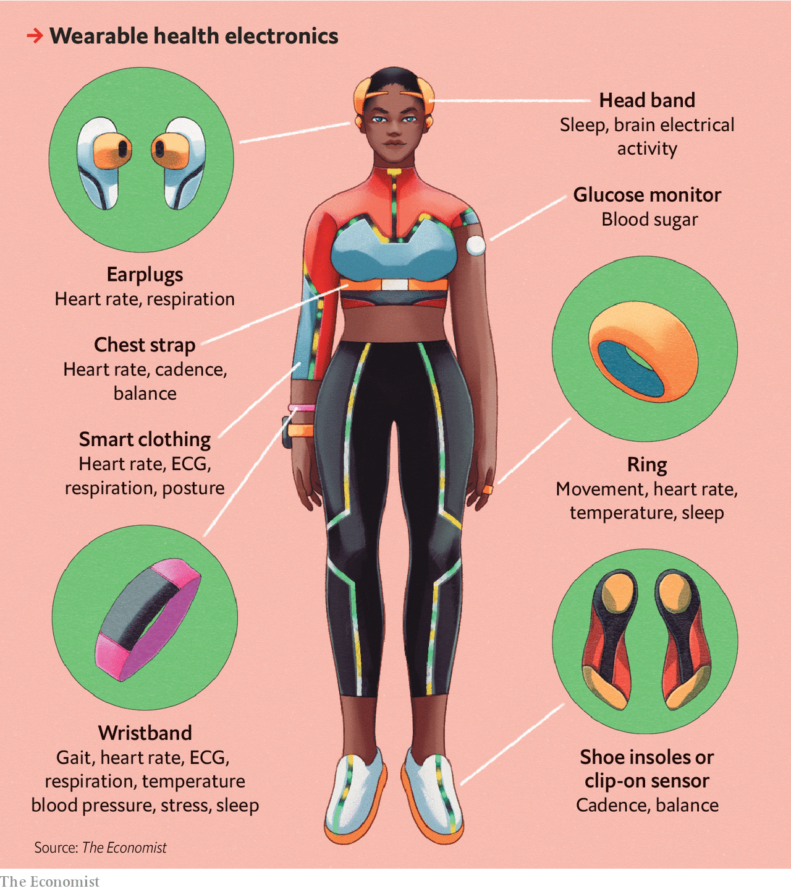

###### One ring to rule them all

# Wearable devices measure a growing array of health indicators 

##### They can detect a disease before it develops 

 

> May 1st 2022 

ON THE OUTSIDE, the Oura ring looks rather ordinary, indistinguishable from a chunky wedding band. But a faint green light that intermittently leaks out from the gap between finger and ring suggests that it is not just jewellery.

The inside of the ring is packed with electronics. The green light comes from a pair of rectangular metallic specks that are light-emitting diodes, or LEDs. Three dome-shaped bumps the size of water drops contain red and infrared LEDs and a pair of photodetectors. They are surrounded by seven temperature sensors, a wafer-thin battery and a miniature 3D accelerometer that detects any kind of motion.


The LEDs illuminate the blood vessels inside the finger. As the heart pumps blood through the body, the vessels expand and contract and the light reflected changes accordingly. The number of these changes per minute is the heart rate or pulse. It is calculated by an algorithm that takes the data given out by the sensors and makes adjustments for the noise in their signal brought on by motion, ambient light and numerous other external factors.

The green LEDs do their work by day; the infrared ones, by night. Their advantage is that they reach deeper blood vessels, in which the pulse is more easily detected. But their signal is even more sensitive to disturbance, so needs more algorithmic adjustment. The red LED will, eventually, be used to monitor blood-oxygen levels. The software which will turn its data into such measurements, though, will be available only in a later update.

 


What a wearable device can measure depends on its sensors and its software. Lower level algorithms turn the noisy output of photodetectors and the like into heartbeats. Higher level programs combine, say, heart rate, temperature and movement into measures of the duration, and quality, of sleep.

Sensors and algorithms combine to help wearable devices measure step counts, calories burned, oxygen levels and more. Artificial intelligence (AI—as machine learning is popularly known) gives extra oomph to the algorithms. Technology advancements in the past five years have made it possible to pack wearable devices with more sophisticated sensors and more computing power. Oura’s third-generation ring, released three years after the second, has 32 times more memory with the same battery life.

All that has enabled wearables to produce more accurate measures and a greater number of them. In a recent review IQVIA, a research firm, found 384 wearable devices marketed to consumers. They include wrist-worn fitness trackers, sports watches, smartwatches, smart jewellery like the Oura ring and sensor-bearing headsets, patches, straps, clip-ons and even clothes (such as smart socks that measure the vitals of babies). Just over half of the devices analysed by IQVIA monitor activity. The rest are devices that measure a wide array of health variables, including sleep, temperature, breathing, blood pressure, oxygen saturation, blood sugar and electrical activity of the heart.

Many of these variables are starting to appear on popular activity-tracking wristbands, such as Fitbit and Apple Watch. Lots of devices added blood-oxygen measurements to their repertoire in response to the pandemic because low levels are a sign of severe covid. Rockley Photonics, which provides sensor technology to big consumer and medical-device manufacturers, claims its newest sensor can measure hydration, sugar, alcohol, lactate (reflecting muscle inflammation from exercise) and much more in the blood, as well as core body temperature and blood pressure, which have been hard to crack in wearables. Rockley plans to seek approval of its new sensors by the Food and Drug Administration (FDA), America’s medical regulator, later this year. For health applications, it helps to turn measurements into the sort of insight required for diagnosis.

In medicine, diagnoses often depend on biomarkers—specific molecules in blood and other fluids linked to a particular health condition. High blood-sugar concentration, for example, is a biomarker for diabetes. Neurological diseases are usually diagnosed with standardised assessments of how people behave, and how well they perform certain tasks. Some of the algorithmic measurements made by wearable devices can be thought of as digital equivalents of established biomarkers and diagnostic tests. Others are novel metrics that can predict or diagnose a disease, such as movement or coughing patterns that cannot be measured with conventional diagnostics. Collectively, these are called “digital biomarkers”.

Tracking digital biomarkers allows wearables and their associated software to identify changes that are early signs of disease or age-related deterioration that may otherwise go unnoticed. Take atrial fibrillation, an abnormal heartbeat that increases the risk of stroke. About 9% of Americans over 65 and 2% under 65 have the condition, often with no symptoms to alert them to it. In 2018 the FDA approved the Apple Watch as a device that can identify atrial fibrillation. It issues an alert when it spots a string of irregular heartbeats. The user can put a finger against a sensor on the side of the watch, which sets up a circuit sensitive to the heart’s electrical activity, allowing the watch to produce an electrocardiogram (ECG). On April 11th Fitbit got FDA approval for its own atrial-fibrillation function.

Movement, an irksome source of noise for individual sensors, is a valuable ingredient in many digital biomarkers. Gait changes, for example, can show whether a person’s balance is deteriorating. A recent study found that people who have early-stage Parkinson’s disease have subtle differences in gait, arm swing and how they type compared with those who do not. All were measured by their phones and wrist-worn devices. The digital measures also reliably tracked how far the disease had advanced.

Currently, depression is diagnosed using a standard set of questions. Algorithmic measures of the sentiment in daily voice diaries can do the job just as well. Some virtual providers of therapy and psychiatric care are already using interaction patterns between people and their smartphones (without capturing the actual content of what is typed or viewed) to track the mood and cognitive state of patients.

Wearables can also spot healthy changes that people want to know about. Upticks in temperature, for example, are markers for ovulation and pregnancy. Oura is testing a feature predicting weeks in advance the date of a woman’s next period. A small study found that measurements from the ring could detect pregnancy on average nine days before at-home pregnancy tests.

Measure for measure

There is almost no part of human biology that has remained untouched by digital measurement. HumanFirst, an organisation in San Francisco that maintains a catalogue of connected devices for remote patient monitoring, has identified 1,200 digital sensors that are tied to 8,000 physiological and behavioural measures.

Quantity does not mean quality. Some devices are much better than others at measuring certain variables; a product may be good at measuring one thing but not another. A recent round-up of studies on the accuracy of various measures produced by 72 wrist-worn trackers found that many devices did a poor job. Some of the leading brands, however, bucked the trend. Fitbit’s devices had consistently good accuracy on step counts; the Apple Watch had the highest accuracy for heart rate. None of the devices was good at calorie counts, with estimates off by more than 30% for all brands. But most of the devices in these studies have since been updated and probably use more sophisticated algorithms.

The situation is similar with sleep tracking, an increasingly popular feature. Many devices report measures such as the amount of time in various sleep stages, including deep and rapid-eye-movement (REM) sleep, which are important for brain functioning and recharging the body. Researchers comparing wearable devices against a clinical-grade method that tracks electrical brain activity with a special headset, have been unimpressed. As one study of nine popular wearables published in 2020 put it, “All the commercial devices tested struggled with accuracy.” But some, notably Fitbit’s and Oura’s products, have been reasonably accurate for several years. Oura’s chief scientist, Shyamal Patel, says that in studies of more than 1,000 nights of sleep its algorithm agreed with polysomnography, the gold standard for grading sleep, 78% of the time. Polysomnography involves an expert analysing data on brain activity from an entire night of slumber. Two experts doing this agree with each other’s assessment 83% of the time.

One area where independent studies find consistently good performance across many devices is heart-rate measurement. Euan Ashley, a cardiologist at Stanford University whose team has done independent studies on the accuracy of wearable devices, says that leading brands, notably Apple and Fitbit, have been good at measuring heart rate for years, “to the point that I would have been willing to trust it in a clinical situation”.

When measurements are informing formal diagnostic tests for medical conditions, such as that for atrial fibrillation, they need not just accuracy, but also selectivity. Making an algorithm more sensitive means it will catch more cases, but also means it will call more false positives.

The Apple Heart Study and the Fitbit Heart Study each enrolled more than 400,000 people, who were followed for several months. About 0.5%-1% of participants in each study got an alert about irregular heartbeat. They were asked to wear an ECG patch (the best method for measuring heartbeat) for a week or two. In both studies, a third of people monitored that way went on to have atrial fibrillation. Fitbit’s devices identified cases correctly 98% of the time. Apple’s did so 84% of the time. Comparing them is tricky because the studies differed on average age of participants and other things. In a study of people mostly older than 55 an updated version of Apple’s algorithm caught 89% of atrial-fibrillation cases, and 0.7% of those without the condition got a false alert.

Heather Ross, a cardiologist at the University of Toronto is particularly worried about false negatives from devices that claim to diagnose heart problems but have not had these claims validated. People may ignore warning signs like heart palpitations, she says, if they are wearing something which suggests there is no problem. Dr Ross points to a round-up of studies on 40 wearable devices on the market in 2020, only 15 of which had been vetted by the FDA. Although there were nearly 1,300 studies published about these devices, most were about feasibility or proof of concept matters; only 128 of the studies were from some stage of a cardiovascular clinical trial, the sort of data that doctors want to see in order to trust the results from a device.


Andy Coravos, the chief executive of HumanFirst, has a worry about unregulated devices. Some collect information that is not currently protected as health data, she says—which means it could be used to target advertisements or possibly discriminate when it comes to health insurance or employment. A neurological symptom such as a tremor, for example, could be collected as “wellness” data and reveal a high likelihood for a disorder such as Parkinson’s disease, says Ms Coravos. Insurers can get hold of this information via online data brokers and charge that person a higher premium.

The growing array of health variables tracked by wearable devices can lead to big changes in the prevention of chronic ailments like diabetes and heart disease. Continuous measurement makes it possible to establish what patterns are normal for an individual for vital measures like heart rate or respiration. This, in turn, will help users and their doctors to recognise important deviations in lifestyle earlier, before a disease develops. Spotting unhealthy lifestyles, however, is not much use unless it leads to change. And that is something that the devices can now help with, too. ■

