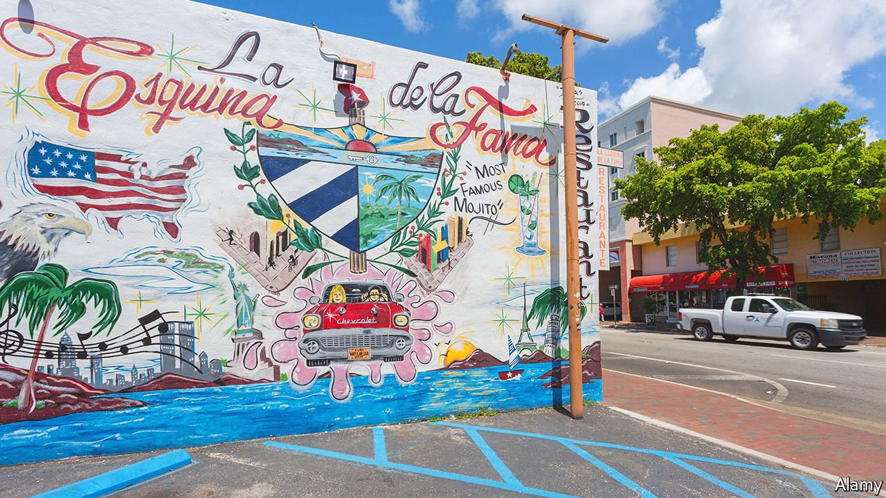

###### Hub for a hemisphere

# If Latin America has a commercial capital, it is Miami 

##### Despite not being in Latin America, it offers cash, connections and creativity to the region 

 

> May 7th 2022 

FOR JOAN DIDION, an American essayist, Miami in the 1980s was “not exactly an American city…but a tropical capital: long on rumour, short on memory, overbuilt on the chimera of runaway money”. Nearly 40 years later, the place that Didion described is still more of a tropical capital of Latin America than a typical city in the United States. But the money which is flowing into it is no chimera.

Miami has become a commercial hub for the hemisphere. Miami-Dade County, which comprises the city of Miami and around three dozen municipalities, is where 1,200 multinational corporations have set up the headquarters of their Latin American operations. The county’s GDP was around $172bn in 2019, making it the 14th-largest county economy in the United States, and roughly as big as the combined GDP of Ecuador and Uruguay. Miami’s airport handles 43% of all flights from the United States to South America. It is the “meeting place for the hemisphere”, says Alejandro Portes of Princeton University. “It is easier to commute from capitals in Latin America to Miami than between capitals in Latin America,” he says.


With more than half of its residents born outside the United States, Miami has the largest proportion of immigrants of any metropolitan area in the country. Around 70% of the 2.7m residents in the county are Hispanic, about double the share in 1980. Its population is increasingly diverse (see chart).

 


Recent geopolitical shocks, such as the war in Ukraine and frostier relations between the United States and China, have made Miami more important, argues Mauricio Claver-Carone, president of the Inter-American Development Bank (IDB), who comes from the city. He sees a trend for “regionalisation” over “globalisation”. This plays to Miami’s strengths as a Latin American hub. “There’s no greater city that encapsulates the heterogeneity of Latin America and the Caribbean,” he says.

Turmoil in Latin America has often boosted Miami’s fortunes. When Communists seized control of Cuba in 1959, Cubans with money or get-up-and-go fled the island and flocked to Miami. Next came Nicaraguans escaping from a socialist revolution in the 1970s and the civil war that followed it. From the mid-1990s Colombians came in droves, fleeing drug-related violence. All these groups have prospered, and contributed to Miami’s prosperity.

The city benefits in both good times and bad, says Jorge Perez, the boss of a property firm. People from unstable places buy homes in Miami as a “secure investment”, he says. Following the election of leftist leaders in Peru and Chile last year, the number of people moving from those countries has increased, thinks Paulo Bacchi of Artefacto, a furniture shop. And when Latin American economies are doing well, people buy second homes.

The bass and the sunset low

Belen Jesuit Preparatory School was founded in Havana but shut down in 1961 by its most famous old boy, Fidel Castro. Undeterred, it moved to Miami. Its staff, many of them Catholic priests, now teach children whose families come from across the region. “Latin America’s losses are our gains,” says Father Guillermo Garcia-Tunon, the president of the school. And recently, Americans moving to Florida for sunshine and low taxes have also been applying in large numbers.

The political upheaval that drives people to Miami shows few signs of abating. Many desperate Haitians and Cubans—escaping from gang violence, poverty or socialism—have attempted to make their way by boat to South Florida. Since October 2021, the US Coast Guard has intercepted 3,519 Haitians, more than in the previous four years combined.

In this salsa-merengue melting pot

And if more leftists are elected in Latin America, more conservative types may vote with their feet. Some Colombians are nervous about the prospect of a victory for Gustavo Petro, a former guerrilla, in the presidential election this month. Capital flight from Colombia is already evident, says Paul Angelo at the Council on Foreign Relations, a think-tank. People fear Mr Petro will turn the country into “another Venezuela”, he says. In March Colombia was the biggest source of international searches on MiamiRealtors.com, a property website, accounting for around 11% of international traffic. Members of Colombia’s armed forces have asked Mr Angelo about the United States’s asylum process, fearing that they may become targets for left-wing guerrilla groups if Mr Petro is elected.

Miami also appeals to younger tech types. Its startup scene is thriving. Entrepreneurs can find safety and plentiful capital there, so Miami has become a “no-brainer in a post-covid world”, says Shu Nyatta, who co-leads a Latin American fund at SoftBank, a large technology-investment firm. Today there are around 2,500 fintech companies in Latin America. That is more than double the number that existed in the region in 2018, according to IDB. Many Latin American founders are choosing either to base themselves in Miami or to work there for part of the year.

Members of Latin diasporas in Miami are increasingly active in regional affairs. Analysts tend to agree that Latin America is not a foreign-policy priority for President Joe Biden. Eight Latin American countries, including Brazil and Chile, still do not have ambassadors from the United States. Chile has not had one for three years. But American politicians pay attention to their voters, and that includes a lot of people with links to both hemispheres.

After Hurricane Maria hit Puerto Rico in 2017, sending an estimated 50,000 Puerto Ricans to Florida, Republicans worried that these migrants would vote for Democrats. Perhaps for this reason, Donald Trump tightened sanctions on Venezuela’s dictatorial regime and backed the opposition, knowing that this would please the Venezuelans in South Florida who had fled from their country.

Venezuelans in the United States were indeed “galvanised” by Mr Trump’s move, says Erik Bethel, a former director of the World Bank who grew up in Miami. They voted for Mr Trump in droves. Colombian voters are also growing in importance, says Annette Taddeo, a Florida state senator who is running for governor.

“Miami is a city that’s informed by exile much more than immigration,” says Alberto Ibarguen, a former publisher of the Miami Herald. Whereas most new immigrants try to assimilate, Miami’s exiles have often hoped to return to their home country. That may be changing. As Miami tilts further to the right, Latin America is poised to veer further to the left. ■

