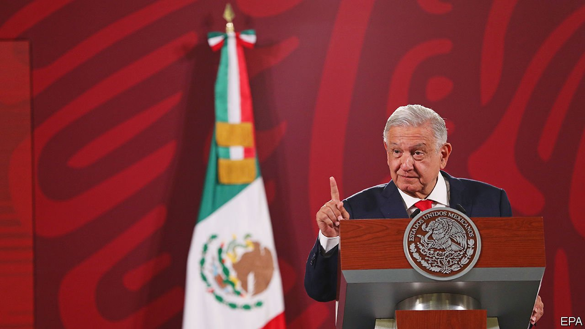

###### Wrecking ball

# Mexico’s president takes on the electoral system 

##### Even if Andrés Manuel López Obrador’s reforms fail to pass, he can do a lot of damage to democracy 

 

> May 5th 2022 

IN 2006 FELIPE CALDERÓN won Mexico’s presidency by 0.6 of a percentage point. His vanquished rival, Andrés Manuel López Obrador, angrily rejected the result, claiming that the independent electoral body had rigged the vote count. There was precious little evidence for this explosive allegation. Nonetheless, Mr López Obrador staged his own “inauguration” ceremony and encouraged nationwide protests.

Fifteen years later and Mr López Obrador, now president, still distrusts the electoral body, now known as Instituto Nacional Electoral (INE). In his daily press conferences he often rails against its staff, calling them part of a corrupt elite. On April 28th he unveiled a package of constitutional amendments which he says will end electoral fraud and give Mexico “an authentic, a true democracy”.


Under his proposals, which have now been sent to the lower house of Congress to debate, the INE would be scrapped and replaced with a new centralised body. This body would have a smaller budget and fewer independent experts working for it. Its most senior people would be elected by popular vote, instead of by lawmakers.

Similarly, the electoral court would be subsumed into the Supreme Court. Its members would also be elected by ordinary folk. Public financing for parties would be cut and electoral propaganda laws, which regulate how parties can campaign and include a period before elections in which campaigning is illegal, would be loosened. (Mr López Obrador breached these laws 29 times in 2021 by making comments deemed to be campaign messages.)

Mr López Obrador says he wants to save money. But the budget for the INE is 13.9bn pesos ($700m) this year, which is equivalent to just 0.2% of the overall budget. And elections cannot safely be run on a shoestring in a country that in the 1970s and 1980s was racked by electoral fraud. The INE, which has run elections since 1990, uses specialist paper and ink to produce ballot papers that cannot be replicated. It also oversees the cards used to prove voters’ credentials for around 93m people.

The proposed changes would politicise the INE and curb its independence. They would also make it harder for small parties to compete in elections. If the president were truly worried about electoral fairness, he should try harder to stop candidates from being assassinated in local and state contests, says Edna Jaime of México Evalúa, a think-tank.

The constitutional amendments are unlikely to pass; that would require a two-thirds majority in both houses and the support of a majority in the state legislatures. But the president can still do damage. The INE’s budget has already fallen in recent years. His verbal swipes are likely to continue. Such conspiracy theories may rally his supporters in the run-up to the presidential election in 2024, but they threaten to undermine confidence in Mexican democracy. Still, not everyone believes him. Surveys show that Mexicans trust the INE more than any other institution, except for the armed forces. ■

