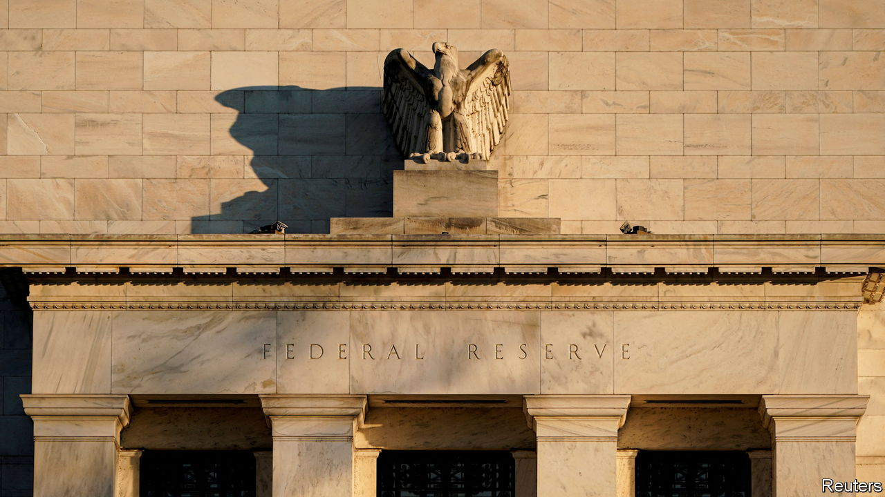
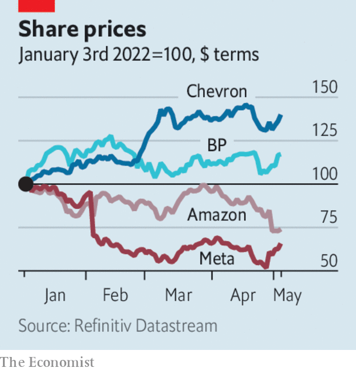

###### The world this week

# Business 

#####  

 

> May 5th 2022 

America’s Federal Reserve raised its benchmark interest rate by half a percentage point, lifting it to a target range of 0.75% to 1%. It was the biggest increase since 2000. The Fed also unveiled a plan to start reducing its nearly $9trn balance-sheet from June, and accelerate the pace of sales in September, intensifying its battle against inflation. More half-point rate rises are expected this year.


Other central banks also tightened policy. The Bank of England lifted its main rate to 1% from 0.75%, the highest level since 2009 and the fourth consecutive rise. The Reserve Bank of Australia increased its benchmark rate for the first time in 11 years, to 0.35%, amid high inflation. India’s central bank also unexpectedly raised its main rate, to 4.4%, in an effort to tame prices, especially for food.

The great tech slide

With many tech share prices shedding their gains from the pandemic, the Nasdaq stockmarket fell by 13.3% in April, its worst monthly performance since the financial crisis in 2008. Amazon’s stock struggled to recover from the hammering it took after the company reported a slowdown in quarterly revenue from online sales. It recorded a net loss of $3.8bn, in part because it wrote down the value of its investment in Rivian, which makes electric vehicles. Amazon’s cloud-computing division, which provides the backbone of its profits, did well.

The momentum that labour activists were hoping for from the recent decision by workers at an Amazon warehouse to join a union stalled, after staff at a smaller facility voted against unionisation. Separately, Amazon joined a growing list of companies that are reimbursing costs for employees in America who will have to travel to get an abortion.

Lyft lost 30% of its stockmarket value, after the ride-hailing company forecast a weak outlook. Uber’s share price also fell, though not as sharply; its business rebounded in the first quarter because of “strong mobility demand”, but it nevertheless made a $5.9bn loss because of its sinking investments in tech firms.

 


Underlining a reversal in fortunes compared with the tech sector over the course of the pandemic, the oil industry reported bumper quarterly profits, helped by surging oil prices. Despite a $24bn write-down from leaving Russia, BP’s headline profit came in at $6.2bn, the best since 2008. It expanded its share buy-back programme. Shell’s adjusted profit of $9.1bn was its best ever. ExxonMobil tripled its stock buy-backs and Chevron recorded its most profitable three months since 2012. 

Intercontinental Exchange (ICE), the owner of the New York Stock Exchange, agreed to buy Black Knight, a provider of mortgage data and software, for $13.1bn. Like other stockmarket operators, ICE has been expanding into fintech and other areas outside equities. Its acquisition of Black Knight comes amid a boom in American house prices.

Biogen decided to wind down the commercial operations supporting Aduhelm, its treatment for Alzheimer’s disease, after Medicare, America’s health-insurance programme for the elderly, refused to pay for it. The drug was mired in controversy from the start. The Food and Drug Administration approved it, although a panel of experts advised against this. Doctors argued about its effectiveness and health insurers said it was too costly. Biogen will continue to provide Aduhelm free for patients on a programme who have started to take it. Its chief executive is stepping down.

Elon Musk hinted that businesses and governments may have to pay a small fee to stay on Twitter once he takes it over, but that it would remain free to “casual users”. Mr Musk also said he was not planning to dispose of any more Tesla stock, after selling $8.5bn-worth of his stake to help fund his buy-out. He may return Twitter to public markets in a few years after the deal is done, according to reports.

Executives from HSBC and Ping An are reportedly to meet soon to discuss the latter’s proposal to break up the bank. Ping An, a Chinese insurance giant, is HSBC’s biggest shareholder and wants it to split its business in Asia, where it is most profitable, from its Western assets. HSBC is understood to be cool to the idea.

It’s all going downhill

Just Eat Takeaway’s chairman stepped down. Investors are peeved that, despite its sloping share price, the food-delivery company went ahead with its Snow Fest staff jamboree at a ski resort in April. Last year’s acquisition of Grubhub has gone off-piste and it might be sold. JET is also investigating a complaint of misconduct at a company event made against its chief operating officer.

Qantas confirmed orders for 12 Airbus A350-1000s that will fly non-stop from Australia to New York and London starting in late 2025. With very-long haul 20-hour flights the planes will have just 238 seats to make space for first-class suites and a “well-being zone”. The airline’s boss, Alan Joyce, said the aircraft would overcome “the tyranny of distance” that has always bedevilled Australia.

