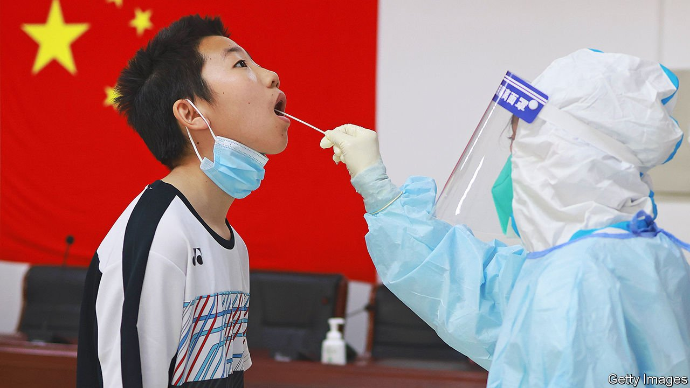

###### The world this week

# Politics 

#####  

 

> May 7th 2022 

America’s Supreme Court is preparing to overturn the , according to the leaked draft of a majority opinion in a case that is before the court. Written by Samuel Alito, it argues that Roe v Wade, the ruling in 1973 that secured women’s right to an abortion, “was egregiously wrong from the start” and must be overruled. The court stressed that it was still deliberating and that the draft did not represent the final opinion of the justices. Still, the leak propelled abortion to the front of campaigning for the mid-term elections.


Meanwhile Oklahoma became the latest state in effect to outlaw abortion, after the governor signed a bill banning the procedure after six weeks. More than a dozen American states have prepared laws that will immediately prohibit abortion if Roe is overturned.

Hillbilly energy

 won the Republican primary in Ohio to be the party’s Senate candidate. Mr Vance, who wrote a bestselling memoir about the Appalachian values of his family, was boosted in the race by Donald Trump’s endorsement; his victory is seen as confirmation that Mr Trump is still the Republican kingmaker.

Russia’s army made little progress in its offensive to seize Ukraine’s eastern Donbas region. Russian forces captured several villages, while Ukrainian forces pushed the Russians back from the outskirts of the city of Kharkiv. Despite a minor evacuation from the Russian-occupied city of Mariupol, many civilians remain trapped there. Investigators uncovered further evidence of atrocities by Russian troops. Vladimir Putin is believed to be desperate for some form of success before his country celebrates the anniversary on May 9th of its victory over Nazi Germany.

Ursula von der Leyen, the president of the European Commission, said the EU would ban the import of Russian oil within six to nine months. But Hungary, Russia’s closest friend in the bloc, said it would veto the plan unless countries that import Russian oil via pipelines, as it does, are exempted. The EU is blocking aid to Hungary for violating the rule of law.

Olaf Scholz, Germany’s chancellor, said he would back Finland’s and Sweden’s membership of NATO, if they decide to join. Earlier Mr Scholz attended a trade-union rally where protesters shouted “warmonger” at him for sending arms to Ukraine. He responded that Ukrainians would think it “cynical” to be “told to defend themselves against Putin’s aggression without weapons”.

Spain said that Pedro Sánchez, the prime minister, the current defence minister and a former foreign minister, had all been victims of . More than 60 people associated with the Catalan separatist movement were previously known to have been targets. Spanish intelligence is suspected of bugging the separatists, and Morocco of bugging the government.

Luiz Inácio Lula da Silva, a left-wing former president of Brazil and the front-runner for the presidential election in October, claimed that Volodymyr Zelensky could have done more to prevent the war in Ukraine. Lula also criticised Joe Biden for not stopping the war. His main opponent in the election, the incumbent president, Jair Bolsonaro, has refused to condemn Mr Putin’s bloody invasion.

Iran’s oil minister made a trip to Venezuela, where he met Nicolás Maduro, the autocratic president. The pair discussed ways to “overcome” the sanctions on their oil industries.

Andrew Fahie, the premier of the British Virgin Islands, was arrested in Miami. He is accused of money-laundering and conspiring to import cocaine (he denies both allegations). In the British Virgin Islands protesters took to the streets after a report recommended returning the territory to direct rule from Britain.

 


The authorities in Beijing continued mass-testing for covid-19. China’s capital hopes to avoid a full-scale lockdown. More than 60 underground stations were closed and a mass-isolation centre reopened. In Shanghai dozens of cases were detected outside quarantine facilities, raising fears that the city, which has been locked down for weeks, will delay reopening. Hong Kong, though, eased its restrictions, which have battered the economy (GDP shrank by 4% in the first quarter) and triggered an exodus of people.

India continued to suffer from a , with temperatures consistently exceeding 40C (104F) in many places, causing households to crank up their air-conditioners. Coal shortages have exacerbated the problem, leading to power cuts.

North Korea fired yet another missile, the 14th weapons test this year, more than in the past two years combined. It came just a week before Yoon Suk-yeol was due to be inaugurated as South Korea’s president. Analysts believe North Korea is preparing to conduct a nuclear test.

Russia’s foreign ministry accused Israel of backing neo-Nazis in Ukraine, worsening a row sparked by an anti-Semitic trope from Russia’s foreign minister, Sergei Lavrov, that Adolf Hitler had Jewish origins. This brought a rebuke from Israel’s prime minister, Naftali Bennett.

Turkey’s president, Recep Tayyip Erdogan, met Saudi Arabia’s crown prince and de facto ruler, Muhammad bin Salman, in Jeddah in a sign of warmer relations. These had been chilly since the assassination of Jamal Khashoggi, a prominent Saudi critic. He had been dismembered in the kingdom’s consulate in Istanbul in 2018.

Militants from al-Shabab, a jihadist group, attacked a base in Somalia used by Burundian soldiers who are part of an African Union force, killing between ten and 30. The AU and Somali government have been fighting al-Shabab for 15 years with little progress.

Human Rights Watch accused Wagner Group, a Russian mercenary outfit, of torturing and murdering civilians in the Central African Republic. Meanwhile, Germany has stopped training  Mali’s army after HRW reported in March that Wagner and government forces massacred 300 people.

Running late

London’s transport operator announced that the Elizabeth Line (known as Crossrail) will open at last on May 24th. Dogged by delays since work started in 2009, it will run through the centre of the city, connecting suburbs in the east and west. Initially three separate railways, all will be connected later this year. Chances of getting a seat are good: passenger numbers across the existing Tube network are still far below their pre-covid levels.

