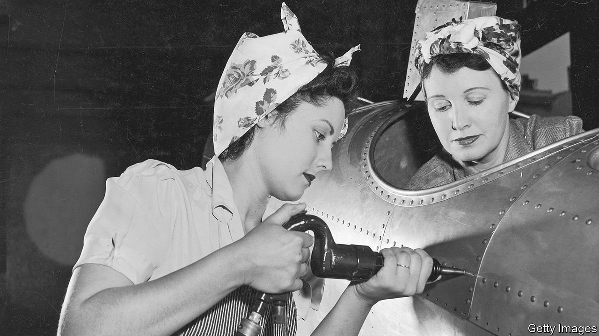
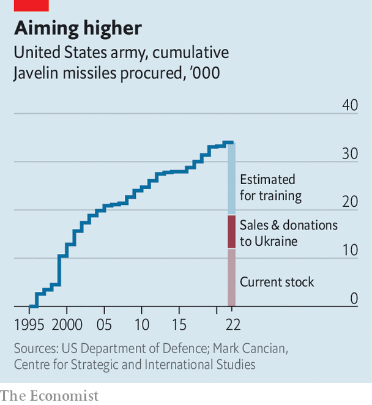

###### Few tools to give them

# Because of Ukraine, America’s arsenal of democracy is depleting 

##### The war raises worries about America’s ability to arm its friends 

 

> May 7th 2022 

AS LONDON WAS being bombed during the Blitz, Franklin Roosevelt delivered a “fireside chat” over the radio on December 29th 1940 that still resonates today. America, the president said, had to become “the great arsenal of democracy”, both to help those fighting the Nazis and to protect itself. When Japan attacked Pearl Harbour a year later, America’s factories went into full wartime production. The car industry in Detroit took up much of the burden: Oldsmobile made cannon shells, Cadillac produced tanks and howitzers, Chrysler made Browning machine-guns. Ford built a huge factory to roll out B-24 bombers at a rate of one an hour. One of its workers might have inspired the song and poster of “Rosie the Riveter”, now an iconic image.

With war raging in Ukraine, President Joe Biden is casting himself as a latter-day Roosevelt. America will not fight directly but is determined to . On April 28th he  for an extra $33bn to respond to the crisis, on top of $13.6bn approved earlier this year. The new request includes about $20bn in  to Ukraine and European allies. “The cost of this fight is not cheap, but caving to aggression is going to be more costly if we allow it to happen,” he declared.


Can America’s arms industry respond? It must help supply not only Ukraine but also European allies that are  and America itself, which must replenish its stocks and worry about the risk of great-power conflict. “One of the great success stories of this war is that we have been able to supply the Ukrainians with large numbers of munitions,” says Thomas Mahnken of the Centre for Strategic and Budgetary Assessments, a think-tank in Washington. “My question is: who is going to supply the United States? Nobody.”

America has been by far Ukraine’s biggest armourer. Since 2018 it has sold or donated 7,000-odd . America has sent 14,000 other anti-armour systems, 1,400 Stinger anti-aircraft missiles, 700 Switchblade loitering munitions, 90 howitzers with 183,000 155mm shells, 16 Mi-17 helicopters, 200 armoured personnel carriers and more. And it has marshalled allies to provide military equipment, often of ex-Soviet vintage.

 


Most of these weapons have come from stockpiles. Factories may not be able to raise production quickly. Take the Javelin. America does not release details of its stock of weapons. But according to budget documents, its army has bought around 34,500 Javelins since they went into service in 1996. Mark Cancian of the Centre for Strategic and International Studies, another think-tank, reckons that it has used 12,500-17,500 for training and testing. That would leave 17,000-22,000 in stock at the end of 2021. So the 7,000 Javelins given to Ukraine may account for a third or more of the army’s stock (see chart). His calculation excludes about 2,400 Javelins bought by the marines, and perhaps 5,000 expended in Iraq and Afghanistan.

On May 3rd Mr Biden visited the factory in Troy, Alabama, where the Javelins are assembled. It produces 2,100 of them a year. It would thus take three or four years to replenish the army—more if orders from other countries take priority. The factory could in theory turn out 6,480 Javelins a year. But this assumes that its makers, a joint venture by Lockheed Martin and Raytheon Technologies, receive firm orders, can find the extra workers and, crucially, components. On earnings calls with investors last month the bosses of both firms spoke of supply-chain constraints.

The production of Stinger anti-aircraft missiles is tighter still. They entered service in 1981, and America bought its last batch in 2003. The production line closed last year, but reopened for a foreign customer (thought to be Taiwan). Its maker, Raytheon, says it has only a limited stock of parts. “Some of the components are no longer commercially available,” Raytheon’s boss, Gregory Hayes, told investors. “And so we’re going to have to go out and redesign some of the electronics in the missile seeker head, and that’s going to take us a little bit of time.”

The recent move to send Ukraine NATO-standard artillery may relieve pressure on munitions stocks (countries have lots of 155mm shells). But other pinch-points will appear. Having long dominated the airspace of war zones, Western countries have underinvested in longer-range ground-to-air weapons of the kind Ukraine craves.

This is not the first time they find themselves short of weapons. In the air war in Libya in 2011—a limited campaign—Britain and France quickly ran short of precision-guided munitions (PGMs). America itself, at some points during the campaign against the jihadists of Islamic State in Iraq and Syria in 2014-18, was consuming more PGMs than could be produced.

Precision weapons, packed with chips and sensors, are hard and expensive to make. Planners tend to focus on “platforms”—tanks, ships, planes—and save money on the bombs and missiles, notes Bradley Martin of the RAND Corporation, a think-tank supported by the American air force. “A risk is being assumed based on a belief that, if a war were to occur, we would be able to ramp up production,” says Mr Martin. “That’s a bad assumption.”

A related problem is a tendency to underestimate how intensely armies use munitions in a war. A third is that, after decades of peacetime procurement, industry has given priority to efficiency, not resilience. Maintaining spare capacity is costly.

It does not help that the defence industry, like others, has been hit by the covid pandemic, tight labour markets and global shortages of computer chips. A recent report by the National Defence Industrial Association argues that America’s defence-industrial base is deteriorating. The biggest problems were a shortage of skilled workers and spare parts. About 30% of firms it questioned said they were the sole supplier of a product to the Pentagon.

A battle against bottlenecks

Kathleen Hicks, the deputy defence secretary, says the Pentagon is trying to clear bottlenecks at weekly meetings with the bosses of defence firms. It is helping them locate alternative suppliers for hard-to-find parts or, in the case of the Stinger, the tools with which to make them. In the longer term the government is trying to boost domestic semiconductor production.

Ms Hicks warns against fixating on particular weapons. “We talk in name-brands. People walk around the street talking about Javelin, but the reality is that we’re providing our anti-tank systems,” she notes. What Ukraine needs is not a specific weapon, but a capability, such as stopping armoured vehicles. That might be provided by other weapons or allies (Britain and Sweden, say, which have sent their jointly produced Next-generation Light Anti-tank Weapon). And America, she says, is able to draw down stocks of Javelins and Stingers because it has other means with which to destroy tanks and planes.

Ideas for improving defence production abound. Bigger stockpiles, diversifying suppliers, modular weapons designs that allow components to be swapped, common standards among allies and joint acquisition. But much of this is hard, given that procurement is slow and national industries tend to be protected. Ms Hicks says the Pentagon must give industry “a strong, enduring market signal”, an assurance that if they hire workers and expand factories “the work is going to be there”.

For America, the war in Ukraine is still a limited commitment. But if its industry is under strain now, could it cope with a big war—say against China over Taiwan? “In world war two, one reason industry could rapidly make the shift was because we had a massive amount of unused industrial capacity after the Depression,” says Mr Martin. “Right now the arsenal of democracy is not capable of responding to the demand of long-term high-intensity conflict.” ■

Read more of our recent coverage of the 

