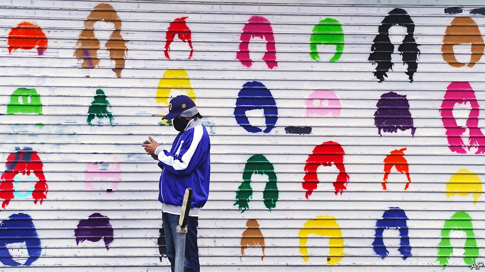
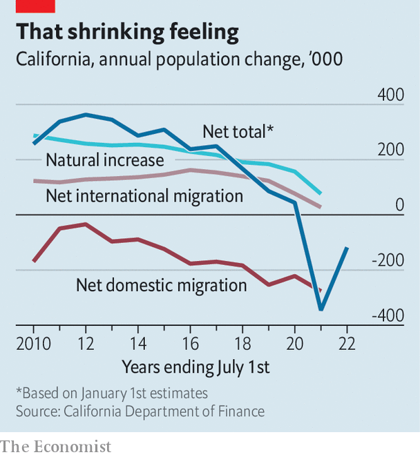

###### Population trends

# California’s demography is at odds with the old California Dream 

##### The Golden State shifts from dynamism to decline 

 

> May 7th 2022 

WALLACE STEGNER, a novelist, once called California “America…only more so”. To judge by population estimates released on May 2nd, the state is still America, but slightly less so. The population fell to 39.2m in the year to January 2022, 400,000 lower than in 2020 (see chart). In 1990, the number of Californians had been rising by a robust 2.5% a year. The biggest contribution to the decline came from migration. In 2021, the net change (people moving out of state minus those moving in) was twice as large as the number of covid deaths and four times the population’s natural change (the excess of deaths over births). Big cities have been hit hardest; the population of Los Angeles County has fallen for the past four years.

Even if these declines were no worse than average—and national demographic trends are slowing, too—they might seem worse in a state where, as its governor once said, “the future happens here first”. In fact California’s demography is worse than average. The state’s total fertility rate (TFR, an estimate of the number of children women will bear over their lifetimes) fell from 2.2 in 2006 to 1.5 in 2020, more than in America as a whole, where the fall was from 2.1 to 1.6. The TFR is one of the most important indicators of future population trends. Fertility has been depressed, in part, suggests the state demographer, Walter Schwarm, because of the larger share of foreign immigrants now coming from South Korea, Japan and China. East Asians have brought their low fertility with them.


 


As a result, argues Joe Mathews, a writer and commentator, the state’s demography is now at odds with Californians’ sense of their home state as “a place where we can play in the sun” (to quote the Beach Boys). Youthfulness, attractiveness to migrants and diversity: all three are eroding.

California is still young, but less so. The state’s median age, 37.3, is a year and a half below the national average but is catching up, having risen by two years in 2010-20. The over-65s were 11% of the population in 2010 but will almost double to 19% by 2030. The state’s 88-year-old very senior senator, Dianne Feinstein, is representative of her constituents in this respect.

California is no longer the migrant magnet it was. Between 2000 and 2020, it lost roughly 3m people to other parts of the country. In recent years the decline has been exacerbated by the pandemic and border controls, both of which have restricted foreign migrants. In 2000 Texas was 60% the size of California in terms of population; now it is three-quarters, thanks in part to an influx of Californians.

Drought, wildfires and relatively poor schools all played roles in the exodus, but dominating everything is the cost of housing. In 2019 median house prices in California were 184% higher than those in Texas. Dowell Myers, a demographer at the University of Southern California, argues that exorbitant housing costs also explain California’s falling fertility, since couples who want children go to states where they can afford a family home—and even its relative youth, since large numbers of older Californians are cashing out and buying big retirement homes elsewhere.

As a result, California has lost a component of its diversity: the sense that it is a place where people from all over America come to make good. Ethnically, it has not changed much: 27% of Californians are foreign-born, the highest share in America and twice the national rate. It is one of only two states (with New Mexico) where there are more Latinos (39%) than whites (37%). In absolute terms, it has more Asian-Americans and Pacific Islanders than anywhere, even Hawaii. And it will become less white in future because, though whites are two-fifths of Californian adults, among children they account for only a quarter.

Despite this, the state is less of a melting pot in another way: it used to be a place where everyone came from somewhere else. Before 2000, says Mr Myers, only 40% of 25- to 34-year-olds were born in the state. Now the share is 60%. The Beach Boys’ Wilson brothers were born in California, but their parents were from Kansas and Minnesota. Eddie Van Halen grew up in Pasadena to become one of the world’s greatest guitarists. His parents were born in the Netherlands and Indonesia.

On surfari to stay?

One sign of the state’s ebbing diversity is the decline of those who speak mostly or only Spanish. In the 2010s, four-fifths of self-identified Hispanics spoke the language fluently; by 2020, the share was two-thirds. Another sign is that half the states’ foreign-born immigrants are citizens, the highest share for 40 years. “We’re not that different any more,” laments Mr Mathews.

William Frey, at the Brookings Institution, a think-tank, points out that many of the state’s demographic problems are concentrated in four big cities. The rest of the state rivals Texas and Arizona in its continued attractiveness to incomers. And it will be helped as house prices throughout the West start to catch up with California.

Migration into the state has remained steady for a decade (it is the number leaving that has changed). California continues to attract the same share of foreign immigrants as ever, roughly a quarter, even though the total fell. And in the 2010s, according to the Public Policy Institute of California, a research group, more college graduates moved to the state than left, at a time when people with only high-school education were flooding out. Incomers tended to be wealthier, too.

Perhaps California is still where the future happens first. It is a future of ageing, declining populations, ethnic diversity and educational advance: no bad thing, but not the sunshine of California dreamin’. ■

