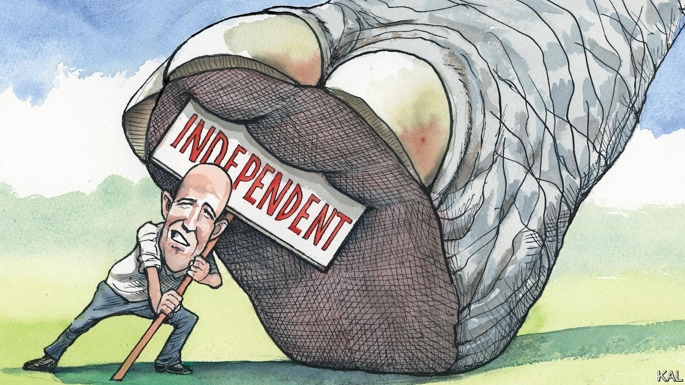

###### Lexington

# Evan McMullin’s run against extremism in Utah is working, so far 

##### The former Never Trump Republican, and now independent Senate candidate, is testing a new defence against the populist right 

 

> May 5th 2022 

AMID THE horrors of the 2016 presidential election, Evan McMullin offered a moment of relief. The former CIA officer and Republican congressional staffer had watched in horror as his party traded its principles for Donald Trump. When it became clear that no Republican leader would resist him, Mr McMullin launched an independent run of his own. He entered the race just three months before the election, with little name-recognition or money, yet won half a million votes in the 11 states where his name was on the ballot (and over 200,000 write-in votes where it wasn’t), including a fifth of the total in his native Utah. The state’s senior Republican senator, Mike Lee, voted for him.

Now Mr McMullin has Mr Lee in his sights. His protest vote long forgotten, the senator has become an arch Trump toady and conspirator. A Mormon, like most Utah Republicans, Mr Lee has compared the former president to a mythical Mormon hero, Captain Moroni. Text messages leaked last month suggested that the senator was up to his neck in Mr Trump’s effort to steal the 2020 election. Few Republican politicians have fallen further into the Trumpist mire. So Mr McMullin is standing against him at the mid-term elections in November. “Utah is a state founded by my ancestors in the mid-1800s and many others who fled persecution,” he told Lexington. “We know the value of our system of self-government better than many. We cannot be represented by someone who is trying to destroy it.”


He is again running as an independent, but with a couple of differences. In 2016 he sought to rally his fellow conservatives against Mr Trump for the sake of conservatism and the country. He was for gun rights and against federal efforts to cut greenhouse-gas emissions. Yet, having apparently concluded that conservatism is beyond saving, he is now trying to woo moderates of all parties and none. “A majority of Utahns want to replace Mike Lee but they are divided between political factions,” he says. “Our strategy is to unite them into a single voting bloc.”

So far, it is working. Though Utah’s conservatives are less resistant to Mr Trump than they were, a minority still back Mr McMullin. They might include the state’s other senator, Mitt Romney, who has suggested he will not endorse either his Republican Senate colleague or Mr McMullin, because both are “friends”. Even better for Mr McMullin, Utah’s Democrats voted on April 23rd not to field a candidate against him.

A two-horse race could be tight. Mr Lee’s approval ratings are poor and the senator could be further bruised by next month’s Republican primary, at which his secretive role in Mr Trump’s post-electoral machinations will receive fresh scrutiny. This is a remarkable development in a state that has not had a competitive Senate race since 1976.

Mr Lee’s campaign is naturally trying to define Mr McMullin as a shifty opportunist. In response, the challenger presents his change of tack as a recognition that politics is now less a struggle between right and left than between extremism and moderation. He makes a compelling point. Mr Trump is unrestrained, has no ideology and his party is in thrall to him. By contrast, the Democrats are a broad ideological coalition, including conservatives such as Joe Manchin and democratic socialists, which accepts compromise and restraint, however grumblingly, as its only means to stick together. The rise of Joe Biden, an ageing moderate whom few Democrats love but most can live with, is emblematic of the party’s pragmatism.

So is the decision of Utah’s Democrats to tacitly embrace Mr McMullin (at the urging of the state’s most recent Democratic congressman, Ben McAdams). All the more so, it might seem, because Mr McMullin has not significantly revised his conservative views. Three of his five priorities—cutting government waste, keeping America safe, and protecting air and water—are standard Republican talking points. And the other two, strengthening democracy and reducing health-care costs, are hardly left-wing. It is a reminder that Democrats and moderate Republicans, a dwindling but extant species, could govern together perfectly well if their fanatical colleagues would only allow it. Indeed, in Utah, which has a strong tradition of bipartisanship despite its conservatism, they quite often do.

The arrangement looks particularly significant given how hard the Democrats are finding it to win a governing majority on their own. In the Senate, the fact that most states lean to the right, though most Americans vote on the left, gives the Republicans a huge advantage. Senate Democrats have therefore spent much of the past two years debating possible structural reforms to correct such anomalies, for example by scrapping the filibuster in order to grant statehood to staunchly Democratic Washington, DC. Yet to make any reform they need unanimity, given their paper-thin Senate majority, and their most conservative member, Mr Manchin, is not on board. Lending Democratic votes to a pragmatic independent such as Mr McMullin in places where Democratic candidates cannot win looks like a useful second-best option. It could give the Democrats a serious governing partner, as Mr McMullin promises to be, or at least fewer hard-right opponents like Mr Lee.

Reform by stealth

It is also hard to see what the Democrats could lose from the arrangement. Their 35% share of the vote in Utah—and 40% in Louisiana and in Missouri and so on—is currently wasted. Many Democratic voters therefore do not bother to turn out in such places, making it difficult for the party to win the down-ballot contests that it otherwise might. Providing its supporters with a novel winning option, albeit in the form of an independent candidate, should help the party correct this. “I do believe that this is a model for defending our democratic republic from the anti-democracy far-right,” says Mr McMullin. He may just be right. ■

Read more from Lexington, our columnist on American politics: (Apr 30th)

 (Apr 23rd) (Apr 16th)

For exclusive insight and reading recommendations from our correspondents in America, , our weekly newsletter.

