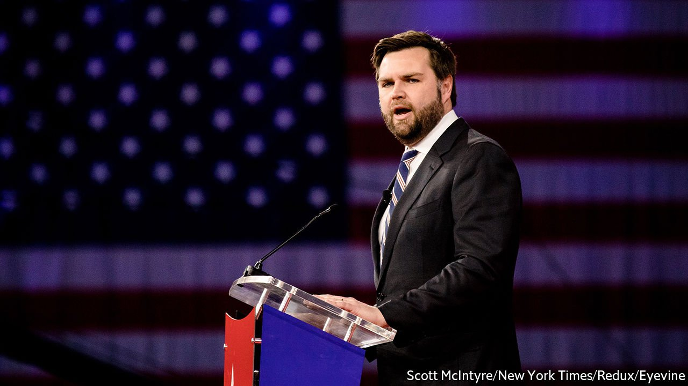

###### Capitol Hillbilly

# Fear of illegal immigrants helps J.D. Vance triumph in Ohio’s primaries 

##### Fear of illegal immigrants helps J.D. Vance triumph in Ohio’s primaries 

 

> May 7th 2022 

MASON, A SUBURB north of Cincinnati, does not feel like a place where the apocalypse is coming soon. It is a district of detached houses and perfect landscaping. After voting at a bucolic-looking wedding venue, however, David Myer, a retired health-care worker, says he sees a much darker future. Thanks to Joe Biden (“not the president”), illegal immigrants are being invited en masse into Ohio. They are living on welfare “and all of the free stuff we give them”, and voting for Democrats. Some are even coming to Mason and begging at traffic lights. “We’re on the precipice of social collapse,” he says.

Mr Myer did not vote for J.D. Vance, the author and venture capitalist who won the Republican primary for the Senate on May 3rd. But his talking points could have come straight out of one of Mr Vance’s speeches. With his vision of America being looted by woke corporations, illegal immigrants and a crooked liberal media, Mr Vance persuaded 32% of Republican voters to back him, enough to win in the crowded field.


Mr Vance was helped by the endorsement of Donald Trump. The former president gave his blessing on April 15th, tipping him into the lead. But at his victory speech in Cincinnati, Mr Vance only briefly mentioned Mr Trump, along with other Republicans who had helped his campaign, such as Marjorie Taylor Greene, a conspiracy-theorist congresswoman from Georgia.

Instead, he said that he intends to stand for “the people who are caught between the corrupt political class of the left and the right”. “Establishment” Republicans, he said, have connived to send American jobs to China while doing nothing to stop Americans getting addicted to opiates. Democrats “actively encourage” Mexican cartels to import fentanyl, even as they tell children there are “42 genders”. Mr Vance said both groups ought to be sent to jail.

Why this sort of rhetoric is so persuasive among Ohio’s Republican voters is unclear. It is true that opioid addiction is a catastrophe in the state. But illegal immigration is not. Less than 5% of Ohio’s population are foreign-born, one of the lowest rates in the country. And yet it seems to have rallied the majority of those voters who turned out (all but one of the seven candidates espoused a similar creed). Every voter your correspondent interviewed outside various polling places mentioned illegal immigrants as their primary concern, shortly followed by inflation.

What did not stop Mr Vance’s victory was his previous incarnation, as a darling of liberal publications and a thoughtful critic of Mr Trump after his book “” came out in 2016. His opponents plastered the airwaves with unfortunate quotes, including a suggestion that Mr Trump might become “America’s Hitler”. No matter. “He made a mistake and he admits it,” said Rob Fyte, another pensioner in Mason, after voting for Mr Vance. Having become famous for a memoir about how working-class people from the Appalachians often look for outsiders to blame for their problems, Mr Vance has seamlessly switched to arguing that outsiders are to blame for their problems.

Will voters in the general election in November be as forgiving? The winner of the Democratic primary, Tim Ryan, a congressman from Youngstown, is also running on China-bashing populism, and may have a chance. But in 2020 Ohio went for Mr Trump by eight points. Most probably, the proud Hillbilly will go on to take his apocalyptic message to Washington. ■

For exclusive insight and reading recommendations from our correspondents in America, , our weekly newsletter.

