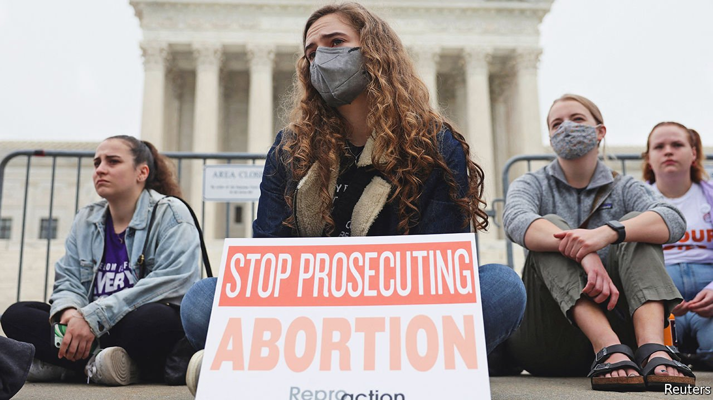

###### The draft seen round the world

# How the end of Roe v Wade will affect American politics 

##### Democrats’ hopes of a boost may rest on wishful thinking 

 

> May 7th 2022 

IN THE 50 years since the Supreme Court handed down its decision on Roe v Wade, the right to an abortion has been deemed a constitutional guarantee in America. As he drafted a new decision that would overturn this precedent, Justice Samuel Alito recognised that the verdict would be . “We do not pretend to know how our political system or society will respond to today’s decision overruling Roe,” he wrote. “Even if we could foresee what will happen, we would have no authority to let that knowledge influence our decision.” Little could he have known that he—and the country—would get an unplanned preview of the public reaction.

On May 2nd Justice Alito’s draft opinion was published by Politico, an American news outlet, more than a month before its expected release. It was a shocking breach of the court’s norms of discretion and deliberation. John Roberts, the chief justice, confirmed the draft’s authenticity and swiftly ordered an investigation.


Such opinions are often revised as justices trade drafts and dissents. That caveat has not stopped glee from Republicans, who are close to vindication for a decades-long strategy aimed at seizing control of federal courts and overturning Roe, and recriminations from Democrats. Chuck Schumer and Nancy Pelosi, the Democrats’ leaders in Congress, denounced the reported Supreme Court votes as an “abomination” and accused the Republican-appointed justices of having “lied to the US Senate, ripped up the constitution, and defiled both precedent and the Supreme Court’s reputation”. President Joe Biden pointed to the political repercussions. “If the court does overturn Roe, it will fall on our nation’s elected officials at all levels of government to protect a woman’s right to choose. And it will fall on voters to elect pro-choice officials this November.”

If Roe were to be definitively cast aside next month, as had been widely predicted, women would be confronted with a maze of abortion rules depending on their home state. Republican-dominated legislatures in 13 states have pre-emptively passed complete bans on abortion, intended to come into effect after the Supreme Court strikes down Roe. Other states, including Georgia and Ohio, have prepared somewhat less draconian restrictions, limiting abortions to pregnancies shorter than six weeks (federal courts have until now blocked these from going into effect). Women in Democrat-run states, meanwhile, would experience little change.

Democrats plainly hope that the shock of such a decision would limit their expected mid-term losses. Sean Maloney, who leads the Democratic Congressional Campaign Committee, has called abortion “the central choice in the 2022 election”.

It is true that overturning Roe seems unpopular. Polling from Gallup shows that only 32% of Americans favoured striking down the precedent, compared with 58% who would have kept it. In other ways, though, public opinion is ambivalent. Majorities also support restrictions on the procedure, such as waiting periods and requiring ultrasounds to be shown to a woman considering an abortion. For decades, divisions on abortion have remained fairly stable.

That suggests the immediate political impact may be limited. Extreme polarisation means that those Americans most exercised by the issue, whether pro-life or pro-choice, are already sorted into their supportive political party. Might suburban women respond by abandoning the Republican Party? Perhaps, but such an exodus has already been under way since Donald Trump’s presidency. Against this, Republicans would be able to count on the motivation of an evangelical base elated with judicial victory and on surprising gains among Hispanic and African-American voters, who are more socially conservative than the college-educated whites defecting to the Democrats.

Another strain of wishful thinking among Democrats concerns the coherence of their opponents. The hope that judicial power would overturn Roe has for decades bonded seemingly disparate allies in the conservative legal movement: the largely evangelical religious right, the tuxedoed Rockefeller Republicans and the Trumpist nationalists. Having carried out its mission, the fellowship of the right might dissolve. For now, this seems unlikely. White evangelicals are not latent Democrats hindered only by their disdain for abortion. Polling by the Public Religion Research Institute finds that only 11% trust Mr Biden; more than twice as many, 23%, believe in the QAnon conspiracy theory.

Instead, perceived Democratic fecklessness may demotivate the party’s own supporters. In theory, a Democrat-controlled Congress could pass a law codifying a national right to abortion, pre-empting the states. Mr Schumer has called for a vote on exactly such a bill. But it will fail. To pass it would require unified support for overturning the filibuster and legislating a nationwide right to abortion. Joe Manchin, the pivotal Democratic swing vote, disagrees with both notions.

The likely result of all this is that the politics of abortion will grow even more febrile. In Missouri, a state with only one functioning abortion clinic, a legislator named Mary Elizabeth Coleman has introduced a new style of abortion bill. It would ban the distribution of abortion pills (which are used more often than surgical abortions) and allow private lawsuits against anyone who knowingly helps a woman go out of state to obtain the procedure. “Missouri women are being targeted by those who are wanting to profit off of abortion. You see billboards across the state. Women are being harmed out of state,” she says.

Some thought, incorrectly, that the Supreme Court had settled the issue when it decided Roe in 1973. It’s equally unlikely that the issue will be settled now. ■

