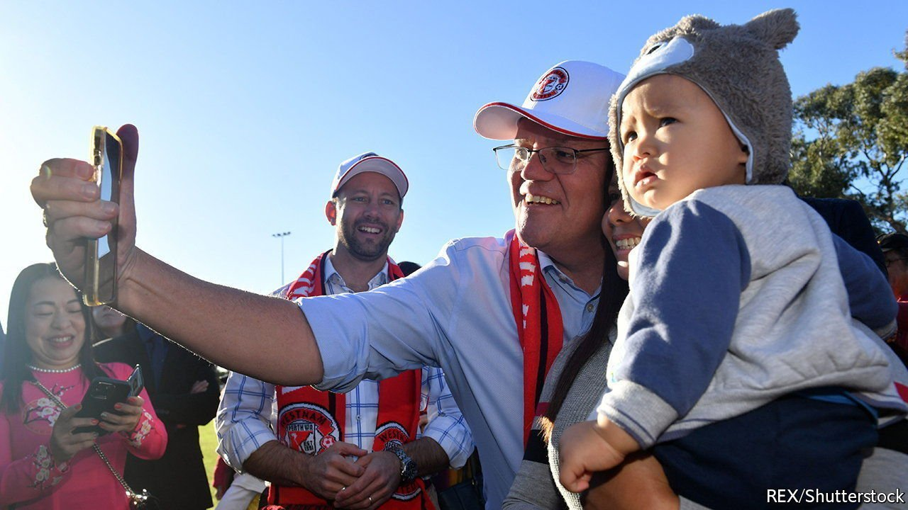

###### For whom the teals poll

# Australians are fed up with their two main parties 

##### They may turn to independents in record numbers in elections this month 

 

> May 14th 2022 

AUSTRALIANS DISAGREE on much when it comes to politics. Left-leaning parties hold sway in cities and conservatives in the countryside. Voters in resource-rich states worry about the future of mining. Urbanites want to cut emissions. Yet they will be in agreement about one thing when they vote in a federal election on May 21st: disillusionment with their political system. “Too much rubbish goes on,” grumbles a voter in Wentworth, a wealthy constituency in Sydney. “It’s just a whinge- and bitch-fest. No one is actually getting the job done,” concludes another in Hunter, a coal-rich seat in New South Wales.

Their frustrations are not as loud as Britain’s or America’s (nor are their electoral choices as self-harming), but that does not make their politics healthy. In 2019 only a quarter of Australians said they trusted “people in government”, down from 43% in 2007, according to polling by the Australian National University (ANU). Turnout should be plummeting. But voting in Australia is compulsory. Citizens face a familiar choice between the incumbent Liberals, who govern in a permanent conservative coalition with the smaller National Party, and the opposition, Labor.


Big ideas tend not to win elections in Australia, so neither side has put forward many. Both are led by “uncharismatic middle-aged white males who are not exactly inspiring”, says Paul Williams, a political scientist at Griffith University in Brisbane. Many Australians find their prime minister, Scott Morrison, cringe-inducing. He is accused of lying and bullying by members of his own party. Yet he still ranks above Labor’s gaffe-prone leader, Anthony Albanese, in polls of Australia’s preferred prime minister. Mr Albanese has been pilloried for forgetting basic numbers including the unemployment rate.

Still, Mr Morrison’s coalition seems unlikely to return for a fourth term. It has been in government since 2013, and unless opinion polls are spectacularly wrong, Australians want it gone. (Mr Morrison confounded expectations at the previous election in 2019, winning a “miracle” victory. Pundits insist that will not happen twice.) One national count predicts a swing against the coalition of more than 5%, enough to lose 13 seats in the House of Representatives, where it has a majority of one. No government has had a majority in the Senate, which is elected on a system of proportional representation, for years.

To many, the government’s successes against covid-19 feel like ancient history. Inflation is rising and so are interest rates. Mr Morrison’s odds have not been helped by successive scandals. His government has been buffeted by two separate allegations of rape, against a former minister and a political staff member. It has pumped grants into marginal constituencies, feeding complaints about corruption.

Labor, for its part, is “packed with politicians who stuffed up in its last government”, argues John Wanna of ANU. It lost the election of 2019 after proposing reforms to taxes on housing and investment. Its promises now are less controversial. Mr Albanese wants cheaper child care, better nursing homes and a commission to investigate federal corruption. On climate change, he would set a goal to slash emissions by 43% by 2030, from 2005 levels—a big improvement on the coalition’s 26-28%. On the economy, some of his ideas seem likely to fan inflation: he wants to raise minimum wages by over 5%.

Australians are deserting both main parties in growing numbers. Support for them is at historic lows, says William Bowe, a political analyst. Perhaps a third of voters will back minor parties and independent candidates this time. Few of those will win seats. But a new set of climate-focused independents stands a chance.

These “teal” candidates—so-called for the colour of their campaign materials—are vying for wealthy Liberal seats, where voters are fed up with the government’s dismal efforts on climate change and want to clean up politics. Their campaigns are heavy on vision and light on detail: they would strive for stiffer emissions cuts and “integrity” in politics. Their supporters have built enthusiastic grassroots movements around them. One independent candidate, Zali Steggall, ousted a former Liberal prime minister, Tony Abbott, in 2019. The Liberals could lose at least two more seats to independents in this election, Mr Bowe predicts. They are bankrolled, in part, by Climate 200, a political action group established by Simon Holmes à Court, the son of a mining billionaire.

A hung parliament, in which independents and minor parties hold the balance of power is possible, believes Kosmos Samaras, a former Labor strategist. That would give them leverage to pursue their lofty goals, their fans say. It would also cause “chaos and instability”, Mr Morrison argues. The latest polls, however, show Labor extending its lead. It could win enough seats to form a respectable majority in the lower house. That would boost the strength of government. But it is unlikely to lighten Australians’ dour mood. ■

