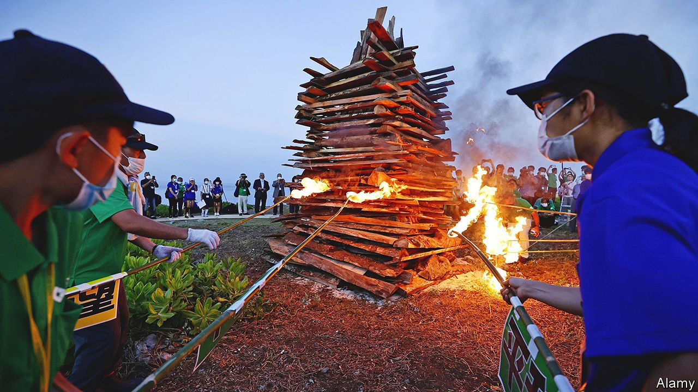
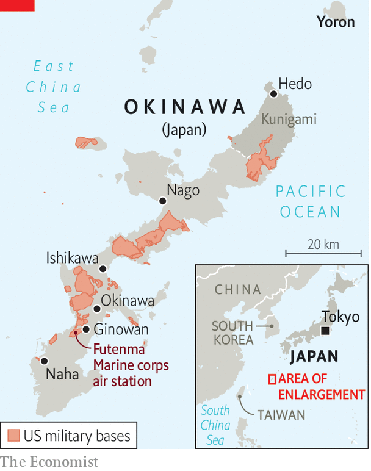

###### Base case

# Fifty years after America returned Okinawa to Japan, it still feels cut off 

##### No one listens to the islanders’ complaints about American bases 

 

> May 14th 2022 

FLAMES LICKED the sky over Cape Hedo on the northernmost tip of Okinawa’s main island, burning bright enough to be seen from the nearby island of Yoron. After the second world war, when Yoron belonged to Japan but Okinawa was under American occupation, locals lit bonfires as signals, as if to say “Hi, we’re still here” to their brethren. When the fire burned again in late April, it was to mark the 50th anniversary of Okinawa’s return to Japan. Politicians waxed lyrical about peace, occasionally interrupted by American military aircraft overhead. An old protest song blared from a tinny speaker: Okinawa wo kaese! (Give back Okinawa!)

Yet for Okinawans the anniversary, on May 15th, is less cause for celebration than for sober reflection on unfulfilled hopes—and on new threats to their islands from tensions between America and China. “It’s been 50 years but so many issues remain,” laments Miyagi Hisakazu, a former mayor of Kunigami, Cape Hedo’s district.

 


When Japan took back control of Okinawa and the rest of the Ryukyu Islands, locals expected the government in Tokyo to help stimulate the economy and reduce the American footprint (see map). Living standards have improved, but Okinawa is still the poorest of Japan’s 47 prefectures. Some American facilities have closed, but more than 25,000 American troops remain on Okinawa, which is home to 70% of American bases in Japan by area. Those installations would play a big role in any conflict with China.


The Ryukyus have often been caught between great powers. For most of their history, they formed an independent kingdom, balanced between Japan and China. Japan annexed it only in 1879, during a period of imperial expansionism. Roughly a quarter of the civilian population perished in the second world war.

After the war, the Americans stayed, making Okinawa a de facto colony and expropriating land for military bases to support operations in the Korean and Vietnam wars. Cars drove on the right. Okinawans used dollars, and needed passports to visit mainland Japan. Violent crimes by American soldiers were common. By the late 1960s, the occupation had come to threaten the alliance between America and Japan. When America returned Okinawa, it insisted on keeping the bases. In return, it agreed to remove nuclear and chemical weapons located there.

The government lavished Okinawa with subsidies and helped build infrastructure such as ports and roads (Okinawa also receives money for hosting the bases). Before the pandemic hit, the islands had developed a booming tourism industry. Tamaki Denny, Okinawa’s 62-year-old governor, recalls that in his youth “there were mainland bars that said, ‘No Okinawans allowed.’” Now, being Okinawan is cool.

The relationship with America has evolved too. Generations have grown up alongside American soldiers, forming lasting bonds and even families. Memories of the occupation have faded: many young Okinawans know little of the hardships endured before the reversion. Younger Okinawans are “becoming more pragmatic and less ideological”, says Mike Mochizuki of George Washington University, leading to greater acceptance of the American presence. Chinese aggression has convinced more Okinawans of the logic of deterrence.

Even so, a majority would still like to see the American bases shrink. For pacifists, Ukraine’s misfortune is proof not of the need for more powerful defences, but of the risks of entanglement in great-power competition. Even supporters of the alliance fret that large concentrations of troops and materiel, and with them ordinary Okinawans, are vulnerable to Chinese missiles. During a crisis, China might also seek to exploit division between the mainland and Okinawa.

What unites Okinawans across the political spectrum is the sense that the government in Tokyo ignores them. Hawks would like it to think more about their local residents’ safety. Many others feel that its intransigence on the subject of bases is proof of lingering colonial attitudes: mainlanders have been spared the problems, such as noise, accidents and crime, that come with hosting bases.

A particular irritant is Futenma, a base in a densely populated area. After the rape of a 12-year-old Okinawan girl by three American soldiers in 1995, the Japanese government promised to move it. But engineering problems have hobbled its plan to build a replacement off the coast of a quieter part of the island. Most Okinawans oppose that plan anyway. Mr Tamaki has petitioned the authorities in Tokyo to call it off. Doing so, he says, “would show they have listened to our feelings”. The government is bent on pushing ahead. ■

: A previous version of this article said more than 250,000 American troops remain stationed on Okinawa. In fact, roughly 25,000 remain. 

