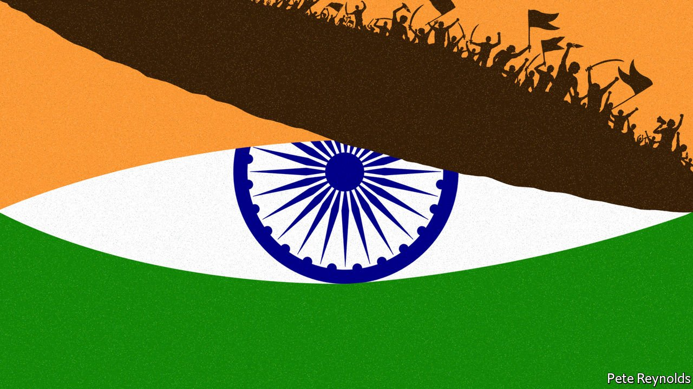
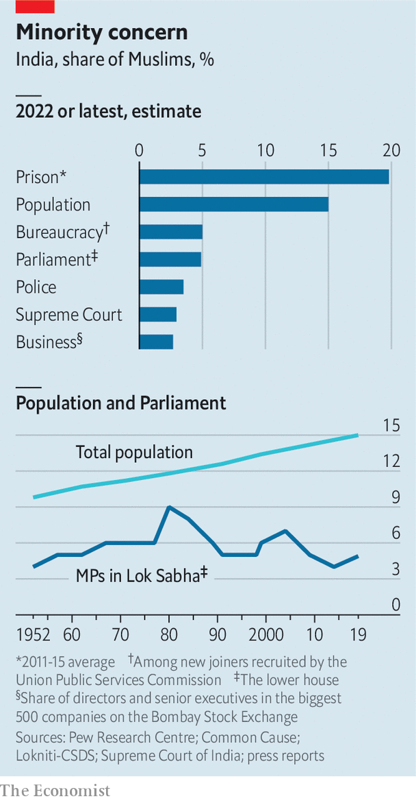

###### Saffron nation

# How Narendra Modi is remaking India into a Hindu state 

##### The prime minister and his party are laying waste to the secular underpinnings of the constitution 

 

> May 14th 2022 

THE PATTERN is plain to see. On the occasion of a religious festival, youths affiliated to the sangh parivar, or the Hindu-nationalist “family of organisations”, march through a densely packed slum. When the rowdy young men, sporting saffron-coloured clothes or flags and brandishing swords, reach a mostly Muslim neighbourhood, their chants turn to taunts and insults. Muslim boys start throwing stones. In the ensuing fight shops get looted, houses burned and lives lost. Reporters tally the damage. This is typically lopsided, inverting the proportions of India’s 79% Hindu majority and 15% Muslim minority. No matter. The sangh gleefully choruses its mantra: “Hindus are in danger! Unite!”

Over the past 50 years, Indian governments have repeatedly dampened such local eruptions by mouthing words of regret, paying a bit of compensation and tapping some retired worthy to write a soon-forgotten report. No longer. The Bharatiya Janata Party (BJP) which rules both at the centre in Delhi, the capital, and in about half of India’s states, is itself a child of the sangh. Many of its top leaders started as foot soldiers in just the sort of gangs that so predictably spark trouble.


Small wonder that as a bigger-than-usual spate of nasty communal clashes broke out across a swathe of central India during this spring’s festival season, BJP officials made scant effort to calm things. Instead they loudly invoked the right of Hindus to “practise their faith”, blamed Muslims for the violence and demanded exemplary punishment. Following a mini-riot in Delhi on April 16th, provoked once again by sword-waving youths menacing a mosque, Kapil Mishra, a local BJP leader, quickly spun the events as a Muslim conspiracy. “They should be identified and their homes should be bulldozed,” he declared. A few hours later bulldozers duly rolled in, smashing Muslim property for alleged building-code violations.

The increasing use of summary collective punishment is disturbing enough—the demolitions in Delhi followed identical post-pogrom targeting of Muslims in three other BJP-ruled states. More telling still has been the response from higher up in the party, and in particular from Narendra Modi, India’s prime minister. The leader’s reaction to months of sporadic communal violence and rising social tension, and to loud calls from activists, politicians and even retired civil servants for him to do something has been absolute silence.

To many Indians and in particular to the country’s 200m Muslims, the world’s biggest religious minority, the government’s shrug of indifference to growing distress is deeply ominous. It does more than offer tacit approval to mob violence and mob justice. It suggests that in the emerging Hindu rashtra (state) envisioned by the sangh, some will always be more equal than others, with religious identity becoming a measure of citizenship. It also suggests that what lies in India’s future may not merely be further sporadic, localised troubles, but something wider and more painful.

India has long stood out proudly in Asia, precisely because of its success in building a nation from an extraordinary diversity of religions and ethnicities. It has enjoyed both democracy and relative peace, even as its neighbours succumbed to majoritarianism. Pakistan tried to shove the Urdu language down Bengali throats, sparking a bloody war that gave birth to Bangladesh. Sri Lanka’s Sinhala majority sought to lord it over the island’s ancient Tamil minority, triggering a 26-year civil war that left 300,000 dead. Even tiny Buddhist Bhutan hounded out its entire Nepali Hindu minority—a sixth of its population—in the 1990s. Majority muscle-flexing has reduced all too many Asians from citizenship to tenuous subjecthood.

With its robust democracy, independent courts, noisy press and fissiparous diversity even within big categories such as Hindus, could India really embrace majoritarian rule? Surely this goes against the grain of its own history. In the messy partition at the end of British rule in 1947, Muslims who feared Hindu majoritarianism created the new state of Pakistan, while those who hoped for an all-embracing, secular country remained with India.

White flags

Over time, however, the secular notions enshrined in India’s constitution have decayed. In 1992, when Hindu extremists demolished a 16th-century mosque, which they claimed was built on the site of the god Ram’s birth in the northern town of Ayodhya, they sparked a decade-long cycle of bloodshed. India’s establishment was, by and large, appalled. Yet in 2019, when the Supreme Court ruled that although the demolition was a crime, the property should be given to a Hindu trust, the same establishment cheered.

 


During this period the institutional vigilance needed to sustain pluralism had slowly eroded, with police, courts and the press across much of India growing partisan. The global wave of Islamist terror in the 2000s, which also struck India hard, did not help. The use of disparaging language about minorities was long shunned in polite society. It is now increasingly acceptable. Even as Muslims grew as a share of population, their numbers in Parliament, the civil service and security forces did not (see chart).

Hindu-nationalist dogma has filtered into mainstream discourse by a slow-drip process. This has been propagated by the Rashtriya Swayamsevak Sangh or RSS, a volunteer service corps founded in 1925 and once regarded by many Indians as cranks. Myriad affiliated groups (including the BJP) with tens of millions of members, amplify the word. Their main message, that Hindus must unite to face imminent danger, may sound absurd in a country with an unassailable preponderance of Hindus. But the urgency and passion of the cry, set against the heroic narrative of a Hindu  reconquista after centuries of Muslim and European rule over Mother India, is irresistible for many.

And as the BJP has found, promoting “Hindu consolidation” by pointing to a common enemy—generally Muslims—is electoral magic. It erases the divisions of caste and ethnicity that for decades fragmented the Hindu electorate, and in doing so gave minorities some weight in the game. Again and again the BJP has entered a contest, stirred up hatred, and walked off with victory. That success has brought more power and more money in a self-reinforcing cycle, such that even Mr Modi’s political rivals now compete in burnishing their pukka Hindu credentials rather than in defending secular ideals, let alone defending actual Muslims.

In this way, a narrative of the awfulness of Muslims has grown increasingly entrenched, and is all the more easily exploited by the sangh’s zealots. In states ruled by the BJP this shows in policies to counter such imagined abuses as “love jihad”, “land jihad” and “job jihad”, supposed campaigns to usurp Hindu women, property and opportunities. Petty rules are imposed to ban veils in schools, ban public prayers, ban the Muslim call to prayer and, in the BJP-ruled state of Karnataka this year, even to ban Muslim street traders from plying their wares near Hindu temples. Tightened restrictions on cattle slaughter, violently enforced in many parts by vigilantes tacitly supported by the state, have recently been followed by efforts to proscribe halal butchery of any kind. Yet another campaign seeks to delete Muslim-sounding names from Indian maps.

At the most extreme end of the Hindu-nationalist spectrum, speakers at public rallies across northern India in recent years have launched bidding wars of threats against Muslims, from mass rape to mass expulsion. On May 7th Hari bhushan Thakur Bachaul, a BJP politician in Bihar, in eastern India, declared that Muslims should be burned alive just like effigies of the Hindu demon Ravana.

All but a tiny portion of Hindus regard such talk as madly over the top. Yet in part because of the reluctance of either Mr Modi or his RSS mothership to intervene, the demonising tone has become commonplace, and not just regarding the Muslims minority. Other groups such as Dalits, leftist activists (dismissed as “urban Naxalites”) and liberal do-gooders (smeared as “libtards” and “pseudo-seculars”) have become the targets of digital troll armies and, dismayingly often, of the law.

The large Christian (35m) and Sikh (25m) minorities are not spared, either. False rumours of conversion, in many cases fanned by BJP-appointed officials, have led to mob attacks on priests and church-run schools. When farmers, many of them Sikhs from Punjab, protested against farming reforms last year, the BJP tried to link them to Sikh separatist groups that mounted an armed insurgency in the 1980s.

Green light

Such charges carry ominous echoes. In 1984, angered by military operations in Punjab, Sikh bodyguards assassinated Indira Gandhi, the prime minister of the day. Anti-Sikh pogroms erupted in some 40 cities, with police often failing to intervene. The death toll is estimated at 10,000-17,000. Given the mounting drumbeat of intimidation against the far bigger Muslim minority, it is frightening to think what spark it might take to set off a similar conflagration today. And Mr Modi’s record as chief minister in Gujarat, where his government did nothing to prevent bloodshed during anti-Muslim rioting in 2002, does not offer reassurance in case it does.

So far, India’s Muslims have responded to the accumulating humiliations with remarkable cool. When the city’s bulldozers growled into a Muslim part of Delhi on May 9th for more punitive “enforcement of building codes”, residents simply surrounded them in such numbers that they could not move. But it would be foolish of Mr Modi to imagine that more and more wood can be piled on a pyre, without risk of burning the whole village down. ■

