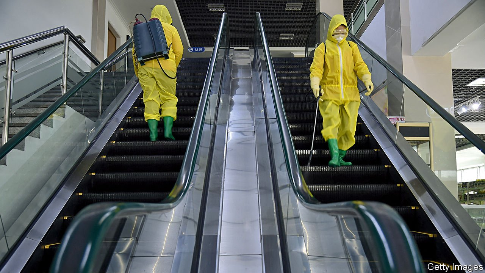

###### State of emergency

# North Korea admits it has an outbreak of covid-19 

##### An unvaccinated population and minimal health infrastructure spell disaster 

 

> May 13th 2022 

FOR MORE than two years, North Korea insisted that its border controls had kept covid-19 out of the country even as it devastated most of the rest of the globe. No longer. On May 12th state media said that the country had recorded its first cases of the Omicron variant a few days earlier. Pyongyang was locked down on May 10th.

Even for a country accustomed to bad news, the outbreak is disastrous. North Korea’s response to the pandemic was to close itself off from the world, reduce imports to a trickle and impose domestic travel restrictions. While other countries rushed to vaccinate their people, North Korea gambled that it could ride out the storm. It repeatedly declined offers of vaccines from China, Russia and COVAX, a UN-backed global effort to supply shots to poor countries. The leadership was reluctant to allow health workers into the country, for fear they might spread the virus or gather information about the dire conditions inside the closed dictatorship. It may have been spooked by rumours of doubts about the safety of the vaccine made by AstraZeneca, offered through COVAX.


Whatever the reasons for the vaccine hesitancy, the approach always looked dubious. There was no guarantee that the virus would evolve to be less dangerous over time, rather than become more infectious and harder to manage, as turned out to be the case. China’s pursuit of a zero-covid strategy was designed to buy time while it vaccinated its population. Though the North Korean leadership blamed those tasked with keeping the virus out for their “carelessness, laxity, irresponsibility and incompetence”, the real folly was the leadership’s failure to set up a vaccination programme in the time it had bought.

North Koreans will now suffer the consequences. Omicron is not especially dangerous in vaccinated populations, but still deadly for the immunologically naive. Hong Kong, which had a poor vaccination rate among the elderly when the variant hit, is a case in point. In late January its death toll stood at 205. Within two months it had climbed to nearly 8,000 after an Omicron outbreak spread like wildfire.

North Korea is likely to do even worse. The impoverished dictatorship lacks the testing and tracing infrastructure that other countries have built over the past two years. Its health-care sector suffered from serious underinvestment even before the pandemic. It does not have enough equipment and medical staff. Hospitals do not have regular power, clean water or proper sanitation. Two years of closed borders have depleted supplies of medicine, much of which is imported. It is unclear how much oxygen or how many ventilators the country has available. And pre-existing conditions make North Koreans especially susceptible to covid-19. Tuberculosis, which worsens the effects of the virus, is rampant. So is malnutrition.

North Korea may turn to China, but its patron is already busy struggling to salvage its own failing zero-covid policy. If North Korea can be convinced to accept help from South Korea, the new president, Yook Suk-yeol, could make good on his promise that he would provide humanitarian aid “regardless of the circumstance”. North Korea has in the past organised successful mass-vaccination campaigns, notably against measles in 2007, and it has the cold-chain distribution infrastructure necessary to keep vaccines from spoiling. If enough doses were offered and allowed to be administered, many lives could be saved.

The irony is that North Korea might have been better off had it let covid spread early in the pandemic when the virus was less infectious (while also jabbing people). Had it done so, the curve of the epidemic would have been flatter and less hard to cope with today. The best-case scenario would be if there have been far more cases in the country than the government has previously admitted, meaning that there is some immunity in the population. For once, North Koreans should hope that their leaders have been lying to them. ■

Dig deeper

All our stories relating to the pandemic can be found on our . You can also find trackers showing ,  and the virus’s spread across .

