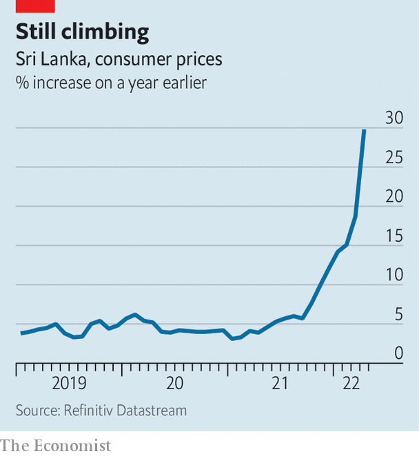

###### The morning after

# Sri Lanka has no money and no government. What now? 

##### The prime minister and the cabinet are gone but the president clings on 

 

> May 14th 2022 

FOR MORE than a month the anti-government protesters camped along Galle Face, the seafront in the Sri Lankan capital of Colombo, had been mostly peaceful. They were demanding the departure of the president, Gotabaya Rajapaksa, and the prime minister, Mahinda Rajapaksa, his brother. There were tents, stages for political plays, and singing. “Go home Gota!” their signs read, using the name by which the president is commonly known. He did not budge. Neither did the protesters.

All that changed on May 9th when hundreds of government supporters descended on the camp at Galle Face and other protest sites in the city. Unmolested by police, they attacked the demonstrators and burnt down their tents. Many had come straight from a meeting at the residence of the prime minister, who had hosted them in a bid to cling to his job. As anti-government protesters counter-attacked and the violence began to spiral out of control, the prime minister at last heeded calls to resign, in the process triggering the dissolution of his cabinet.


In theory, that should pave the way for a new government of national unity led by a prime minister who enjoys cross-party support, and made up of representatives of all the main parties and perhaps some technocrats. But unity is the last thing on the minds of many Sri Lankans, who are enraged to find themselves demoted from relatively well-off by South Asian standards to begging for handouts from India. The protesters responded to the attacks on them by burning down the homes of many cabinet ministers and a museum dedicated to the Rajapaksas. The buses that had carried government supporters into Colombo were also set ablaze. A minister’s car was dumped in a lake.

Hundreds of people were injured as the violence continued into the next day. Several died, including a member of parliament who shot and killed a protester as a crowd surrounded his car, according to police reports. Mahinda and his family were airlifted to safety by security forces on May 10th after an angry mob surrounded his residence. Troops were deployed across the country and ordered to shoot on sight anyone seen damaging property or attacking people. The following afternoon, police told protesters at the Galle Face encampment to clear the area to comply with an island-wide curfew, though they did not immediately enforce the order. The governor of the central bank said he would resign unless political stability was restored.

Perhaps it was this threat that cured the president of the temptation to rule by decree, as he would have been entitled to do following the dissolution of the cabinet. Late on May 11th Mr Rajapaksa addressed the nation, promising to appoint a new government. He appeared to agree to most of the conditions outlined by the opposition, including a reduction in the powers of the presidency, which he had boosted by amending the constitution in 2020.

All-party talks to choose ministers for an interim cabinet were under way as The Economist went to press. Ranil Wickreme singhe, a veteran lawmaker, looked set to be sworn in as interim prime minister. But his putative government faces obstacles, not least the fact that many MPs do not want to sabotage their careers by associating themselves with Mr Rajapaksa. The president’s refusal to step down may damage the credibility of any interim government from the start. A way forward will require balancing the necessary political stability with enough accountability to command public support.

 


That is particularly important given the daunting task facing any new government. Sri Lanka must implement a series of painful economic reforms—a tall order in such a febrile atmosphere. A combination of bad policy and external shocks, notably a collapse of tourism during the pandemic and spiking commodity prices following Russia’s invasion of Ukraine, have depleted Sri Lanka’s foreign-currency reserves and raised consumer-price inflation to almost 30% year-on-year in April, from 19% in March (see chart). For nearly two months, Sri Lankans have had to live with long power cuts, soaring prices for staples such as rice, and shortages of essentials as petrol—largely a function of the lack of currency with which to pay for imports.

The government’s foreign reserves are down to $50m—nothing, in effect. It burned through all its cash in recent months in a doomed effort to prop up the currency and service its foreign debts. On April 12th it conceded defeat and said it would stop paying interest, seek a bail-out from the IMF and ask creditors, including China and India, to restructure their loans. Since then the government has relied on temporary credit, mostly from India, to import essentials such as food and fuel. Even if the political class gets its act together, turning Sri Lanka’s economy around is getting harder by the day. ■

