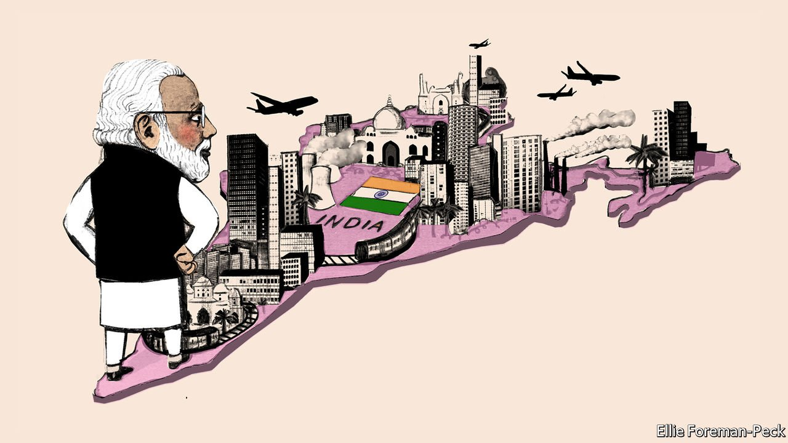
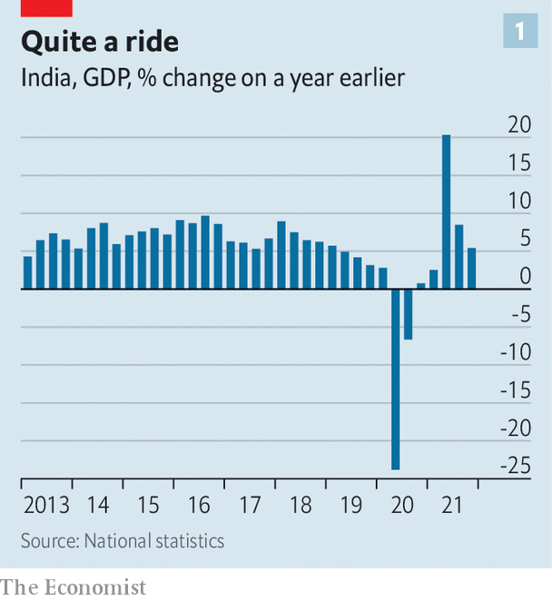
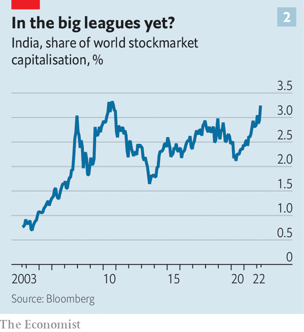
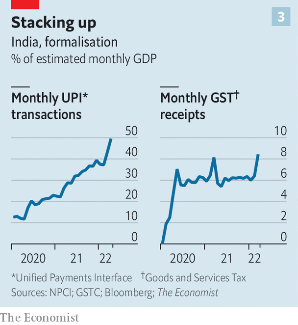
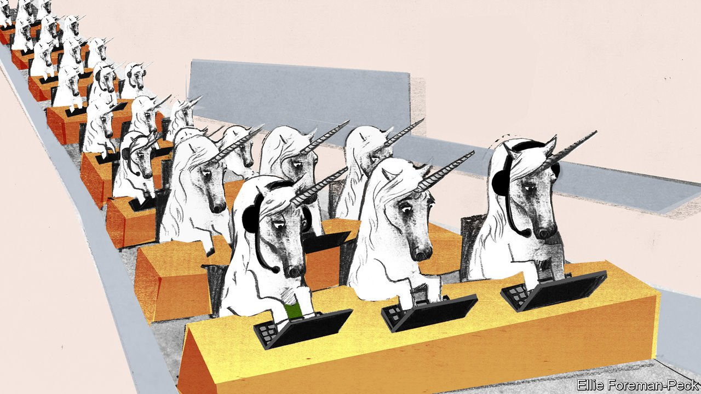

###### A new formula

# India is likely to be the world’s fastest-growing big economy this year 

##### Can the expansion continue? 

 

> May 14th 2022 

THE TRIALS and transformation of India’s economy have an epic quality, reminiscent of 19th-century America. A vast national market is being created, allowing firms to grow from economies of scale. Internal migration is shifting tens of millions of desperately poor people; a brash new consumer class is proliferating and empires are being built on new technologies. Tycoons unleashing vast investments are happy to debate if they are India’s Rockefeller or its Carnegie.

 


In 2014, when Narendra Modi began his first term as prime minister, India was the world’s tenth-largest economy. In the following seven years it grew by 40% (see chart 1); of big economies only China did better, with 53% over the same period. Growth this year of 8% will be the highest among big countries, according to the IMF. It predicts that by 2027 India will be the world’s fifth-largest economy, with a GDP of roughly $5trn at market prices. In terms of the size of its stockmarket it has already reached the number-four spot, behind only America, China and Japan (see chart 2). And with a herd of about 100 unicorns (unlisted startups worth over $1bn), India is third only to America and China.

 


Behind those figures lie ups and downs and bitter controversy. Mr Modi’s decision to void high-denomination banknotes in 2016 saw growth drop from 10% to 5% over the following nine months. A crisis at shadow banks led to a financial scare in 2018, slowing growth again. The lockdowns in the first half of 2020 saw GDP temporarily drop by a quarter.


Yet, as the pandemic recedes, four pillars are clearly visible that will support growth in the next decade: the forging of a single national market; an expansion of industry owing to the renewable-energy shift and a move in supply chains away from China; continued pre-eminence in IT; and a high-tech welfare safety-net for the hundreds of millions left behind by all this.

Mr Modi was elected on a platform of “minimum government, maximum governance”. That is not really what he has served up. There is still a lot of government in India, and the threat that Mr Modi poses to its democratic nature worries observers inside and outside the country. Indeed, one of the reasons India’s performance is less admired than it might be is that people are reluctant to highlight it lest they be seen as endorsing Mr Modi.

But a realistic approach to things which government can and cannot do has paid dividends—despite being based on truths which Mr Modi would never publicly affirm. His government sees that second-best policies forcefully implemented are better than immaculate plans that never happen. It acts on the basis that the country can industrialise, but not as fast as East Asia did. Though it sees the potential in the rise of tech platforms, the shift to clean energy and the redesign of the world’s supply chains, it appreciates that the age of open globalisation that China exploited in the 1990s and 2000s is over. And it knows that if it is to win a continual cycle of elections (the next national poll is in 2024), economic disruption must be combined with instant gratification for the mass of voters.

The first and most important pillar of India’s new growth pattern is the emergence of a single national market in which more firms and consumers use the modern financial system. This is fast superseding regional markets and informal businesses using mainly cash, which accounted for two-fifths of output and 87% of jobs five years ago. Much of the reform and investment underpinning this change predate Mr Modi, but he has expedited them.

Infrastructure is crucial. The national highway network is over 50% longer than it was in 2014 (it also uses a digital tolling system to avoid queues). The number of domestic air passengers has doubled; air-freight volumes are up by 44%. There are more than three times as many mobile-phone base stations, supporting 783m broadband subscribers. Wall Street private-equity firms are competing to create networks of warehouses across India.

 


In addition to all this tarmac and concrete is the “India stack”, a unitary national digital infrastructure created by the state and championed by Mr Modi. This includes Aadhaar, a biometric identity system for all Indians; a push to make sure everyone has a bank account; and a national payments system known as UPI. A huge obstacle to trade between states has been removed by the adoption of a nationwide goods-and-services tax (GST) in place of umpteen local levies. As a result, more businesses are being dragged into the daylight, using modern banking and perhaps paying taxes. Payments via UPI have risen from the equivalent of 13% of monthly GDP in January 2020 to 50% in April 2022. Receipts from GST reached the equivalent of 8% of monthly GDP in April (see chart 3). Tax evasion is getting harder.

Competition in a national marketplace has been bad news for smaller firms that were reliant on tax-dodging and captive markets. The covid-19 slump hit them badly, too: by some estimates, 10-20% have failed during the past few years. Investment by households, which operate lots of tiny informal businesses, has dropped from 16% of GDP a decade ago to 10%. Bigger firms that have brands, scale and technological perspicacity have grown. For example, Titan, the leading firm in the jewellery trade, boosted sales by a third and floor space by a fifth during the pandemic. A new bankruptcy code that makes it harder for zombie firms to stagger on is also spurring consolidation. Formalisation and consolidation, in turn, presage a leap in productivity. McKinsey, a consultancy, reckons India’s top 600 firms are 11 times more productive than the average.

The second pillar of India’s new growth concerns industry. India has long dreamed of becoming a factory for the world. But manufacturing’s share of output has remained stuck at 17-18% over the past decade as corporate investment by all firms has idled at the equivalent of 9-12% of GDP. The country accounts for a paltry 1.9% of global exports of goods.

Bigger and bigger business

Big companies with large cashflows are looking to change this. Saurabh Mukherjea of Marcellus, an asset manager, calculates that India’s top 20 firms earn 50% of corporate India’s cashflows. They are making money fast enough to take risks with their earnings instead of having to borrow to excess. The ambitious giants include conglomerates—Adani (energy, transport), Reliance Industries (telecoms, chemicals, energy, retail), Tata (IT, retail, energy, cars)—and more focused giants such as JSW (mainly steel).

Those four firms alone plan to invest more than $250bn over the next five to eight years in infrastructure and emerging industries; in doing so they intend to develop local supply chains, which fits with government goals. Mukesh Ambani of Reliance says he will cut the price of green hydrogen to $1 per kilogram by 2030, for instance, from about $5 today. Tata is rolling out battery plants, electric vehicles and semiconductors. These are huge, risky bets that few other firms would dare take.

There are worries about excessive corporate power, monopolies and, in some cases, cronyism. If the firms accrue yet more economic power through their investments, such concerns will surely grow. At the moment, though, the ratio of those four firms’ profits to national GDP is 0.7%, half the equivalent ratio for the four tech giants which are currently America’s biggest companies. The government seems happy with big business, given its high reinvestment rates.

Hoping to benefit from multinationals’ efforts to diversify away from China, Mr Modi’s lieutenants are also handing out $26bn in subsidies over the next five years for investment in 14 industries. These “production-linked incentives” (PLIs) pay out as firms’ revenues expand in such fields as solar panels, batteries and pharmaceuticals. Samsung from South Korea and Foxconn from Taiwan are using PLIs to make more mobile phones in India. Local companies, such as Ola Electric, an affiliate of a big ride-hailing firm, are also taking advantage of them. Ola has built a large e-scooter factory 90km from Bangalore with the goal of becoming a global force.

The government wants to catalyse manufacturing. The danger is that benign intentions degenerate into cronyism and protectionism. Still, although $26bn amounts to only roughly 1% of all expected corporate investment over the next five years, in the short run the policy is having the intended effect.

The new edifice’s third pillar is founded on a long-standing strength: technology. India’s IT-services and outsourcing industry has doubled in size over the past decade. Its annual revenues are now $230bn. That has made India the world’s fifth-biggest exporter of services, despite being only 16th in goods. A global shortage of software engineers, and the fact that software is increasingly supplied as a service from the cloud, mean that the trend is likely to continue. India’s biggest difficulty is now finding talent. Some 5m people already work in tech and there is a red-hot market for new workers.

The combination of engineering skills, mobile data and a national tech stack has created lots of startups. They have gone from providing e-commerce, delivery and ride-sharing services for the 10m-20m richest Indians to seeking opportunities further down the economic pyramid. And Bangalore’s low-key tech culture is fostering a new generation of firms that are closer to the global frontier of innovation, for example in space, drones and batteries. Four such “deep-tech” firms that spoke to The Economist all use domestic research and development and are targeting exports for over half of their sales. A rich venture-capital system can finance firms throughout their life-cycle, from angel funding to public offerings (which financial reforms have made easier). A local venture capitalist reckons there is a pipeline of 10,000 plausible startups created each year.

The single market, industrial policy and technology seem likely to bring about a pick-up in growth from the 5.4% year-on-year rate reported in the final quarter of 2021. A mortgage banker says, “I have never seen this kind of demand for loan applications in 40 years.” Demand for electric vehicles is booming, a manufacturer exults. Capital spending is starting to revive, according to an index compiled by CMIE, an analysis firm. Exports are rising.

What, though, of jobs? Formal employment is rising: enrolment in the national social-security scheme for formal blue-collar workers has risen by 19m, to 56m, since early 2020. But that reflects the formalisation of the economy. The share of Indians aged over 15 in work of any sort was 55% in 2012 but only 51% in 2020. Sluggish jobs growth, with a paucity of women in work, are long-standing problems. The jobs that exist are often miserable.

Hence the fourth pillar, digital welfare, with payments for some 300 schemes for needy Indians, from job support to fertiliser subsidies, sent straight to people’s bank accounts. This cuts out bureaucrats and allows spending on a staggering scale. In the year to March, payments reached $81bn, or 3% of GDP, up from 1% four years earlier. Payments have totalled $270bn since 2017. Roughly 950m people have benefited, at an average of $86 per person per year. That makes a difference to struggling households: India’s extreme poverty line is about $250 per person per year at market exchange rates. Mr Modi has not managed to initiate a national jobs boom, but he has created a national safety-net of sorts.

Money for the masses

These four pillars could sustain a transformation of India’s economy over the next decade. It would have a core of highly productive firms. Digital services would mean most people’s consumption took place efficiently in the formal economy (even if their jobs remained informal), raising productivity and channelling funds into the banking system. All this would be taxed, allowing the government to pay for redistribution, using the direct welfare system to placate a great mass of underskilled and under employed people.

One risk to this vision is economic instability. India is dependent on inflows of capital to finance its current-account deficit. Though it uses almost a fifth less oil per unit of GDP than it did a decade ago, almost all of that oil is imported. When interest rates and commodity prices rise, it tends to suffer. Welfare spending has helped push the budget deficit to 10% of GDP and public debt to 87% of GDP. On May 4th India’s central bank raised interest rates from 4% to 4.4% in response to inflation and the global tightening of monetary policy.

 


That said, the financial system is more resilient than it was. Banks’ bad debts have at last been cleaned up. A growing pool of domestic investors offer resilience should foreigners feel forced to flee. And formalisation of the economy gives the government more tax-raising clout.

Another danger is Mr Modi’s style of rule. Businesspeople know he is not the progenitor of all that is working well; he did not invent the tech stack, road-building or unicorns. But they see a government that is more consistent and less corrupt than its predecessor. What is more, his political dominance provides continuity. “They are not ideas guys, but they are open,” says one company founder. “Modi puts the full weight of the system behind it. They are able to kick butt, to get it done.”

A penchant for quick, second-best decisions has costs, though. Intractable problems fester. Despite surging private investment in renewable energy, the state-owned firms that distribute electricity are bankrupt and supply is unreliable. Education remains terrible. Although school enrolment has risen to over 90% for children under 16, many leave barely literate. More efficient welfare is not a substitute for a system in which people are more fully able to realise their potential, rather than be left on tiny farms as automated factories pass them by. Too little is being done to prepare such farms, or the country as a whole, for the ravages of climate change.

There are other disturbing aspects to the mindset of Mr Modi’s BJP. The ideology of self-reliance and habit of tinkering with tariffs could yet morph into full-blown protectionism. The culture of intimidation it fosters in the political world could become a bigger feature of the business world, too. It has already bullied the press and eroded judicial independence.

So far the economy seems to be insulated from the religious tensions that the BJP continuously heightens to sustain itself in power. This is not new. In 2002, in the last big bout of religious violence, over 1,000 people, most of them Muslims, were killed in riots in the state of Gujarat. But the economy shrugged off the horror: the national stockmarket dipped by 4% for a day and then recovered. Gujarat’s GDP grew by 8% the following year, twice as fast as the national economy—growth which helped Mr Modi, then the state’s chief minister, rise to his current office.

Unlike, say, ethnic Chinese in Indonesia, India’s persecuted Muslim minority does not have a disproportionate role in business. Their exclusion reflects discrimination. It also limits the potential scale of any capital flight should things deteriorate further. But there is a chance that sectarian violence could return on a large scale. And Mr Modi’s chauvinism could also damage the economy by destabilising the federal system. Promoting Hindi as a national language goes down badly in the south and Maharashtra, which have disproportionate economic weight. A potential redrawing of India’s parliamentary seats could heighten regional tensions. The government’s sinister tendency to undermine rival sources of power could obfuscate problems and promote cronyism.

Mr Modi wants to restore Indian greatness. For him, that seems to involve not only bolstering Hindu pride at the expense of minorities, but also building a large, integrated, high-tech economy. So far the two ambitions have gone together, but that may not always be so. India’s Rockefellers and tech stars are hoping that the country’s economic modernisation and unification will survive his divisive politics. ■

