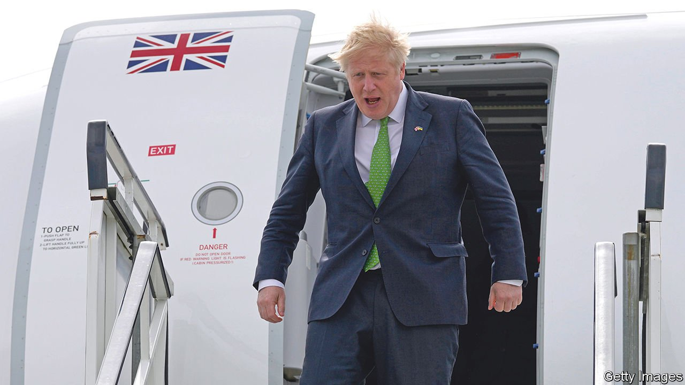

###### A hawk on the wing

# Britain’s security deals with Finland and Sweden shine a light on Boris Johnson 

##### An interview with the British prime minister 

 

> May 14th 2022 

Read  of our interview with the prime minister

“THE INVASION of Ukraine by Vladimir Putin was a massive punctuation point in post-war history,” says Boris Johnson, the British prime minister. “We are now in a new era.” One sign of this new age came on May 11th, when Mr Johnson travelled first to Sweden and then to  to sign “solemn declarations” with the leaders of both countries; in each case the signatories affirmed that should either one be attacked, the other would be ready to respond with military aid. Another sign came the next day, when Finland’s leaders announced they favoured joining NATO.

The events of this week underscore the dramatic changes in Europe’s security landscape since Mr Putin’s decision to invade on February 24th. They also shed light on Britain’s place in Europe and illustrate Mr Johnson’s frustrating duality— and timid at home.


Start with the pacts.  in the cold war, and Sweden hasn’t fought a big conventional war in 200 years. With  now moving swiftly towards NATO membership, the agreements with Britain offer particular reassurance against Russian attack during the “grey-zone period” between applying to join and ratification of their membership. If they do join the alliance, “it would be a complete repudiation of Putin’s assumptions,” says Mr Johnson, speaking to The Economist on the plane back to London.

Sceptics might say that making commitments is easy when the risk of a conventional assault is low, at least in the immediate future.  in Ukraine and barely has the manpower to advance in the Donbas region, let alone turn its attention to Finland and Sweden. “Looking at Russian military forces right now, they are rather occupied in Ukraine,” noted Magdalena Andersson, the Swedish prime minister.

Finnish and Swedish officials think that a far bigger risk is a prolonged and intense campaign of “hybrid” warfare—meaning cyber-attacks on critical infrastructure, incursions by Russian warplanes, disinformation campaigns and the like. The agreements cover closer co-operation in areas such as intelligence-sharing and cyber-security, and are meant to stand in perpetuity. “Are we safer with this agreement? Yes, we are. Of course this means something,” Ms Andersson concluded.

The deals fit with Britain’s evolution over the past decade into one of the most active defenders of NATO’s northern flank and eastern front. It is central to a network of bilateral pacts and groupings, including the Joint Expeditionary Force, a cluster of ten states around the Baltic and the North Sea. Britain shunned a treaty on foreign policy and security when it left the EU. As a result, says Richard Whitman of the University of Kent, its policy in Europe resembles a “Polo mint”: it has a hard outer rim, and a hole in the middle.

Hard-edged is a good way of describing Mr Johnson’s view of the war in Ukraine. Dmytro Kuleba, Ukraine’s foreign minister, has raised the country’s goals to nothing less than the liberation of the territories invaded by Russia in 2014. Ukraine’s war aims are a matter for them, but that aspiration is “entirely logical”, Mr Johnson says. Ukrainians feel they cannot “negotiate sensibly with someone who is in the process of trying to devour their country. And I have to say I agree with them. So everyone is then forced into the same logical position, which is the only answer is to keep going until Putin is back to the status quo ante of February 24th—at least.”

In the long run, he says, the West must help Ukraine through a “doctrine of deterrence by denial. So that even without invoking the question of NATO membership, Ukraine is being given NATO-compatible weaponry, training and intelligence sharing of such quality and quantity that no one will ever invade Ukraine again.”

Mr Johnson’s hawkish tone is not shared by other European leaders. In a speech on May 9th President Emmanuel Macron of France suggested a means must be found to spare Russia “humiliation”. Mr Johnson discounts this concern. “It is one of the paradoxical advantages of the situation that the strength of Putin’s popular support gives him the opportunity actually to be completely flexible. And to say, for instance, that certain objectives have been achieved, ‘denazification’, whatever, and that’s why the operation is over.”

Mr Macron’s idea of a community of EU and non-EU states that co-operate on security, migration and more is also likely to fall on stony ground. “I think most fair-minded observers would say that after some sort of initial anxieties and hesitations, an independent UK foreign policy has really been important,” says Mr Johnson. “I think that our ability to take decisions at speed, to be out in front, to campaign for outcomes that we want, that we think are right has been very valuable…we are able to give a lead in a different way.”

Fair-minded observers might also point out that Britain has been far from the biggest donor to Ukraine, in cash terms or as a share of GDP, and not particularly generous in taking refugees. But its policy has had a nimbleness which has won Mr Johnson a genuine and widespread gratitude in Ukraine itself. Britain was dispatching anti- tank weapons before the invasion began; Mr Johnson was the first western European leader to walk the streets of Kyiv after the repulse of the Russian assault, and the first to address its parliament.

Mr Johnson is hardly the architect of Britain’s policy in Ukraine, notes Robin Niblett of Chatham House, a think-tank. Rather, he has been following a trajectory, largely shaped by the Ministry of Defence, of preparing Ukraine against Russian aggression that has been in place since 2015. But the prime minister deserves credit for not recoiling as the crisis emerged, says Mr Niblett. “He’s been looking for a bigger purpose for British policy. Sometimes history throws you a card, and your positioning could be just right.”

The contrast with Mr Johnson’s timidity at home is striking. A fear of aggravating his backbench MPs and core voters was on full display on May 10th in a safety-first Queen’s Speech, which laid out the government’s legislative programme for the coming parliamentary session. His bombast often seems clownish, his character questionable, and his judgment weak: threats to rip up Britain’s deal with the EU over trade arrangements in Northern Ireland are deeply wrong-headed.

But on Ukraine at least, and in his commitments to Sweden and Finland, flourish and boldness have served Mr Johnson well. His predecessor, Theresa May, flew on a plane decked in dull air-force grey. These days it is liveried in red, white and blue, with gold lettering down the fuselage. ■

Read more of our recent coverage of the 

