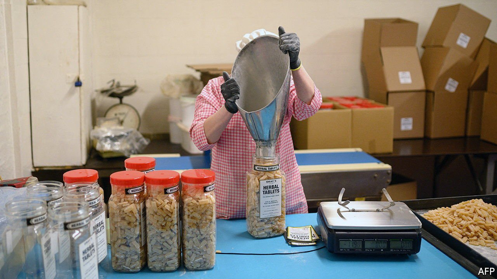
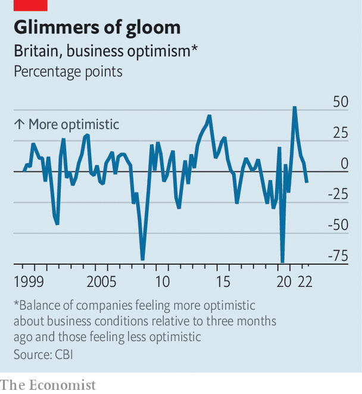

###### The cost of doing business

# Businesses in Britain are not as gloomy as consumers. Yet 

##### Prices and interest rates are rising, so why hasn’t corporate confidence fallen more? 

 

> May 12th 2022 

SIMON BOYD of REIDsteel, an engineering firm, is haunted by rising taxes, high energy prices and expensive raw materials. He complains of “scary spikes” in the firm’s costs. Over the past two years he has seen steel almost quadruple in price, and in October he expects energy bills to double—at least. (There is no energy-price cap for companies, unlike households.)

Mr Boyd is not suffering alone. In March manufacturers’ input prices were 19% higher than a year earlier, the sharpest increase since records began in 1997. Service providers are reporting record-breaking rises in costs, too. After dipping during 2020, the rate of corporate insolvencies is now higher than in 2019. The British Chambers of Commerce, a business association, wants an emergency budget to provide tax relief. On March 12th it emerged that the economy had contracted in March.

 


Yet for all the bad news, business confidence in Britain is a puzzle. Though falling (see chart), it has not plummeted in the way it has for consumers, among whom confidence is at its lowest since the financial crisis. In March the OECD, a club of mostly rich countries, recorded the largest gap between business and consumer confidence since records began in 1977. Why?

Anna Leach of the Confederation of British Industry, a business association, thinks that the relatively gradual creep of businesses’ costs has normalised their pain. Paul Dales of Capital Economics, a consultancy, also suggests that the energy-price increases could be concentrated in a few industries. According to calculations by The Economist, businesses accounting for around a quarter of private-sector output consume as much as half of its gas and electricity (excluding firms that produce and distribute energy themselves).

Businesses are still feeling relatively optimistic about their ability to pass on price rises to their customers. A survey run by the Bank of England suggested that in April managers expected prices to grow by a little over 6% over the next year, and for revenue to grow by over 9%. All the attention on inflation may be making it easier for businesses to push climbing costs onto their customers. Whereas companies may be in a position to negotiate inflation ratchets into their contracts, households are less able to protect themselves.

For now firms are still hoping to hire more people than average, and redundancy notifications remain low. But there is a strong chance that the corporate mood will become as dark as that of consumers. The Bank of England is trying to curb inflation by raising interest rates: that means higher corporate borrowing costs. Soggy consumer spending will dampen revenue projections. A row with the EU over the Northern Ireland protocol would add uncertainty.

On May 5th the Bank of England predicted that growth would slow sharply, partly because of the decline in households’ real incomes but also because of squeezed profit margins. Those with an eye on Britain’s longer-term growth will be studying both investment intentions and investment itself. Uncertainty over the macroeconomic environment could weigh on both, in which case productivity will suffer. If so, an acute problem would compound a chronic one. ■

