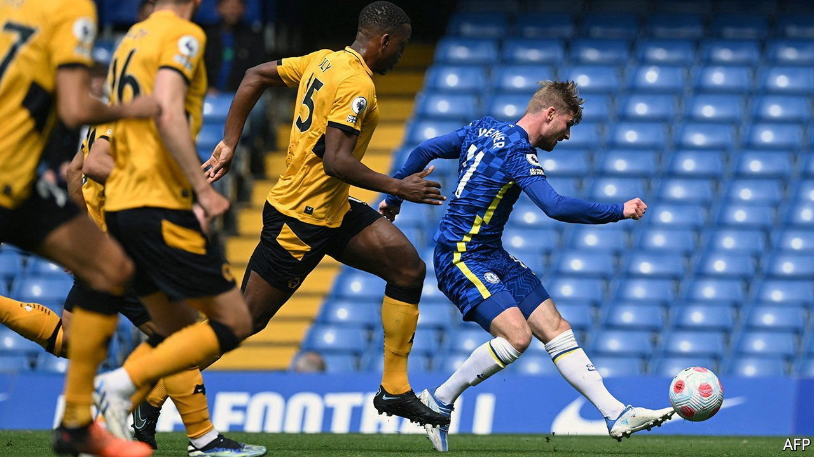
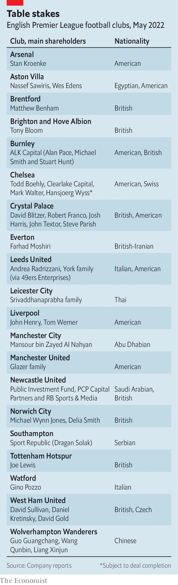

###### Fall of the Roman empire

# Chelsea is the latest Premier League club to fall into American hands 

##### Roman Abramovich’s exit underscores big changes in English football 

 

> May 14th 2022 

THE EFFECTS of war are rarely confined to the battlefield. Sport felt the ripples from Russia’s  almost at once, with the banning of the country’s football team from the World Cup and its athletes from the Paralympic Games in Beijing. Now the forced sale of Chelsea, a west London football club owned since 2003 by Roman Abramovich, an  under British government sanctions, is about to transfer a prestigious Russian asset into American hands.

On May 7th a consortium headed by Todd Boehly, owner of the Los Angeles Dodgers baseball team, and including Clearlake Capital, a Californian private-equity firm, agreed to buy Chelsea for £2.5bn ($3.1bn). Mr Abramovich, his British , will not see a penny. (He had promised to give the proceeds to “all the victims of the war in Ukraine”, but what happens to the money is for the government to decide.)


The sum, thought to be the highest yet paid for a sports team, reflects not only Chelsea’s stature in the game (lying third in the Premier League, and last year’s European champions) but the commercial appeal of English football. Chelsea will be the eighth of the league’s 20 clubs in which Americans have a meaty stake. Whereas some club owners, like the Middle Easterners in charge at Manchester City and Newcastle United, are also interested in football’s soft power, American investors tend to be focused on the bottom line.

 


Other owners from across the pond have similarly added Premier League teams to broad portfolios of sports assets. Arsenal’s Stan Kroenke also has American football, “soccer”, ice hockey and basketball franchises. The Glazer family, who control Manchester United, own the Tampa Bay Buccaneers, an American football team. For American investors, says Simon Chadwick of Emlyon Business School, “it’s often all about selling” (Manchester United has even had an official paint partner). The Premier League, he says, has a global appeal that US sports cannot match.

Television is clubs’ main source of income. An annual survey of European football finance by Deloitte, a firm of consultants, indicates that in the three full seasons before covid-19 struck, England’s six leading clubs by revenue got 45% of their income, or €4.3bn ($4.9bn), from broadcasting—which depends partly on league position and on participation in European competition. A further 38% came from commercial sources (such as sponsorship and merchandise) and the rest from match days. Even when income falls short, as happened during the pandemic, investors in big football clubs have still seen their assets rise in value, rather like houses in a booming property market.

Chelsea’s weakest link is its match-day revenues. As well as buying out Mr Abramovich, Mr Boehly and his colleagues have promised to invest in an upgrade of Stamford Bridge, Chelsea’s ageing stadium. Its age and size—it holds around 40,000 people—limit the club’s earning power. Chelsea’s match-day revenues trail those of other top clubs, notably its north London rivals, Arsenal and Tottenham Hotspur, which both have newer stadiums holding more than 60,000.

Redevelopment will be tricky, however. Stamford Bridge is hemmed in, and London land is pricey. How Mr Boehly and Clearlake must envy John Henry, the American owner of Liverpool football club (and the Boston Red Sox baseball team). To modernise its Anfield stadium, Liverpool bought and demolished neighbouring streets of terraced houses. Next year capacity at the ground will exceed 60,000, a third more than in 2016.

Mr Abramovich’s purchase of Chelsea marked the start of a new era in the game: of foreign owners, big-name managers and lavish spending. He bankrolled an extraordinary run of success, which brought five domestic championships (Chelsea’s only previous win was in 1955) and two European ones. But he regarded the club as an expensive toy as much as a commercial proposition; the club lost hundreds of millions, which he covered with interest-free loans. The new owners will be of a different stripe. ■

