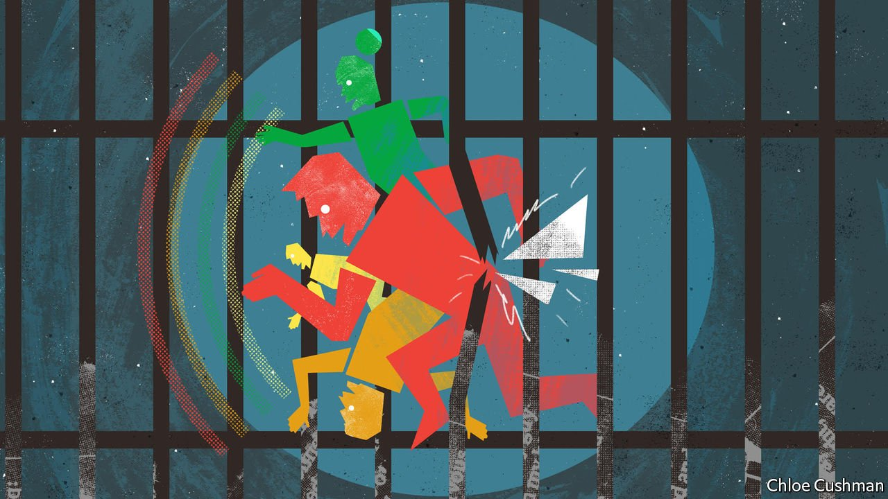

###### Bagehot

# Labour and the Liberal Democrats are learning to play nicely with each other 

##### Escaping the progressive prisoner’s dilemma 

 

> May 14th 2022 

A HIERARCHY OF hate exists on the progressive wing of British politics. True, Labour wallahs may not like their Conservative colleagues. But they save their real contempt for the Liberal Democrats, whom they deride as spineless cynics and dirty campaigners. In a feat of projection, the Lib Dems detest the Greens because it is annoying to have a small party with no chance of power snatch precious votes. Meanwhile, everyone loathes the Scottish National Party (SNP) to the point that, when its Westminster leader, Ian Blackford, rises to speak in the House of Commons, an audible groan often echoes around the chamber.

Progressive parties in Britain struggle to work together, which keeps them out of power. That is not because of a lack of voters. Surprisingly, for a country that usually elects Conservative governments, the bulk of British voters support progressive parties. In every post-war election bar 2015, more voters supported progressive parties (Labour, the Liberal Democrats, the SNP and the Greens) than conservative ones (the Conservative Party and its cousins on the radical right). Yet, owing to the iniquities of Britain’s first-past-the-post electoral system, the government usually has a conservative bent.


In effect, Britain’s progressive parties are stuck in a prisoner’s dilemma. Co-operation would be better for all, yet they never quite manage it. Signs are emerging, however, that the dilemma has been solved. Changing electoral geography, a shift in Labour’s politics and canny voting behaviour suggest that Britain’s progressive parties could, for once, be more than the sum of their parts. Although Labour are only slightly ahead of, or level with, the Conservatives in most polls, progressive parties have a 20-point lead over their conservative rivals. A happy equilibrium has been reached. The prisoners could soon escape.

For starters, there is less incentive to fight each other. Progressive parties no longer tread on the turf of their peers. Sheffield Hallam, a leafy suburb of the Yorkshire city, is the only marginal constituency where Labour faces off against the Lib Dems. The Lib Dems predominantly battle the Conservatives in tighter races: around 70 of their 90 winnable target seats are Tory-held. As a result, peace has broken out in recent by-elections. Labour barely put up a fight in North Shropshire, when the previously safe Conservative seat fell to the Lib Dems. A similar strategy will be employed in forthcoming by-elections. A new era of non-aggression between the two parties, similar to one in the 1990s, is under way.

There is also less to scrap over in terms of ideology. Politics has settled down after a frenzied period, when both Labour and Conservatives dabbled in populism on the left and right. Brexit is no longer the be-all-and-end-all of British politics. Jeremy Corbyn, the fomer, hard-left Labour leader, made those wavering between the Lib Dems and the Conservatives nervous about not plumping for the Tories. Now, Labour is a more centrist option. Sir Keir Starmer was elected to lead the party on a soft-left ticket, and has since dragged Labour even more to the right. A mushy consensus blurs the lines between Labour, the Lib Dems and the SNP.

That means progressive parties can focus on their target voters. If there is no challenge from rival parties for their metropolitan base, Labour can focus on winning seats that turned Tory at the last election. Likewise, the Liberal Democrats have previously been an incoherent mixture of low-tax liberals and disaffected social democrats. Now the party can focus on well-off, liberal Conservative voters in southern England. Call them Tesla Tories: those voters who were happy under David Cameron but chafe at the populist diet of illiberalism and tax rises served up by Boris Johnson.

Across southern England, Conservative MPs are nervous. Councils such as Somerset fell to the Lib Dems in local elections on May 5th. Talk of “levelling up” northern England sounds a lot like taking tax revenues raised in the south and spending them in the north. If Conservative voters in the Home Counties wanted that, they would have voted Labour in the first place. To placate them the Conservatives could admit that levelling up involves little money actually being spent. But that would upset their new supporters. Clinging on to both sets of voters, without the centripetal force of Brexit, is a tricky task.

It is one made harder by the efficiency of the Conservative vote. British politics follows the same principles as Wilkins Micawber’s finances. Theresa May managed 42.4% of the vote in 2017. Result: misery, and a hung parliament. In 2019 Mr Johnson won an extra 300,000 votes, hitting 43.6%. Result: happiness, and an 80-seat majority. A small swing has a big effect. British politics obsesses over the newest marginal voter—the extra shilling in Mr Micawber’s formula. It was new voters across the Midlands and northern England that won Mr Johnson his majority. It is forgotten Conservative voters in the south of England who stand to take it away.

Knight, knight Boris

A formal deal between progressive parties would either be pointless or harmful. Scottish independence would become a live issue if the SNP were involved in a pact. Oliver Dowden, part Conservative Party chairman and part political Rottweiler, accused Labour and the Liberal Democrats of a secret stitch-up ahead of the local elections. By causing a fuss, the hope is that a Tesla Tory in Winchester may still blanch at voting Lib Dem because of the thought of a Labour-led government. The truth is that there is no need for a formal pact when a tacit one is already in place.

Breaking out of jail will be the easy bit. Even pollsters optimistic about Labour’s chances think that a governing coalition of opposition parties is likely to be a total mess. Any such coalition would probably consist of three parties, or a complicated confidence-and-supply deal, in which junior parties support a Labour government on specific votes. The progressive parties do still hate each other, after all. But being in power beats being in prison. ■

 (May 7th) (Apr 30th)

 (Apr 23rd)

