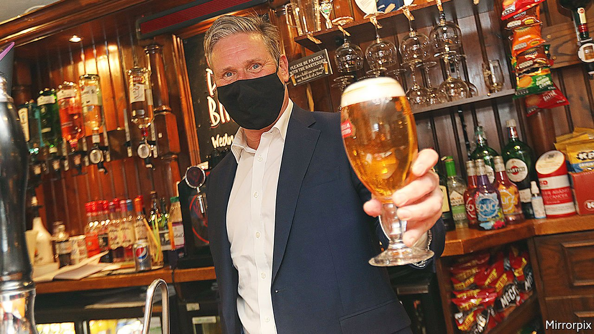

###### Partygate 2

# Sir Beer Starmer 

##### A late-night beer and curry may end the Labour leader’s career 

 

> May 12th 2022 

ON FRIDAY APRIL 30TH 2021, at around 10pm, a £200 ($248) order of takeaway curry arrived at a Labour Party constituency office in Durham. A year on, the circumstances surrounding the delivery are subject to a police investigation that will decide the future of Sir Keir Starmer, the Labour leader.

Last year’s local elections took place during a partial lockdown. After a day of campaigning in north-east England, Sir Keir was recorded through a window drinking a beer while waiting for the fateful curry. The Labour leader insisted that since this was a work event, it was legal. After finishing his bottle of beer, he returned to the political coalface, firing off missives about the following day.


But one witness claims no work was done and that it was, in effect, an end-of-week bash. After complaints from a local Conservative MP, Durham police decided to examine the case. And on May 9th Sir Keir pledged to step down if fined by the police for breaking lockdown rules.

Sir Keir’s curry is the latest twist in a long-running scandal. For the past six months, British politics has largely been shaped by who drank what, where and when during a series of lockdown-busting parties in 2020 and 2021. Anger rose after it emerged that Downing Street and parts of Whitehall had hosted a series of soirées throughout the peak of lockdown. Juicy details, such as civil servants smuggling a suitcase full of wine into Downing Street, triggered apoplexy among voters and a slump in Boris Johnson’s poll ratings.

In April the prime minister became the first holder of that office to be fined for breaking the law. However, his £50 penalty was related to the least egregious event, in June 2020, when officials gathered to sing Mr Johnson “Happy Birthday” in the middle of the working day. Rishi Sunak, the teetotal chancellor, who was there because he had arrived early for a meeting, was also fined. Far worse allegations, including an ABBA-inspired party in Mr Johnson’s private Downing Street flat, still hang over the prime minister. But because Sir Keir called on both to resign over the birthday-party fines, the Labour leader has pledged to do the same if he gets one.

Sir Keir’s decision to stake his political career on a decision by a regional police force is risky. But he would have faced pressure to quit in the event of a fine, or look a hypocrite. Sir Keir, a former director of public prosecutions, has pitched himself as a man who follows rules, unlike Mr Johnson, who revels in breaking them.

This is not a new strategy. Sir Tony Blair employed a similar tactic in the middle of the cash-for-peerages scandal, when Labour donors were pledged seats in the House of Lords, in the final years of his tenure. Advisers let it be known that the then prime minister would resign if interviewed under caution. The upshot was that police skipped over Sir Tony in their inquiries. Sir Keir has some wriggle-room, too: if police say he broke the rules but choose not to fine him, he will stay in office.

“Beergate”, as the scandal is lazily known, is the Labour leader’s first taste of a Fleet Street monstering. Photos of the event first appeared in the Sun, a tabloid, at the start of 2022. Conservative MPs recirculated them as a cheap hit ahead of local elections on May 5th. From there things snowballed into a fortnight of stories that repeatedly graced the front pages of pro-government newspapers such as the Sun and the Daily Mail. If Sir Keir steps down, it would show that these papers still have a lot of clout, even if they have fewer readers than of old. ■

