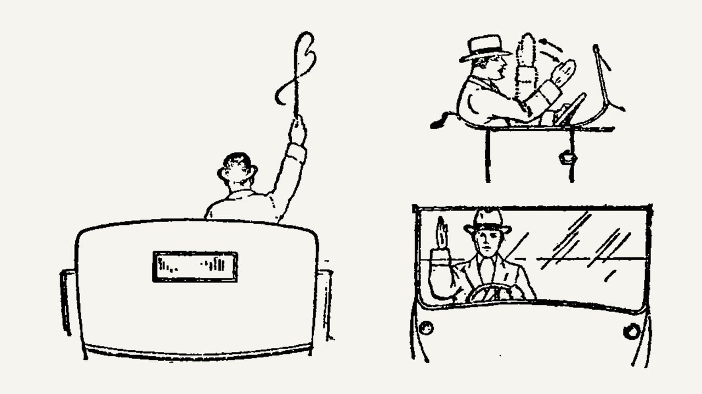

###### Codes of conduct

# The Highway Code tops the bestseller lists, again 

##### One of the most-read books of the 20th century is reissued 

 

> May 14th 2022 

LAST MONTH a slim volume rose to the top of British bestseller lists. It outsold Kazuo Ishiguro, trounced Julian Barnes and outstripped Richard Osman. It deserved its place: its illustrations are iconic; its prose as familiar and powerful as poetry. Few who have read it could forget the lapidary simplicity of its most famous line: “Remember: Mirrors-Signal-Manoeuvre.” It is “The Official Highway Code”.

Few cultural critics spend much time thinking about the Highway Code. They should. It is arguably one of the most influential British books of the 20th century—and certainly one of the most read. Some 24m copies of the 1959 edition were printed, and 14m of them were distributed free. It has topped the bestseller lists repeatedly, and over the past 20 years has outsold Jo Nesbo, John le Carré and William Shakespeare. The latest edition, published in April, sold 19,000 copies in a single week. As the Bible was in another era, it is a staple of British bookshelves.


The Bible and the Code share other qualities. Both issue large numbers of commandments. Both are obsessed by mortality, albeit in rather different ways. Where the Bible observes that we walk in the valley of the shadow of death, the Highway Code notes that the shadows are darker and death more probable when cars speed, since “At 40mph your vehicle will probably kill any pedestrians that it hits.”

The frail flesh of man was the genesis of the Code. Britain’s first victim was killed on the roads in 1896. The coroner hoped that “such a thing would never happen again”. It did. By the time the first edition of the Code was printed in 1931, Britain’s fleet of motorised vehicles had risen to 2.3m and the annual total of those killed on the road had risen to over 7,000. (Today Britain has over ten times as many vehicles but around a quarter as many deaths.) A code of conduct was needed.

Whether or not it instantly improved safety is not clear, for the instructions contained within early editions could be eccentric. The 1931 edition told drivers that to indicate a “TURN to my RIGHT” they should extend their right arm out of the car and hold it “ rigid in a horizontal position straight”. To indicate a “TURN to my LEFT” they had to repeat the procedure, but flap their arm up and down while “keeping the wrist loose”. To overtake, a driver should first sound his horn; perhaps to allow other drivers to retract their arms first.

The Code was a product of its time. Its pages accept that other users of the road might include sheep, herds of cattle and even “a pack of hounds”, but absolutely nowhere does it indicate that any of those other users might be women. All the drivers are, without exception, “he”. Children appear, to be told to stay out of the way: they are to be warned “of the dangers of the road” and how to avoid them. And though the Code lacks women, it does contain instructions on how to drive a horse-drawn carriage on the road (for right turns, first, “Rotate the whip above the head…”).

Its editions chronicle a changing world. In the first, its drivers wear cravats, panama hats and an imperious air. Like “Brideshead Revisited” and “The Wind in the Willows”, it evokes an era when cars were roofless, driving was glamorous and roads largely lawless. In an opening scene in Brideshead, Charles Ryder and Sebastian Flyte set off with “a motor-car and a basket of strawberries and a bottle of Chateau-Peyraguey”, drive to the country and drink till “the golden wine seemed to…hold us suspended” above the turf. By later editions, the Code included other kinds of suspension for drinking. The 2022 edition warns, bluntly: “Do not drink and drive”.

Later editions of the Code show a country metamorphosing as driving became more popular. From the 1950s motorways unspooled and old road signs were redesigned. In Hyde Park graphic designers drove repeatedly past boards of different colours to see which were most readable at speed. They chose bright blue for motorways and green for A-roads. A new, sans-serif font—”Transport”—was created. The designer Margaret Calvert came up with the “Men at Work” sign (people told her it looked more like “Man having difficulty with a large umbrella”). Her “School Children Crossing” sign, based on her as a child, may be the best-known self-portrait in the country.

Cultural indicator

The Code kept on changing. The 1968 edition was welcomed by a speech in Parliament noting the tightening of laws on seat belts and speed limits, breathalysers and road markings. “Semaphore signals,” one politician observed with pleasure, “are almost a thing of the past.”

Progressive editions hint at the democratisation of driving, and of Britain. The 1968 edition was rewritten in part because the previous one had “used too many long words”. The most recent Code involved a consultation of almost 21,000 people, who were asked whether its wording was clear. It offers absolutely no guidance on what do when you meet “a pack of hounds”—but does include large numbers of images of women using the roads.

Above all, the Code chronicles the demise of the golden age of motoring. In its pages, driving changes from glamorous, to dangerous, to a chore that many would rather avoid. Plans are already being made for a new version that will allow for driverless cars and watching films at the wheel. And it chronicles a world that is ceasing to capitulate to the car. No longer must children avoid cars: cars must avoid them. The latest Code has a hierarchy of road users: pedestrians are at the very top; motorised vehicles are at the bottom. And no one is wearing a cravat. ■

