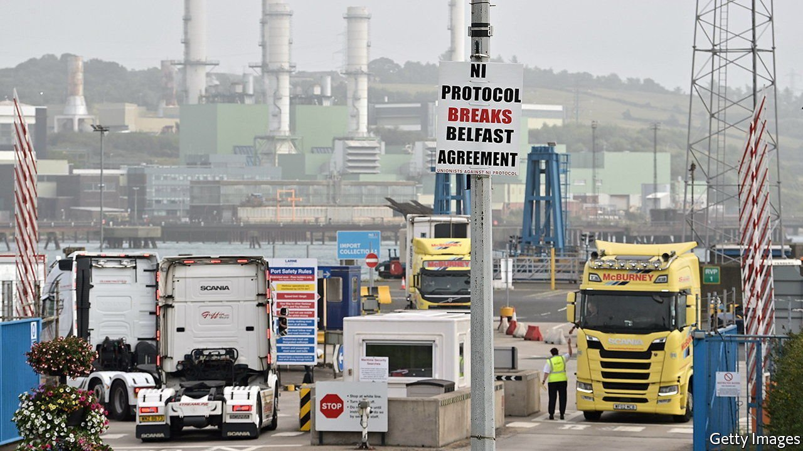

###### The aftermath of Brexit

# The Northern Ireland protocol could soon spark a new row between Britain and Europe 

##### Boris Johnson prepares to renege on the Brexit treaty 

 

> May 14th 2022 

MOST OF THE excitement over Northern Ireland’s assembly election on May 5th focused on Sinn Féin , and on the prospects of a united Ireland. But talk of reunification is speculative. The far more pressing concern is the , part of the Brexit withdrawal treaty that keeps the province (but not Great Britain) in the EU’s single market for goods, thereby creating a customs border in the Irish Sea.

The Democratic Unionist Party (DUP), which came second to Sinn Féin, dislikes the protocol for undermining Northern Ireland’s ties with “the mainland”. It is refusing to rejoin the executive until the protocol is scrapped or radically altered. In response Liz Truss, the foreign secretary, reportedly plans to put forward a new bill to ditch most of the protocol within days. That would be a terrible idea.


First, it would be an undemocratic response to a new assembly that, says Katy Hayward of Queen’s University Belfast, has a 54-36 majority of members in favour of keeping a tweaked protocol. This is not a body that will vote down the protocol when the treaty allows it to in 2024. Second, disowning a treaty that Boris Johnson himself negotiated, signed and triumphantly ratified 30 months ago would break international law (though Suella Braverman, the attorney-general, apparently thinks differently). Claims that he was forced into it or that the protocol was always meant to be temporary are false.

Third, unilateral suspension of the protocol cannot solve the trilemma that led to the protocol’s creation: the impossibility of leaving the single market but having no border controls either north-south with Ireland or east-west with Great Britain. By further undermining mutual trust, unilateral action would also squash any chance of successful negotiations to moderate the protocol’s application.


For despite Ms Truss’s impatience after months of such talks, they could yet help. The EU offered concessions last October that it said would eliminate up to 80% of checks at the sea border. It has accepted free movement of medicines. More could be done to reduce customs inspections and facilitate freer transport of pets and online deliveries. And the government could move towards closer alignment with EU food-safety standards, pleasing British farmers. But it would be nigh-on impossible for any of this to be agreed if one side forfeits trust by reneging on the treaty.

Worse, scrapping the protocol unilaterally could spark a legal battle with the EU that might spiral out of control. Mujtaba Rahman of the Eurasia Group, a consultancy, thinks the EU will be cautious before starting a trade war, not least because it knows any bill may be blocked in the House of Lords. But the bloc will not renegotiate the withdrawal treaty and it will resume legal action against Britain for failing to implement the protocol in full. Controls at Calais may be tightened, lengthening queues at Dover. When there is a premium on Western unity against Russia’s invasion of Ukraine, and the economy is in trouble, confrontation is especially misconceived.

Even the domestic politics look poor. Ms Truss may gain kudos with hardline Tory Brexiteers,  of leading the party. And Mr Johnson may hope that voters will always back him in any dispute with Brussels. But having won the 2019 election on the promise of getting Brexit “done”, another huge row would remind people that it really isn’t. ■

For more coverage of matters relating to Brexit, visit our 

