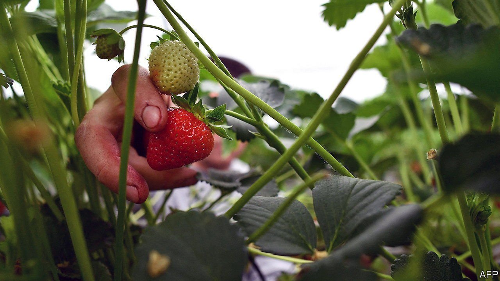

###### Berry big problem


# Ukrainian seasonal workers pick much of Britain’s fruit 


##### That points to a labour crunch this year 

 


> May 14th 2022 


NEARLY ALL of the berries eaten in Britain between May and October are home-grown. Of roughly 30,000 seasonal-work visas issued to workers to pick the 2021 harvest, 67% went to Ukrainians and 8% to Russians. This year, many will stay away, not least because most Ukrainian men have been forbidden to leave the country since the Russian invasion. Recruiters are struggling to fill the gap, which means fruit is bound to be wasted. Nearly 8,000 tonnes of berries rotted in 2021 because of a shortage of pickers.

 

