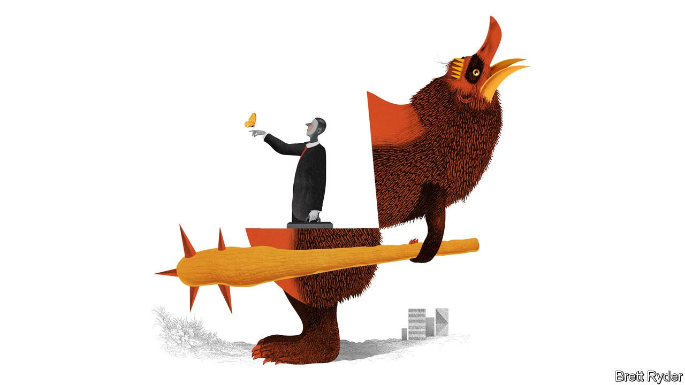

###### Schumpeter

# Activist investors are becoming tamer 

##### They must not become extinct 

 

> May 14th 2022 

“WHEN WE GO at ’em,” Carl Icahn growls, proudly, “we go at ’em.” After decades as chief executives’ number-one tormentor, the 86-year-old’s disdain for them has softened only a tad. “I wouldn’t call them buffoons,” he told Schumpeter recently, “but, with many exceptions, they are in way over their heads.” Mr Icahn continues to browbeat managers for poor performance. As The Economist went to press he was in the final throes of a fight with Southwest Gas, a utility. His gripes are broadening, too. This month and next he will seek to oust directors at McDonald’s and Kroger over the treatment of sows. Yet Mr Icahn also considers himself a vanishing breed. “Activism is dying,” he laments.

Not on paper. In the first quarter of the year activists launched 73 campaigns, the busiest three months since Lazard, an advisory firm, began keeping track in 2014. This week Bluebell, a newish activist fund based in London that made its name last year by ousting the boss of Danone, a struggling French yogurt-maker, set its sights on Saint-Gobain, another icon of France SA. Still, Mr Icahn has a point. Activism isn’t what it used to be.


Activist investing, simply defined, involves buying a stake in a company, then pushing for change. Activists might urge a firm to boot out its boss or sell a subsidiary, say, in the hope of driving up the share price. Mr Icahn became an activist to correct what he deems a broad failing of corporate boards to oversee management. “I’m no genius,” he says, “but I made billions and billions of dollars from this crazy system.”

In making their billions and billions, activists would pair financial acumen with ferocious insults, hurled mostly at companies but sometimes also at each other. After Bill Ackman of Pershing Square, a hedge fund, bet against Herbalife, Mr Icahn invested in the multilevel marketing firm. In a notorious televised spat between the two of them in 2013, Mr Icahn called Mr Ackman a “crybaby” and declared, “I wouldn’t invest with you if you were the last man on Earth.” Activists’ open letters to firms are only slightly more temperate. “Years of value destruction and strategic blunders”, Daniel Loeb of Third Point, another fund, wrote to one boss in 2005, “have led us to dub you one of the most dangerous and incompetent executives in America.” In 2018 Third Point’s quest to sack the board of Campbell Soup included a video in which the company’s famous jingle morphed from “mmm, mmm, good” to “mmm, mmm, BAD”.

For CEOs, such antics pose a headache at best, requiring expensive lawyers, bankers, proxy advisers and public-relations gurus. Targeted bosses have occasionally struggled to keep their cool. In 2017 Arconic, an industrial firm, faced a campaign from Paul Singer’s Elliott Management. Klaus Kleinfeld, Arconic’s chief executive, wrote a letter alluding to a raucous trip to the World Cup and suggesting that Mr Singer might have performed “Singin’ in the Rain” in a fountain. Mr Kleinfeld resigned soon after.

In the past few years such altercations have grown rarer. That is partly because there are plenty of newcomers who lack the old guard’s abrasive ways—even if some, such as Politan or Mantle Ridge, were founded by alumni of the veteran funds. First-time activists accounted for 25% of the campaigns launched in the first quarter, according to Lazard, up from 17% in 2019. But some veterans, too, are mellowing with age. In March Mr Ackman declared that his firm had retired permanently from activist short-selling, which he called the “noisiest form of activism” (unsurprising, perhaps, given his volatile record on such gambles). Elliott has built a buy-out arm, so it can take companies private rather than simply badgering them in public. In March it helped lead a consortium to acquire Nielsen, a data company, for $16bn.

Activism is, in other words, becoming if not dull, exactly, then more subtle. Many activists are choosing to operate quietly, pushing a company’s board in private and preserving the ability to grumble in public if the board resists. “Several years ago, when activism was a narrow asset class, the personalities were as big a focus as the actual substance of the campaigns,” says Avinash Mehrotra of Goldman Sachs. Now Mr Mehrotra reckons that for every public campaign on which the investment bank advises a company, it is working on four to five times as many private ones. Politan’s campaign last year at Centene, a health insurer, had little press coverage before an agreement was announced to replace the firm’s boss and add new board members. In quiet campaigns, says another activist investor, the public sees no engagement followed by the “kumbaya” result. Even Mr Loeb has adopted a new tone. He wants Amazon to spin off its cloud business; in a letter in February he praised “Amazon’s talented and focused new CEO Andy Jassy”, seeming less inclined to kick Mr Jassy’s backside than to kiss it.

The risk of rewilding

Just as activists are becoming less confrontational, though, regulators are turning more so. Although America’s Securities and Exchange Commission (SEC) is making it easier for investors to elect their candidates to corporate boards, in other ways the stock market watchdog is making activism harder. A new definition of a “group” would limit activists’ ability to make their case to other shareholders. Another rule would require quick disclosure of ownership of derivatives, which could push up the target’s share price, sapping the incentive to build a large stake. Tellingly, the proposals are supported by corporate lobbies such as the Business Roundtable. Elliott, in comments filed to the SEC, warned that the rules would “virtually shut down activism”.

That would be too bad. Research shows that activism lifts returns for activists and long-term value for other shareholders. Robert Eccles of Saïd Business School and Shivaram Rajgobal of Columbia Business School have told the SEC its rules would lead to “less value creation, worse governance, and more acrimony at public companies”. No one wants that—least of all the gadflies. ■

Read more from Schumpeter, our columnist on global business: (May 7th)

 (Apr 30th)

 (Apr 23rd)

For more expert analysis of the biggest stories in economics, business and markets, , our weekly newsletter.

