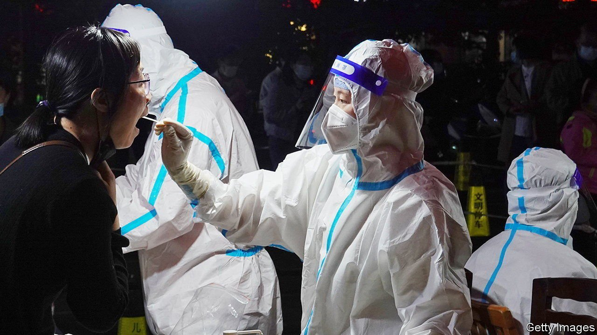

###### Acing the test

# China’s zero-covid industrial complex 

##### The biggest corporate winners from the country’s draconian pandemic strategy 

 

> May 14th 2022 

PRESIDENT XI JINPING’S zero-covid policy has been a plague on China’s firms and a headache for Western ones reliant on its suppliers and consumers. The 25m residents of Shanghai, the country’s commercial hub, have been confined to their homes since April 1st. Beijing, the capital, is teetering on the edge of lockdown. Rail and air travel on a recent national holiday were, respectively, 80% and 75% below the level during last year’s festivities. Retail spending has crashed. GDP may shrink in the second quarter.

Regardless, on May 6th the Politburo’s Standing Committee doubled down. China’s highest decision-making body vowed to fight against “any words or actions that distort, doubt or negate” Mr Xi’s crusade to quash covid-19. Gone was language like “reconciling zero-covid with growth” and “minimising the impact of the pandemic on the economy”, which sought to balance covid-control with economic growth. The stockmarket shuddered. Except, that is, for one industry. The market value of Dian Diagnostics Group, a maker of PCR tests, soared by more than 10% after the Politburo’s pledge. Daan Gene, another big test-maker, and Yiling Pharmaceutical, which produces traditional Chinese medicine that has been heavily promoted as a covid treatment since 2020, also made gains.


Prospects for this zero-covid industrial complex indeed look bright. Covid testing is moving from makeshift tents on street corners into a network of semi-permanent kiosks where residents will be tested regularly for the foreseeable future; Shanghai alone will build 9,000 of them. In big cities tens of millions of people may have their throats or nasal passages swabbed every 48 hours. An analyst at Soochow Securities, a local broker, says that testing at this pace will cost China about 1.7trn yuan ($254bn) this year, or around 1.5% of GDP.

The amount firms can charge for tests has fallen since 2020, when a single swab could cost more than 350 yuan. The government, which pays for most mass-testing, has ordered the 20 or so listed makers of test kits to lower the price to around 20 yuan. The test-makers have nevertheless continued to rake in cash. Dian Diagnostics’ net profit increased by more than 120% year on year in the first quarter, before testing intensified. Guangdong Hybribio Biotech, another test provider, reported a jump of almost 200%.

The testing frenzy is minting covid tycoons. Liang Yaoming, founder of Guang zhou Kingmed Diagnostics, which also makes tests, has become a billionaire during the pandemic. The value of shares in BGI, a $4bn biosciences darling, held by its founder, Wang Jian, has shot up by more than $300m since 2019 to about $2bn. Chen Haibin’s 26% stake in Dian Diagnostics is worth just shy of $1bn.

Some voices have raised concerns about the rise of covid-related big business. Guan Qingyou, an economist at the Xinrui School in Beijing, recently warned of the risk of special-interest groups “misleading and kidnapping” public policy on the pandemic. They could eventually create something akin to America’s military-industrial complex, he said in a post on Chinese social media, which has since been deleted.

Mr Guan may be on to something. Zhong Nanshan, China’s leading respiratory-disease expert, has promoted Yiling’s traditional Chinese medicines used to treat covid-19 while maintaining undisclosed links to the company, the Financial Times has reported. More egregiously, the chief representative of a subsidiary of Guang zhou Kingmed Diagnostics was arrested earlier this year on suspicion that he was trying to spread covid in order to benefit his business. Not quite what the Politburo ordered. ■

For more expert analysis of the biggest stories in economics, business and markets, , our weekly newsletter.

Dig deeper

Dig deeper

All our stories relating to the pandemic can be found on our . You can also find trackers showing ,  and the virus’s spread across .

