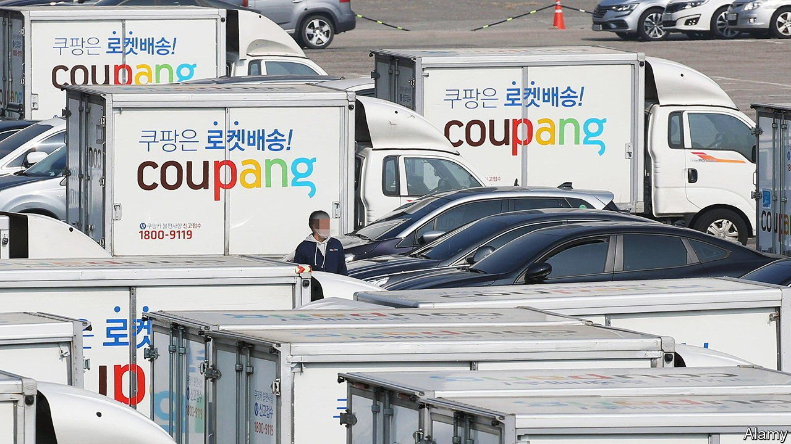
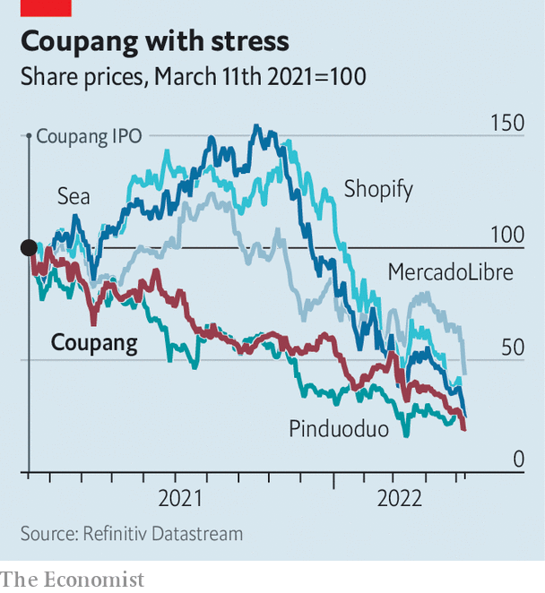

###### Baby Amazons

# Coupang’s high hopes of overcoming high hurdles 

##### South Korea’s e-commerce darling sure knows how to deliver shopping. And returns? 

 

> May 14th 2022 

COUPANG’S OFFICES in Seoul afford a view of the South Korean e-merchant’s promise. Every dawn the forest of high-rise apartment blocks teems with its vans dropping off orders made the night before. This self-styled “rocket delivery”, and Koreans’ love of it, fuelled Coupang’s stratospheric rise. When it debuted on the New York Stock Exchange in March 2021, its shares nearly doubled in value in an instant. It closed its first trading day with a market capitalisation of $80bn. It was the biggest non-American initial public offering (IPO) since Alibaba, a Chinese e-commerce behemoth which listed in 2014.

 


Things have gone downhill from there. Coupang’s share price is around three-quarters below its peak. In March SoftBank, a Japanese tech-investor and Coupang’s largest shareholder, offloaded 50m shares for $1bn, having sold a tranche of the same size for $1.7bn six months earlier. The firm has been caught up in a broader sell-off in volatile tech stocks, especially in unproven companies. The rise of e-commerce may be easing off as the pandemic sales boom fizzles, just as interest rates rise to contain inflation. This has hurt the world’s Amazon wannabes (see chart) and made investors less tolerant of heavy losses in the pursuit of growth—$1.5bn last year in Coupang’s case.


The firm remains confident. On May 11th it reported buoyant first-quarter results. Sales rose by 22% year on year, to $5.1bn. Although it booked another net loss, its core business actually turned profitable on an adjusted basis, earlier than expected. Its shares looked set to start trading a fifth higher the next day, after The Economist went to press.

Nearly half its net loss last year was explained by reinvestment, especially in its infrastructure. Some 70% of South Koreans now live within 10km of one of its warehouses. E-commerce rivals such as Naver and eBay Korea lack its footprint. Traditional retailers with established logistics networks are less technologically sophisticated. Its workforce is made up of employees rather than gig workers, making it less prone to a regulatory backlash. As for SoftBank’s divestment, it may have had more to do with the Japanese group attempting to lock in profits as its other risky tech investments sour than with concerns about Coupang, thinks Park Eun-kyung of Samsung Securities, a broker.

To shore up its dominance, Coupang is getting into food and grocery delivery, video-streaming and fintech, with a “buy-now-pay-later” scheme to complement its own e-payment system. That has helped it draw more people into its empire. In the first quarter the number of active customers grew by 13% year on year, to 18m, having risen by double digits in previous quarters. Last year it launched in Japan and Taiwan. Like South Korea, those countries have high smartphone penetration, ingrained online-shopping habits and dense cities—in other words, Coupang’s rocket fuel. ■

For more expert analysis of the biggest stories in economics, business and markets, , our weekly newsletter.

