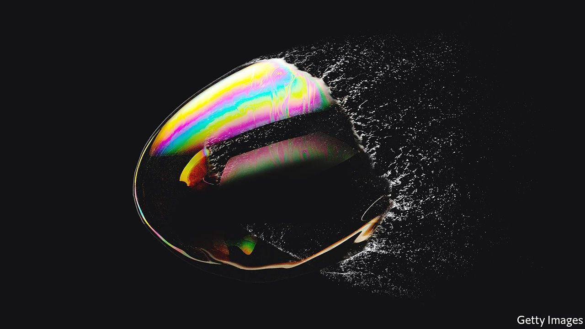
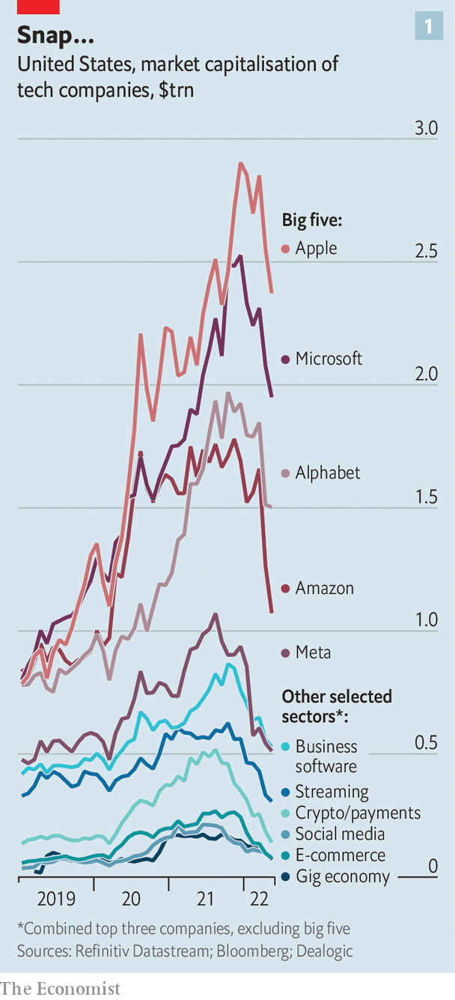
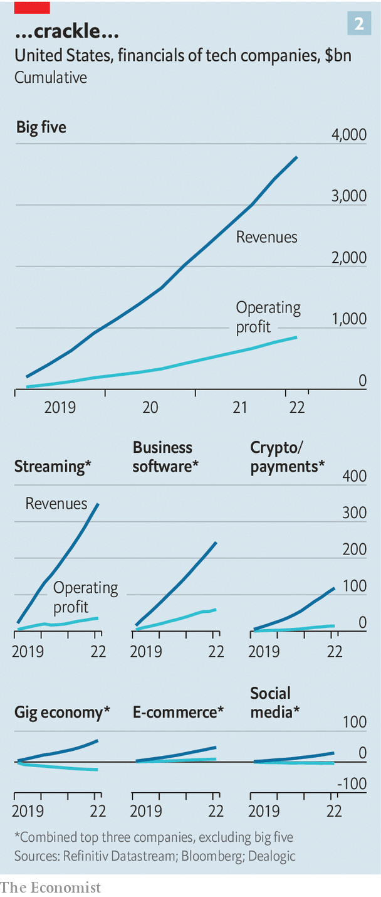
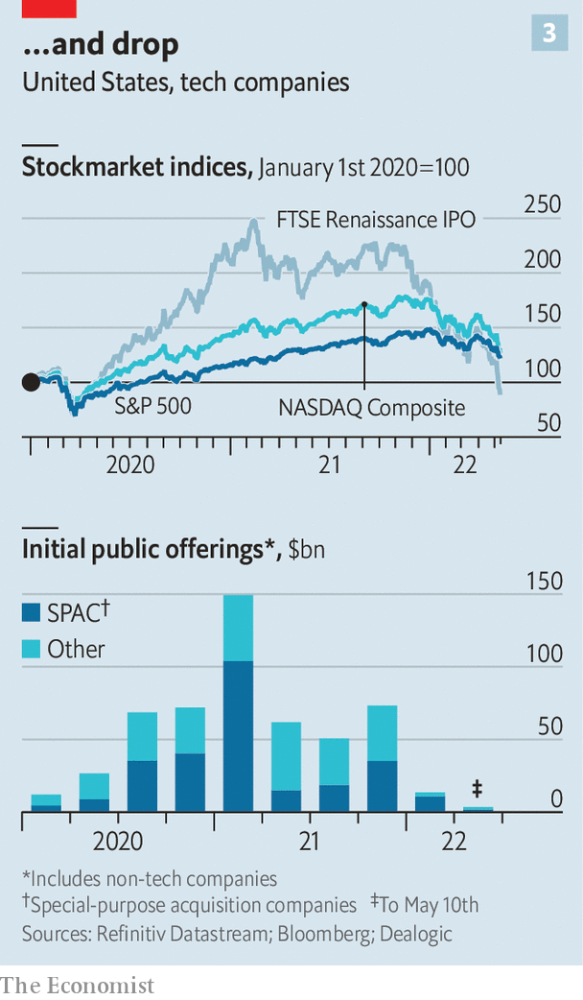

###### Pop!

# Tech bubbles are bursting all over the place 

##### Some more loudly than others 

 

> May 14th 2022 

A FAVOURITE PASTIME in Silicon Valley, second only to inventing the next new thing, is bubble-spotting. Even industry insiders tend to get these things spectacularly wrong. “You’ll see some dead unicorns this year,” Bill Gurley, a noted venture capitalist, predicted in 2015, the year that incubation of these startups worth more than $1bn really got going.

The game has just become much easier: the sound of bubbles popping can be heard all over the place. Tech shares, initial public offerings (IPOs), blank-cheque companies (known as SPACs), startup valuations and even cryptocurrencies: all the assets that climbed to dizzying heights over the past few years are now coming down to earth. It is harder to say how loudly they will burst—and which might still reflate.


The decline of tech shares is the most spectacular. The NDXT, the index of the 100 largest tech firms on the Nasdaq exchange, is down by a third since its peak in early November. Firms in this index have lost a combined $2.8trn in market value.

 


High-flying startups that went public in recent years have been hit hard, too. The shares of Robinhood are 80% below the level at which the retail-trading app went public in July 2021. Those of Peloton, which makes internet-connected exercise bikes, have lost over 90% of their value from their peak. As a group, the largest newly listed firms are worth 38% less than at the start of the year (see chart).

Small wonder that IPOs have dried up. From January to April 2021 some 150 companies went public in America, most of them techie. This year only 30 have done so. The boom in SPACs, which go public and then find a startup with which to merge, has imploded. Of the more than 1,000 such firms that have floated in America since 2018, only a third have merged with a target. Many of those that have done deals have lost their shine. According to an index that tracks the 25 largest de- SPACed vehicles, they have lost 56% of their value since the beginning of the year.

As tech shares crash, they are pulling valuations of private firms down with them. CB Insights, a research firm, reckons that tech startups raised $628bn globally in 2021 in more than 34,000 deals. Between January and March this year the number of transactions fell by 5% compared with the previous quarter. The amount of capital invested dropped by 19%, the biggest quarterly decline since 2012. The unicorn boom’s superstar investors have been walloped. On May 12th SoftBank, a Japanese tech investor with a penchant for risky bets, most of which are private, reported that its flagship funds lost an eye-watering $33bn in the past 12 months.

 


Although they were meant to reach the Moon no matter what, cryptocurrencies are also coming a cropper. Even some hardened “hodlers” have been getting cold feet. On May 12th bitcoin, the largest cryptocurrency, was trading below $26,000, less than half its peak in early November. Other digital monies have shed even more value. The next four biggest coins have lost more than 70% since their peak. Non-fungible tokens (NFTs), even more speculative titles to digital assets such as art that can be traded, have been hammered, too. Sales of NFTs in ether, another big cryptocurrency, have dropped by more than half in recent weeks on OpenSea, a big NFT marketplace.

The industry has suffered from an abrupt reversal of fortunes, explains Mark Mahaney of Evercore ISI, an investment bank. In recent years more than one factor gave tech a boost: the coronavirus pandemic pushed life and work online; government stimulus programmes further increased demand; and super-loose monetary policy made tech’s long-term growth more attractive to investors. Now people are turning away from screens and leaving home again; the war in Ukraine is creating paralysing uncertainty; and economies around the world are suffering from inflation and soon, perhaps, recession.

 


Then there are rising interest rates. Besides possibly triggering a downturn, they reduce the present value of tech companies’ profits, most of which lie far in the future. If inflation does not come down, central banks will pile on more rate rises, putting further pressure on risky tech stocks.

How bad will things get? Although stockmarkets have stabilised a bit in recent days, no one is ready to call the bottom. Just as markets have overshot in the past few years, they can undershoot. There is more of a consensus over what could happen when the dust has settled. According to Daniel Ives of Wedbush, another investment bank, the tech industry is at a “fork in the road”. As interest rates go up, he argues, investors will turn their back on more speculative growth stocks and focus on the quality names in tech.

No prizes for guessing which ones. Although the combined market value of America’s tech titans—Alphabet, Amazon, Apple, Meta and Microsoft—has dropped by nearly 25% since November and their latest results were less stellar than in earlier quarters, they remain safe bets. Together they booked $359bn in quarterly sales and $69bn in net profits. Their core businesses are still growing—in particular cloud computing. Collectively, Alphabet, Amazon and Microsoft, the world’s three biggest cloud providers, took in $43bn of sales for such services in the first three months of 2022, up by 33% from a year earlier.

More unexpectedly, older tech and hardware stocks seem in decent nick, Mr Ives notes. Intel, a veteran chipmaker, is down by a relatively modest 13% since November. IBM, a software icon, is up by 12%. Makers of business software with steady sales and high margins, such as Adobe, Oracle and Salesforce, may rebound fast. Hard though it may seem given Coinbase’s crash on May 11th, so may payments and crypto platforms, which have joined the financial mainstream. Cyber-security firms, such as CrowdStrike or Palo Alto Networks, could see their fortunes return thanks to fears of Russian and Chinese cyber-attacks. Geopolitical rifts may even lift Palantir, a secretive analytics firm that works with security services, whose share price plunged by 20% on May 9th after it disclosed slowing sales growth.

Persistently unprofitable gig-economy firms look shakier. Uber, the ride-hailing and delivery champion which reported on May 4th that trips and users rose by nearly a fifth year on year in the first quarter, still lost nearly $6bn. The heavy repricing of video-streamers, with multibillion-dollar content expenses and reversing (Netflix) or even steady (Disney) subscriber growth, may be permanent. The same may be true for second-tier firms in areas such as social media (Snap) or e-commerce (Shopify), which are dominated by Meta and Amazon, respectively.

It would be wrong to compare the current tech slump to the bursting of the dotcom bubble two decades ago. Back then companies had neither healthy balance-sheets nor promising business models. Nowadays many of them have both. The stomach-churning market gyrations are unpleasant to a generation of tech founders, workers and investors who have lived a long bull run. But they are unlikely to stop digital technology eating the world. ■

For more expert analysis of the biggest stories in economics, business and markets, , our weekly newsletter.

