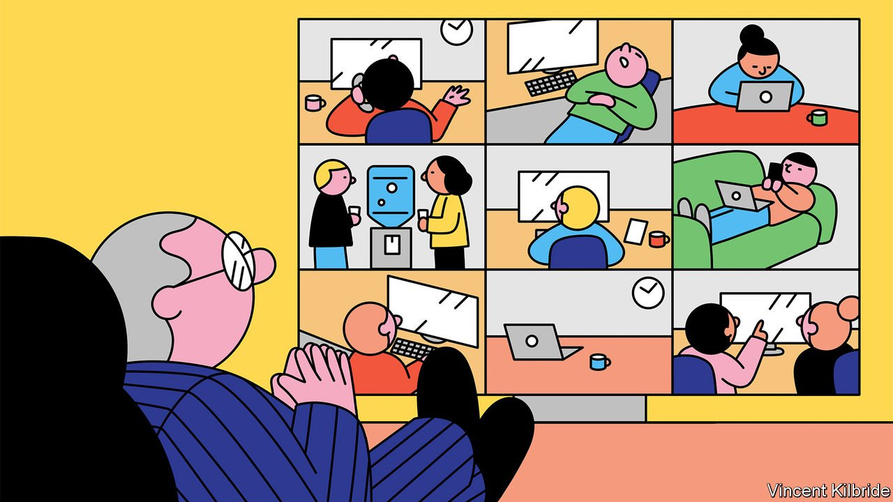

###### Snooping at work

# Welcome to the era of the hyper-surveilled office 

##### The Big Brotherly boss will see you now—and always 

 

> May 14th 2022 

BOSSES HAVE always kept tabs on their workers. After all, part of any manager’s job is to ensure that underlings are earning their keep, not shirking and definitely not pilfering. Workplaces have long been monitored, by inspectors, CCTV cameras and more recently all manner of sensors, to check how many widgets individual workers are assembling or whether anyone is dipping too liberally into the petty-cash box. In the past few years, however, and especially as the pandemic has forced work from the controlled enclosure of the corporate office to the wilderness of the kitchen table, both the scope and scale of corporate surveillance have ballooned.

A study by the European Commission found that global demand for employee-spying software more than doubled between April 2019 and April 2020. Within weeks of the first lockdowns in March 2020 search queries for monitoring tools rose more than 18-fold. Surveillance-software makers’ sales jumped. At Time Doctor, which records videos of users’ screens or periodically snaps photos to ensure they are at their computer, they suddenly trebled in April 2020 compared with the previous year. Those at DeskTime, which tracks time spent on tasks, quadrupled in that period. A survey of more than 1,000 firms in America in 2021 found that 60% of them used monitoring software of some type. A further 17% were considering it.


In an acknowledgment that snooping is on the rise—and raising eyebrows—on May 7th a New York state law kicked in requiring firms to tell staff about any electronic monitoring of their phone, email and internet activity. Corporate scofflaws can be fined between $500 and $3,000 per violation. New York joins Connecticut and Delaware, which have mandated similar disclosures since the late 1990s and early 2000s, respectively, and Europe, where companies have had to prove that monitoring has a legitimate business basis—such as preventing intellectual-property theft or boosting productivity—since 1995. More such rules are poised to emerge. They are unlikely to deter more offices from embracing Big Brotherliness.

Smile, you’re on candid webcam

Firms have valid reasons to monitor workers. Safety is one: tracking staff’s whereabouts in a building can help employers locate them in case of emergency. Another is to keep money and data safe. To ensure employees are not sharing sensitive information, banks such as JPMorgan Chase trawl through calls, chat records and emails, and even track how long staff are in the building. In 2021 Credit Suisse, another lender, began requesting access to personal devices used for work.

Startups are offering more sophisticated threat assessments. One, Awareness Technologies, sells software called Veriato, which gives workers a risk score, so that the employer can assess how likely they are to leak data or steal company secrets. Another, Deepscore, claims its face and voice-screening tools can determine how trustworthy an employee is.

A further big reason for companies to surveil workers is to gauge—and enhance—productivity. The past couple of years have seen an explosion in tools available to managers that claim not just to tell whether Bob from marketing is working, but how hard. Employers can follow every keystroke or mouse movement, gain access to webcams and microphones, scan emails for gossip or take screenshots of devices—often, as with products such as FlexiSPY, leaving the surveilled workers none the wiser. Some monitoring features are becoming available on widely used office software like Google Workspace, Micro soft Teams or Slack.

Many surveillance products are powered by ever cleverer artificial intelligence (AI). Enaible claims its AI can measure how quickly employees complete tasks as a way of weeding out slackers. Last year Fujitsu, a Japanese technology group, unveiled AI software which promises to gauge employees’ concentration based on their facial expression. RemoteDesk alerts managers if workers eat or drink on the job.

Collected responsibly, such data can boost a firm’s overall performance while benefiting individuals. Greater oversight of workers’ calendars can help prevent burnout. Technology can empower employees facing bias or discrimination. Parents and other staff with caring duties can show they are as productive as their office-dwelling colleagues. And people tend to tolerate bag checks and CCTV cameras, which they see as legitimate ways to improve security. Likewise, many accept that their work calls and email are fair game.

Cflritics of surveillance nevertheless fear that firms are not to be trusted. In 2020 a staff backlash forced Barclays, a British bank, to scrap software that tracked the time employees spent at their desks and nudged those who spent too long on breaks. That year Microsoft came under scrutiny for a feature it rolled out to rate workers’ productivity using measures including how often they attended video meetings or sent emails. The software giant apologised and made changes to avoid identifying individuals. On paper, the goal was to provide detailed insight into how organisations work. In practice, it pitted employees against each other.

That points to another problem: many surveillance products aimed at boosting productivity are not well tested. Some risk being counterproductive. Research has associated monitoring with declines in trust and higher levels of stress, neither of which is conducive to high performance. In one study of call centres, which were early adopters of surveillance tech, intensive monitoring of performance contributed to emotional exhaustion, depression and high employee turnover. In a separate survey of 2,000 remote and hybrid workers in America by Express VPN, a virtual private network, over a third faced pressure to appear more productive or to work longer hours as a result of being monitored. A fifth felt dehumanised, nearly half pretended to be online and almost a third employed anti-surveillance software, specifically designed to dodge online monitoring.

Add concerns about privacy—especially as the snooping shifts from the office to the home—and no wonder that workers are wary. According to a survey in 2018 by Britain’s Trades Union Congress, an umbrella group, only one in four workers thought monitoring offered more benefits than downsides. Three in four viewed facial-recognition software as inappropriate. They had similar concerns about the monitoring of their social-media use outside work hours and using webcams to spy on them. Gartner, a consultancy, last year found that employees in nine large economies consistently favoured non-digital monitoring, such as in-person check-ins by managers, to the digital sort. Only 16% of French workers felt that any form of digital surveillance was acceptable.

With laws like New York’s coming into force, lots of employees are about to learn that their employers’ views on the appropriateness of such methods may be quite distinct from their own. Employers, for their part, may need to temper their enthusiasm for snooping on staff. Most companies will probably arrive at a sensible compromise. Those that don’t may find that too much knowledge is a dangerous thing. ■

For more expert analysis of the biggest stories in economics, business and markets, , our weekly newsletter.

