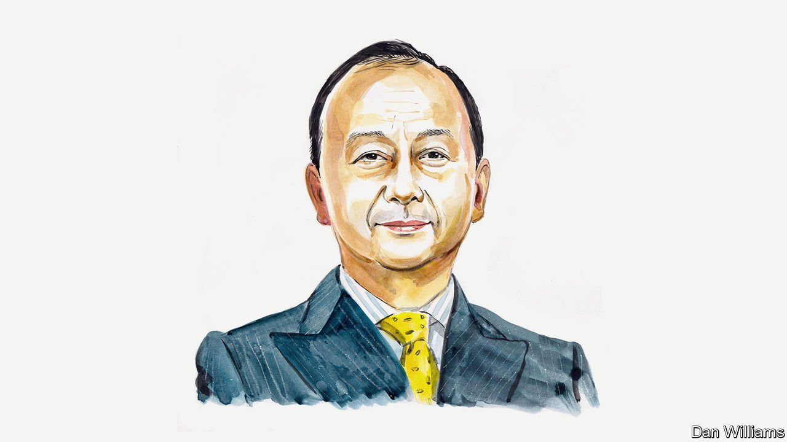

###### Russia, Ukraine and China

# Senior Colonel Zhou Bo says the war in Ukraine will accelerate the geopolitical shift from West to East 

##### The more popular it becomes to join NATO, the more insecure Europe will be 

 

> May 14th 2022 

IF THE ENEMY of my enemy is my friend, is the enemy of my friend also my enemy? Not necessarily. Or so China’s thinking goes when it comes to the raging Russian-Ukranian war. On the one hand China is Russia’s strategic partner. On the other, China is the largest trading partner of Ukraine. Beijing therefore tries painstakingly to strike a balance in its responses to the war between two of its friends. It expresses understanding of Russia’s “legitimate concerns” over NATO’s expansion, while underlining that “the sovereignty and territorial integrity of all countries must be respected”.


Such carefully calibrated neutrality may not be what the warring parties really want, but it is acceptable to both. If China joins the West in condemning Russia, it will be much applauded in Washington and most European capitals. But it will lose Russia’s partnership. And it is only a matter of time before America takes on China again. The Biden administration’s policy towards my country is “extreme competition” that stops just short of war.

Obviously, the conflict in Ukraine has done tremendous damage to Chinese interests, including its Belt and Road initiative in Europe. But Beijing sympathises with Moscow’s claim that the root cause of the conflict is NATO’s inexorable expansion eastward after the fall of the Soviet Union. All Russian leaders since Mikhail Gorbachev have warned of the consequences of such expansion. Russia feels that it cannot allow its Ukrainian brethren to leave Russkiy mir—the Russian world—to join another camp. If NATO looks like Frankenstein’s monster to Russia, with new additions here and there, Vladimir Putin probably believes he must slay the creature.

The future of Europe is not hard to fathom. Mr Putin’s all-out war against Ukraine has failed. Precisely because of that, he will fight until he can declare some sort of “victory”. Presumably this will involve Ukraine’s acceptance that Crimea is part of Russia, its promise not to join NATO and the independence of the two “republics” of Donetsk and Luhansk. The challenge is whether Russian troops are able to control Donbas after occupying it.

A protracted war looks probable, if not inevitable. The situation bears similarities to the one in Afghanistan during Russia’s war there in the 1980s. An American-led alliance sent endless weapons to the mujahideen who managed to bog down and exhaust the invading Soviet soldiers.

Thanks to the crisis, a brain-dead NATO has revived. In February Germany’s chancellor, Olaf Scholz, created a special €100bn ($105bn) fund for defence and announced that his country would spend 2% of its GDP on defence every year—a NATO guideline. It will beef up the alliance and bolster the idea of European “strategic autonomy” (little more than a French slogan until now).

The irony is that the more popular NATO becomes, the more insecure Europe will be. If Finland joins NATO, as looks likely, the alliance’s troops would be a stone’s throw from St Petersburg. The Kremlin has warned that such a move would end the “non-nuclear status of the Baltic Sea”. This could be a bluff. But who knows? If NATO’s worst fear is that Russia might launch a tactical nuclear attack, then why keep poking Mr Putin in the eyes? Europe’s security, now as in the past, can only be achieved with Russia’s co-operation.

In recent months speculation abounded that Beijing and Moscow’s “unlimited” partnership—announced during Mr Putin’s visit to China in February for the Winter Olympics—might usher in a military alliance. But the war in Ukraine has inadvertently proved that Beijing and Moscow’s rapprochement is not an alliance. China didn’t provide military assistance to Russia. Instead it provided humanitarian aid and money to Ukraine twice, including food and sleeping bags, and has pledged to continue to “play a constructive role”.

One reason behind the Sino-Russian non-alliance is that it allows a comfortable flexibility between two partners. And in spite of the fact that China and Russia both call for a multipolar world, a non-alliance suits them because they see such a world differently. Mr Putin’s Russia is nostalgic for the heyday of the Soviet empire. (He lamented its demise as “the greatest geopolitical catastrophe” of the 20th century.) Russia sees itself as a victim of the existing international order. By contrast China is the largest beneficiary of the rules and regulations of global commerce and finance made by the West after the second world war. China has a huge stake in safeguarding the existing international order. This is why, despite ideological differences and even tensions sometimes, China has at least maintained robust economic ties with the West. Neither side wishes to sever them.

How America can focus simultaneously on two theatres—the Indo-Pacific and war in Europe—remains to be seen. Joe Biden had hoped to put Russia policy on a “stable and predictable” footing in order to focus on America’s Indo-Pacific strategy. The war in Ukraine undoubtedly will distract America’s attention and syphon away resources. It will further hollow out Mr Biden’s Indo-Pacific strategy, which already has too many aims and too few tools and not enough supporters. The question is for how long Mr Biden will allow Ukraine to remain a distraction. In a region where China is the largest trading partner of most countries, even America’s greatest allies wouldn’t wish to sacrifice their relationship with China for the benefit of America.

Is the Russia-Ukraine war a turning point that heralds new global disorder? Rumour has it that when China’s Premier Zhou Enlai was asked what he thought of the French Revolution of 1789, he supposedly said that it was too early to tell. But perhaps it isn’t too early to say that the war in Ukraine will accelerate the geopolitical and economic shift from the West to the East. China standing in the centre matters all the more, and it should stand firm as a stabiliser.

_______________

Senior Colonel Zhou Bo is a retired officer of the People’s Liberation Army and a senior fellow at the Centre for International Security and Strategy at Tsinghua University, Beijing and a China Forum expert.

