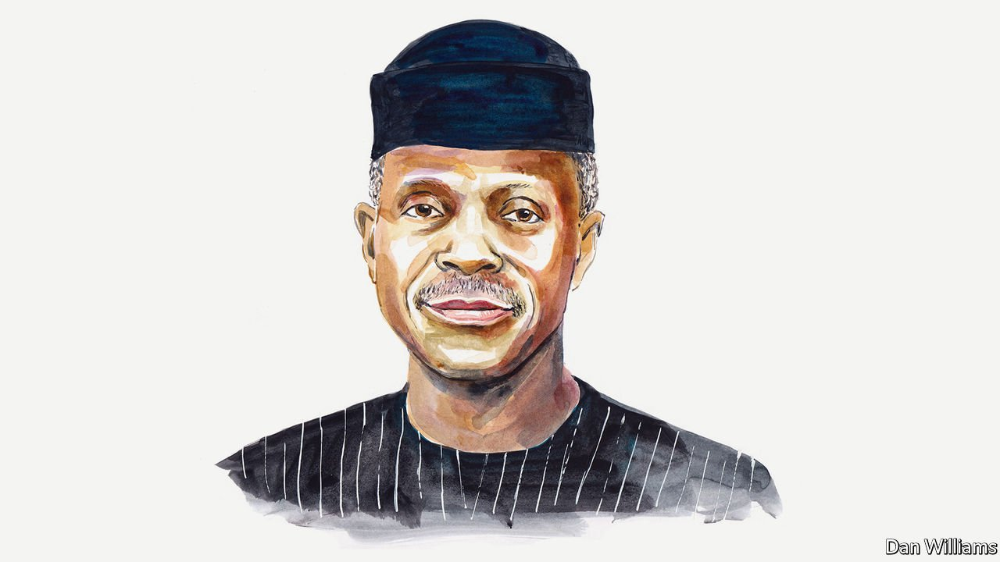

###### Energy and climate

# Yemi Osinbajo on the hypocrisy of rich countries’ climate policies 

##### Nigeria’s vice-president says they cannot demand more stringent actions than they will commit to themselves 

 

> May 14th 2022 

AFRICA NEEDS more energy. Total electricity use for more than a billion people, covering all 48 sub-Saharan African countries except South Africa, is less than that used by Spain (home to just 47m). The dearth of power hurts livelihoods and destroys the dreams of hundreds of millions of young people.

We must close the . Africans need more than just lights at home. We want abundant energy at scale so as to create industrial and commercial jobs. To participate fully in the global economy, we will need reliable low-cost power for facilities such as data centres and, eventually, for millions of electric vehicles.

If our continent’s unmet energy needs are already huge, future demand will be even greater as populations expand, urbanisation accelerates and more people move into the middle class. By 2050, Nigeria will surpass America in population with over 400m people on current forecasts, with the vast majority of citizens in cities. Lagos’s population alone will surpass 30m people.

The Nigerian government remains committed to universal energy access, and all Nigerians deserve to enjoy the benefits of modern energy that are taken for granted in the rich world. We should aim to generate a national average power output of at least 1,000 kilowatt-hours per person which, combined with population growth, means that by 2050 we will need to generate 15 times more electricity than we do today. That ambitious goal will require vast resources.


President Muhammadu Buhari has also pledged that Nigeria will reach net-zero emissions by 2060. We are currently implementing power sector initiatives and reforms focused at expanding our grid, increasing generation capacity, and deploying renewable energy to rural and underserved populations. We aim to end wasteful gas flaring by 2030, instead leveraging this domestic resource for our own economic growth. Reaching both our development and climate ambitions, however, will require far more external support and the same policy flexibility that rich nations claim for themselves in the energy transition. We cannot achieve our goals otherwise.

Despite the tremendous energy gaps, global policies are increasingly constraining Africa’s energy technology choices. Rich countries, especially in Europe, have repeatedly called for African states to use only renewable power sources. This is partly because of a naive belief in leapfrogging, the assumption that, like skipping landlines for mobile phones, Africa can ‘leap’ to new energy technologies. The renewables-only mantra is also driven by unjustified fears of the continent’s future emissions. Yet under no plausible scenario is Africa a threat to global climate targets. Such demands extend even to cooking, where some funders will not support any gas projects although they bring immediate and substantial benefits. The vast majority of Africans still use charcoal or wood to cook, leading to deforestation, early death from indoor air pollution and avoidable carbon emissions.

Instead of viewing Africa’s emergence as a threat to be blocked, the continent should be seen as a tremendous opportunity. The challenge for the continent is to transition to net-zero emissions while at the same time building sustainable power systems to drive development and economic opportunity. The EU’s recent decision to label natural gas and nuclear power as green investments recognises a critical truth: different countries will follow different paths in the energy transition. If this is true for Europe, it’s even more true for diverse African nations.

A promising step was announced last year in Scotland at COP26, the annual UN climate talks, when South Africa received an $8.5bn package to . It is high time to extend that kind of support to the rest of the continent. Nigeria has four times South Africa’s population and yet uses just one-eighth as much electricity. COP27 will be held in Egypt in November. Now is the ideal time to reset global policy so as to bolster Africa’s plans for producing clean energy. Wealthy countries have contributed the most to climate change, and they cannot demand more stringent actions than they will commit to themselves.

First, developed nations should commit to funding in full Africa’s energy transition. This is both a moral imperative and an environmental necessity. We estimate that Nigeria requires $400bn of new investment above business-as-usual spending to meet its net-zero pledge. A green energy package, akin to South Africa’s, should offer at least $10bn per year over the next two decades. Investments would cover not only new renewable generation projects, but also transmission infrastructure, smart grids, data management systems, storage capacity, electric vehicles, clean cooking, and the costs of integrating new distributed energy systems.

Second, there must be a hiatus on blanket bans for fossil-fuel financing in developing countries. Coal investment is already dead in most of Africa and any future oil investment will come from private sources. But financing rules on natural gas will greatly affect our development and our energy transition to net zero. Though solar will provide most of our power in the future, we still need natural gas for baseload power and balance. We insist that liquefied petroleum gas (LPG) be included as a clean cooking alternative to save the lives of our women and girls and to protect our own natural environment. Europe says it needs a decade more of gas investment to meet its 2050 climate targets. Africa—with our greater challenges—should have at least two more decades in order to meet our climate targets.

The world cannot tackle collective challenges if poor nations are treated as second class, or their aspirations are ignored. After enduring colonialism, decades of unfair economic practices and covid-19 vaccine apartheid, we cannot accept regressive climate policy as another injustice. Tackling the dual crises of poverty and climate change can only succeed if all countries play their fair part–and all of humanity is lifted up together.

Yemi Osinbajo is the vice-president of Nigeria.

