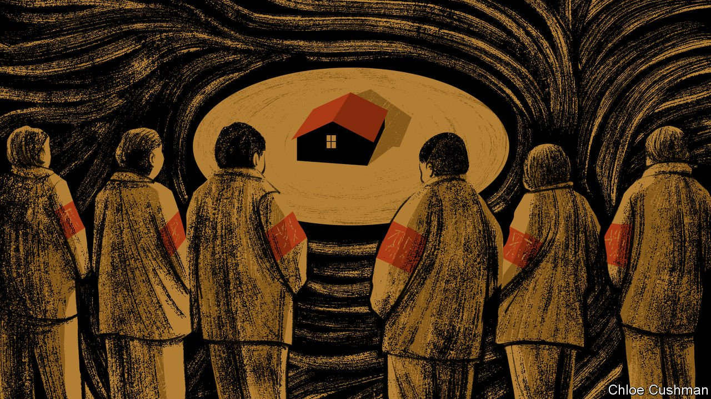

###### Chaguan

# China builds a self-repressing society 

##### Xi Jinping sees strengths in Maoist tools of social control 

 

> May 14th 2022 

FOR FOUR decades China has defied received wisdom about the institutions that countries must build to become rich and strong. After the Communist Party’s bosses embraced market forces in 1979, many foreign observers predicted that political reforms had to follow, such as the emergence of more independent courts to sustain the rule of law and uphold property rights. In time, the optimistic foreigners ventured, most advanced economies realise that they need democratic—or at least accountable—political systems. Societies with such “inclusive institutions” enjoy both stability and broad-based prosperity, Chinese officials were told.

China’s leaders heeded something less than half this advice. Over 40 years successive leaders have tolerated only as much economic and social openness as is compatible with unchallenged party authority. President Xi Jinping, the party chief since 2012, has broken even more decisively with norms that hold sway in much of the rich world. He has explicitly condemned the separation of powers and an independent judiciary as unwelcome Western notions. His China is proud to offer not the rule of law but “law-based governance” via party-controlled courts.


There have been changes at the grassroots, too. In Mr Xi’s China, ever more power, including coercive power, is wielded by party members and volunteers with fuzzy legal mandates. During the covid-19 pandemic many residents of locked-down cities have been forced into squalid quarantine sites or sealed inside housing compounds by pandemic workers, swaddled in the anonymous full-body suits that explain their nickname, “Big Whites”. A few are police officers or local officials. But others are zealous volunteers, imposing house arrest without a warrant. Even before covid emerged, Chinese leaders had called for citizens to take more disputes to mediation by unpaid local worthies, rather than to law courts. In recent years private companies, including joint ventures with foreign firms, have been pressed to form or revive party cells made up of employees with party membership, enjoying ill-defined authority.

Scholars of authoritarian politics have taken note of this trend. Two recent books take complementary looks at how the party embraces ambiguity as it controls the masses—or rather, encourages citizens to control one another. By way of case study, both books examine the same area of public policy, namely urbanisation schemes that have displaced many tens of millions of Chinese. Often the land that they farmed was requisitioned and sold to developers or their homes were demolished, by force and with paltry or no compensation. At the root of such schemes is an institutional void: in China property rights are anything but secure. As Daniel Mattingly of Yale University estimates in “The Art of Political Control in China”, published in 2019, land requisitions have in effect redistributed property worth trillions of dollars from rural collectives to the state. Yet as Lynette Ong of the University of Toronto describes in her new book, “Outsourcing Repression, Everyday State Power in Contemporary China”, resistance to violent land-grabs in China has been fragmented and easily squelched.

One reason, both books suggest, is a tradition of delegating dirty work to non-official agents. These include hired thugs lacking uniforms or badges, sent to wreck homes, cut power and water supplies, or beat up those who try to petition higher authorities. Their links to local officialdom are unprovable but blatant. One gambit involves thugs bulldozing communal lavatories, allowing bureaucrats to declare a village unsanitary and so fit only for demolition, records Ms Ong. Even a threadbare cover for official brutality is useful, though. Drawing on a data set of over 2,000 cases of forced land-taking or demolition recorded by news outlets and rights groups, as well as on hundreds of her own field interviews conducted from 2011 to 2019, Ms Ong finds that citizens were more likely to resist when police acted brutally or officials led thugs into battle in person. Citizens were more fatalistic when attacked by anonymous toughs. The public expects nothing better from them, but is indignant when the state breaks laws, she suggests.

The tyranny of the majority, plus bulldozers

Recorded incidents of violence declined but did not end after 2013, as national leaders urged campaigns of “harmonious demolition”, moved in part by nationwide outrage over citizens killed or driven to suicide during violent land-grabs. In the Xi era anti-corruption campaigns have ensnared some local tyrants who razed scores of villages for profit. Harmonious demolitions may be achieved by recruiting village elders or volunteers with deep community ties to press their own neighbours to sign demolition papers. Some involve the setting-up of zigaiwei, or “Autonomous Redevelopment Committees”. Guided by unseen officials, these are not as benign as they sound. Ms Ong describes local power-brokers spying on households that refuse to comply, setting family members against each other, or hunting for individuals vulnerable to pressure, such as public employees who can be threatened with the sack. Hold-outs are publicly shamed for resisting the majority’s will. Talk of the majority reveals the Maoist roots of outsourced repression. Mr Xi’s China is reviving the “mass line”: a strategy of using rewards and punishments, but also ideological “thought work”, to mobilise the many and ostracise the dissenting few.

Conventional wisdom holds that a strong civil society gives citizens leverage over governments. In fact, co-opted clan leaders and village elders can serve autocrats well, writes Mr Mattingly. Indeed, official biographies of Mr Xi record how, as a young village party secretary in rural Shaanxi, he recruited a local clan leader to help him confiscate land for a dam, including a clan cemetery.

Party bosses grow impatient when foreigners question China’s autocratic politics, pointing to years of growth. But economies can also slow. When they do, inclusive institutions offer legitimacy that arm-twisting and opaque power-structures cannot match. ■

Read more from Chaguan, our columnist on China: (May 5th) (Apr 30th)

 (Apr 23rd)

