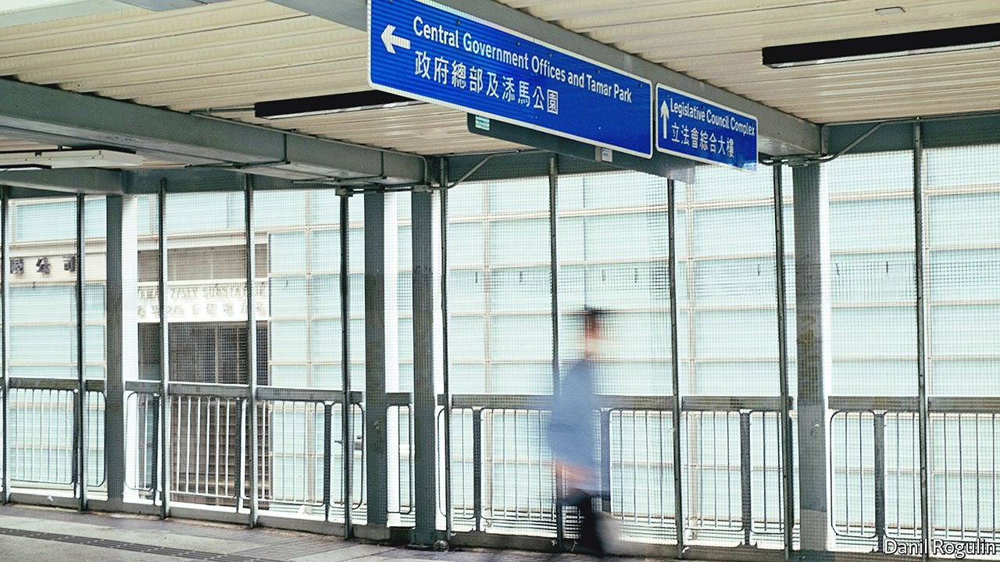
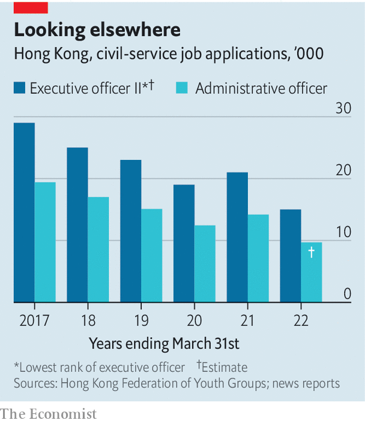

###### Stay neutral, love the party

# China is wary of Hong Kong’s bureaucratic elite 

##### The city’s leader-in-waiting has a civil-service background, but he has a redeeming feature: he’s a cop 

 

> May 14th 2022 

HAVING TAKEN 99.2% of the vote as the sole candidate in an election from which an even higher proportion of Hong Kong’s people were excluded, the territory’s next chief executive, John Lee, made clear why China’s Communist Party engineered his victory. “Protecting Hong Kong from internal and external threats and ensuring its stability”, he said, would be of “paramount importance” under his leadership. Mr Lee is a former policeman. The party trusts him to keep Hong Kong in line.

Trust is something that the party does not have in abundance as it surveys the city’s elite. Since the territory was handed back to China by Britain in 1997, that elite, minus the British, has remained largely the same. China has relied heavily on two types of people to do its bidding there: businesspeople (the first and third chief executives had such backgrounds) and members of the bureaucratic aristocracy (the second chief executive and the current one, Carrie Lam, once belonged to this group—the crème de la crème of the civil service known as administrative officers, or AOs). Both types have proved underwhelming. The eruption of months of turmoil on Hong Kong streets in 2019, on Mrs Lam’s watch, convinced the party that it needed to tighten its grip. It concluded that Hong Kong’s traditional elite should be kept on a shorter leash.


The 180,000-strong civil service is in the party’s sights. As a policeman, Mr Lee belonged to it, too. But he was not one of the 700 or so AOs. He is a security specialist who only branched out of his area of expertise in 2021 when he became Mrs Lam’s chief secretary (ie, deputy). He may appoint fewer AOs to his cabinet than his predecessors did, says John Burns of the University of Hong Kong. Behind the scenes, the party’s outpost in Hong Kong, the Liaison Office, will be more hands-on.

It is striking how much the party has trusted civil servants nurtured by the British. The territory’s first post-colonial chief secretary, Anson Chan, was an AO. She had also served in that capacity under Hong Kong’s last colonial governor, Chris Patten, who was much despised by China. Mrs Chan later became a pro-democracy politician and critic of the party (she is now retired). Donald Tsang, the second chief executive, had been knighted by the British. Even Mr Lee only gave up his British citizenship when he became under-secretary for security in 2012. He, Mrs Lam, Mr Tsang and Mrs Chan are all Catholics—another attribute to which the party is not, by nature, drawn. (Cardinal Joseph Zen, an outspoken advocate of democracy who is 90 years old, was arrested on May 11th by Hong Kong’s national-security police for alleged collusion with foreign forces.)

 


The upheaval in 2019 stoked the party’s anxieties about the loyalty of government officials. Mrs Lam, with Mr Lee as head of security, proved their toughness, cracking down on demonstrations triggered by profound public distrust of the party. China, though, saw disturbing signs of cracks in the establishment. They included anonymous petitions, purportedly signed by hundreds of civil servants (including about 100 AOs), calling on the government to make concessions to the protesters. Thousands of civil servants staged their own demonstration and some went on strike. Participants said they served the public, not the territory’s leaders.

Party-controlled newspapers in Hong Kong fumed. “Insider devils”, a commentary in one of them called the dissenting officials. To prevent further unrest, China imposed a harsh national-security law on Hong Kong in June 2020 and moved to bar those deemed “unpatriotic” from public office. This included purging the legislature—and the election committee that chooses the chief executive—of opposition politicians (both were already stacked with the party’s supporters).

The party’s press grumbled that requirements that civil servants be “politically neutral” were inadequate. They were being used by bureaucrats as an excuse to snub the party. In 2020 Hong Kong began requiring all civil servants to pledge allegiance to the Basic Law, the city’s post-colonial constitution. From this year civil-service recruits must pass a test on the contents of the security law, in addition to a previously required one on the Basic Law.

Such requirements, and Hong Kong’s lurch towards a style of rule more like the mainland’s, appear to be deterring young people from applying for civil-service jobs. In 2021 the number of applicants for AO positions dropped to about 9,700, down from 14,000 in the previous year. These are normally highly coveted slots, offering handsome pay (HK$55,995, or about $7,133, a month for new recruits) and a high level of job security. But the impact may be hard to discern. Only about 45 such posts are available each year; the government will still have a large pool of talent from which to fill them. “The government can control my actions, but cannot control my mind,” says an applicant, professing not to be worried about the new emphasis on loyalty.

Mr Lee has promised to introduce yet more legislation relating to political crimes. He may also implement long-mooted plans to add a new government bureau (ministry, in effect) to look after culture, sport and tourism. In the past some politicians have winced at this, fearing it might be used to promote only culture approved by the party. But with the Legislative Council now shorn of filibustering democrats, there will be no opposition. Last year’s change of leadership of the government’s once feisty broadcasting wing, RTHK, does not augur well. Former employees say the new boss is focused on making propaganda.

Such work may be helped by the opening in December of a training college for Hong Kong’s bureaucrats. It “should strive to nurture civil servants in their sense of patriotism”, said a senior mainland official who joined the launch ceremony by video link. Newspapers controlled by the party have published calls for more instruction of AOs at mainland academies as well. One article, by Andrew Fung, a former senior press handler in the office of the chief executive, said this should include a “short period of military training”. That, no doubt, would help to boost recruitment. ■

