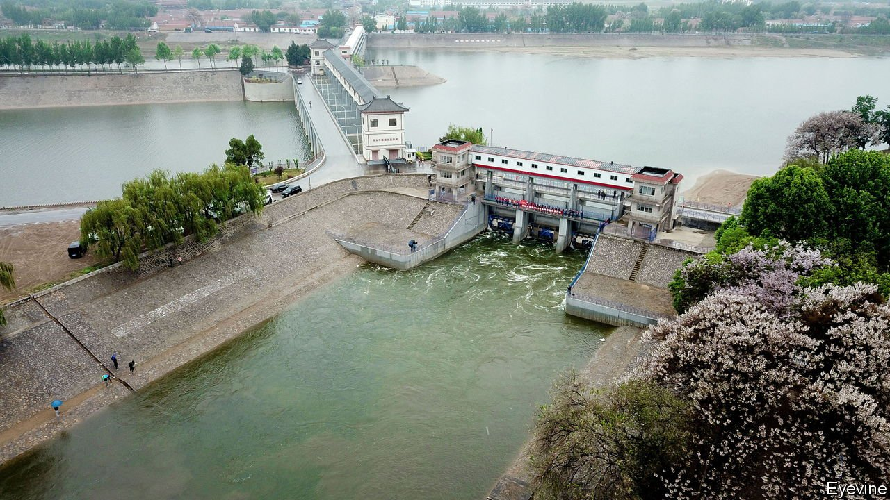
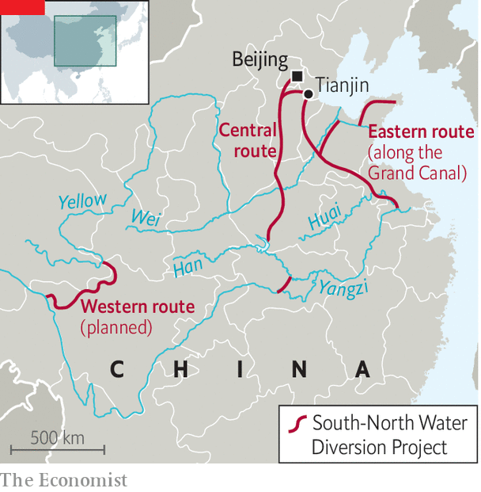

###### Taming the waters

# China’s Grand Canal is full for the first time in decades 

##### Is that a good thing? 

 

> May 14th 2022 

WHEN KUBLAI KHAN tired of spending winters at his pleasure-dome in Xanadu, the Mongol overlord of China, who ruled during the 13th century, built a new capital in what is now Beijing. In order to feed the city, he launched a decade-long hydrological project, extending the Grand Canal, which already snaked through much of eastern China. The oldest sections of the waterway had been constructed centuries before. Kublai Khan was hardly the first ruler to demand that China’s waters do his bidding.

Nor was he the last. “To rule a country, first rule its waters,” says Xi Jinping, China’s current overlord. In a country where floods have wiped out cities and toppled dynasties, this isn’t a bad credo. The canal, in particular, has drawn Mr Xi’s attention. Much of its northern reaches were disconnected or had run dry by the time the Communist Party took power in 1949. Mr Xi called for the waterway to be “reborn”. And indeed it has been: in April water flowed along the canal’s entire length for the first time in a century, according to the party.

 


This is largely a result of the South-to-North Water Diversion Project, which, as the name suggests, aims to pump southern water to northern provinces. In operation for nearly a decade, it is one of the most expensive engineering projects in the world and the largest-ever transfer of water between river basins. It involves two main channels: one in the east, along the Grand Canal, and another that runs through central China (see map). These bring water from the Yangzi river and its tributaries to the north. A third channel, farther west, is in the planning stage.

The north, where around 40% of the population lives, desperately needs water. Beijing is not far from the desert; camel caravans plodded its streets not too long ago. The city can go for months without rain. Thirsty factories and farms add to the strain. The UN sets the threshold for water scarcity at an annual 1,000 cubic metres per person. Most northern provinces fall below that. Some don’t even reach 200 cubic metres per person in a dry year. Transfers from the south have “averted a water crisis”, says Ma Jun, an environmentalist. Around 75% of Beijing’s tap water arrives after a two-week journey north.

With more southern water sloshing around, water sources in the north are recovering. Fishermen have returned to the banks of the Grand Canal in Beijing, catching silver carp that were not there a few years ago. Groundwater levels have stabilised after falling for decades. Sitting in a slightly damper, greener Beijing, China’s governing elite is happy. The decision to move the water was “completely correct”, Mr Xi said last year.

But look south and the picture is grimmer. The project displaced hundreds of thousands of people—and there are more evictions planned. Rivers in the south have been depleted. Pollution was always a problem, but now there is less water to dilute and wash away contaminants. Toxic algal blooms, more often found in ponds, are forming on the Han river, the main source of Beijing’s water. Another megaproject, which aims to replenish the Han, will break ground this year. That project will also take water from the Yangzi, further diminishing its flow.

China’s engineered fixes to water scarcity are “more like a band-aid”, says Britt Crow-Miller of the University of Massachusetts-Amherst. “They’re not actually going to solve the problem.” It would be better if China used water more efficiently, she says. To start, the government could make it more expensive. Industrial users pay more than they used to, but still much less than the scarcity of the resource warrants, says Mr Ma. Farmers pay even less and often waste water. The price for domestic use in Beijing has risen to 5 yuan ($0.74) a cubic metre, from 4 yuan a decade ago. That is still only a third of the average price in American cities, where water is more plentiful. Mr Ma hopes that when residents of the capital turn on the taps, they realise the real cost is much higher. ■

