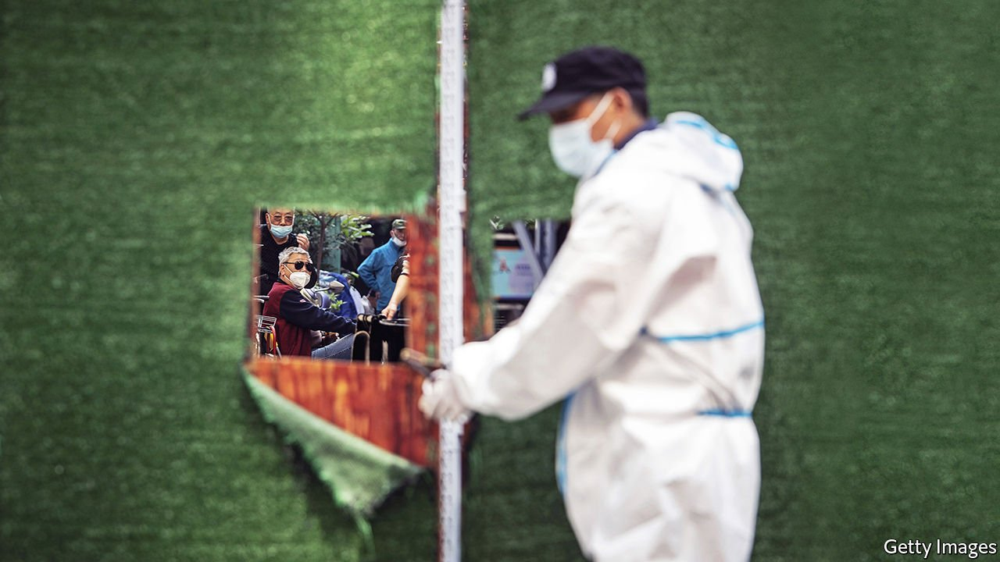
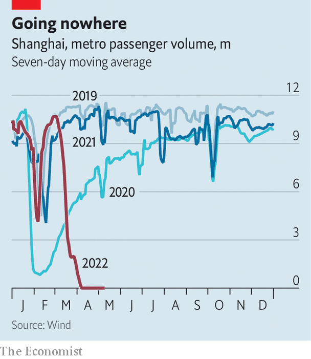

###### All the way to zero

# Shanghai’s covid-19 lockdown is not even close to over 

##### Don’t believe what you read in the papers 

 

> May 14th 2022 

THE 25M RESIDENTS of Shanghai could be forgiven for not recognising their own city in the pages of the local press. Most have been locked in their homes for weeks because of an outbreak of . Yet an article published on May 9th in a state-owned rag noted how residents in some districts are happily returning to their local markets. Another explains that, with covid on the wane, interest in Shanghai from global investors is picking up again. The People’s Daily, a mouthpiece of the Communist Party, referred to the long lockdown as a “pause”.

It is true that the number of new cases in Shanghai has fallen from more than 25,000 a day in mid-April to fewer than 2,000 recently. But  are being tightened. Areas that were slowly reopening have closed again. New barriers seal off housing compounds that were accessible days earlier. Residents may be carted off to a quarantine facility if an infection is found on a nearby floor. Food-delivery services, crucial to keeping Shanghai fed, have been barred from some areas.


The moves have baffled residents. They are reminded of the earliest days of the lockdown, when fresh meat and vegetables were hard to come by. What’s worse is that the new restrictions have come without any official explanation.

 


The government has issued guidelines for moving out of lockdown. The plan, which does not include a timeframe, divides communities into three categories depending on how recently new cases have been found there. The first category is the strictest: residents are unable to step outside their homes, which may be barricaded. The second level allows residents to walk around their housing compound, but not on the street outside. The third allows for residents to be issued passes to walk around their neighbourhoods.

But these guidelines have been widely disregarded by district-level authorities. On May 9th officials in central Shanghai roamed the streets with bullhorns, warning that walking outside was no longer permitted. The tightening of restrictions comes after President Xi Jinping called for stronger anti-covid measures. Officials refer to the stricter regime as a period of jingmo, or silence. One in Huangpu district says it is a short-term experiment to see if less freedom of movement leads to a rapid reduction in cases. But there has been no citywide announcement of such a policy.

The authorities’ haphazard approach is stirring anger. Community-level committees, called juweihui, have been given broad powers to control the movement of people. But committee members are accused of incompetence. Some have been caught hoarding government rations. They often keep people locked down longer than required in order to avoid being blamed if new cases are found. Videos on social media show angry residents yelling at juweihui members, who are often separated from the crowds by fences or gates.

Elsewhere in China, the authorities are similarly cautious. Enforcing the zero-covid strategy, which aims to crush outbreaks before they can spread, is seen as proof of ideological fitness. Restrictions have been placed on Beijing, the capital, in order to stem a small surge in cases. Officials in the city of Jilin continue to keep a tight grip on things a month after claiming to have cut off community transmission, following a long lockdown. That bodes ill for the residents of Shanghai. It is hard to imagine life in the city returning to normal soon, no matter what the papers say. ■

Dig deeper

All our stories relating to the pandemic can be found on our . You can also find trackers showing ,  and the virus’s spread across .

