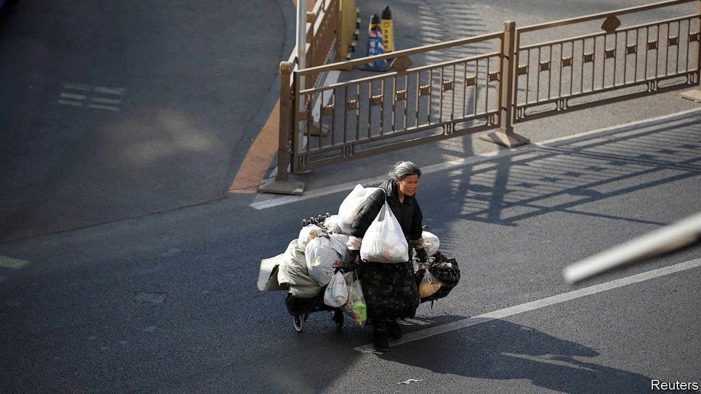

###### Victims, not vectors

# The pandemic has made life harder for China’s homeless 

##### When covid-19 spreads, they are often blamed 

 

> May 14th 2022 

SPARE A LITTLE pity for a Chinese beggar called Mr Jiang. Last month he was blamed for a small covid-19 outbreak in the city of Haining. The media labelled him “patient zero”. The authorities noted his “super-strength infectiousness”. Samples from the public toilets and empty shops where Mr Jiang slept came back positive for the virus. He tested positive, too. The authorities are prosecuting him for allegedly not co-operating with contact-tracers.

The pandemic has made life even harder for the millions of people who sleep on the streets of China’s cities. Most come from the countryside in search of work. Lacking a local hukou, or household-registration permit, they cannot obtain benefits. Officials see them as eyesores. Government shelters are obliged to “persuade” them to leave. Now they are seen as vectors of covid.


Anyone who catches covid in China faces social stigma, as a single infection can lead to a lockdown. But it is worse for the homeless. There is no evidence that Mr Jiang caused the outbreak in Haining, yet people called him the “poison king”. Researchers at Sun Yat-sen University, in Guangzhou, found that efforts to drive the homeless out of that city intensified during covid surges. People sleeping on the streets said the police would douse their resting spots with water. “Everyone was fearful of us because they thought we were spreading the virus,” said one.

The pandemic has affected the homeless in other ways, too. Many make their living looking through rubbish for recyclables to sell. But local governments, believing refuse spreads covid, have cracked down. Odd jobs, such as unloading trucks, become scarcer when covid controls are tightened. During surges there are also fewer people on the street who might spare some change.

Covid restrictions have decreased the help which is available. An NGO in locked-down Shanghai had to close its drop-in centre, which offered food, showers and legal advice. A charity in Beijing, which is battling an outbreak, had to stop giving out porridge.

There are no official data, but the pressure seems to have pushed some of the homeless out of cities. A worker at a rescue centre in Beijing says the number of people using its facilities has dropped sharply. City officials and covid-cautious Chinese will see no problem with that.

Dig deeper

All our stories relating to the pandemic can be found on our . You can also find trackers showing ,  and the virus’s spread across .

