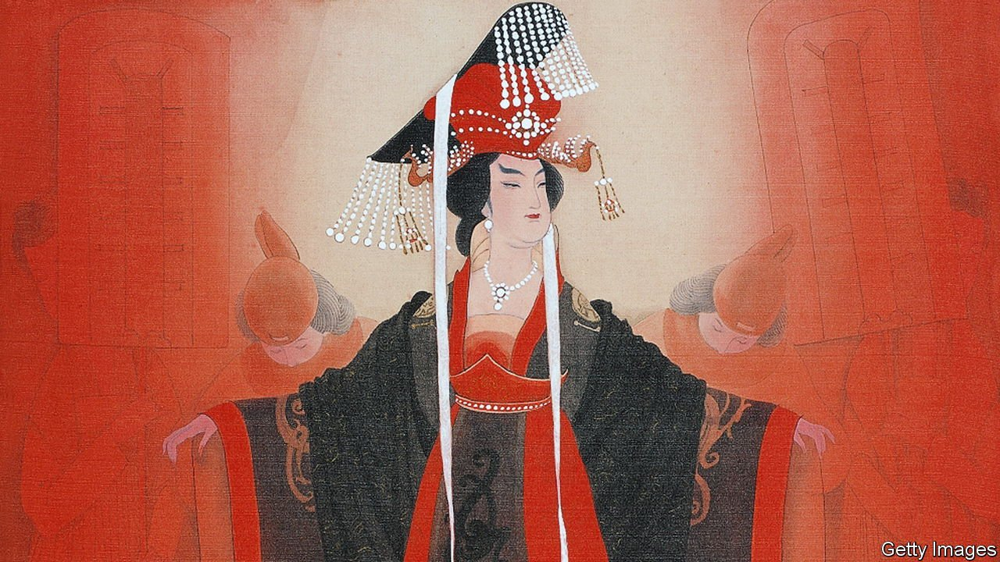

###### Imperial nostalgia

# Empires and emperors are things of the past—in theory 

##### In his new book, Dominic Lieven says understanding them remains important 

 

> May 14th 2022 

In the Shadow of the Gods. By Dominic Lieven. Viking; 528 pages; $40.Allen Lane; £35.

FROM THE decorative sovereigns of Europe to the more potent ones of the Gulf, monarchs still abound in the 21st century. But none of them is a real emperor. That is to say, there is no modern ruler who wields personal authority over a huge, diverse range of polities, thanks to a distinctive, mysterious swirl of dynastic and spiritual credentials.


That is the observation, delivered with a near-audible sigh of regret, of a historian who has devoted a professional lifetime to one empire in particular, that of Russia under the Romanovs, and to imperial regimes in general. Dominic Lieven brings to his latest work a striking, informed empathy for the dilemmas of mighty sovereigns, from Britain’s Queen-Empress Victoria to galloping lords of the steppes.

As his narrative whirls through the realms of Rome, India, the various Islamic caliphates (including the Ottoman one), the tsarist autocracy and colonial systems commanded from western Europe, he demonstrates an unmistakable soft spot not only for most of the empires of the past, but for their masters and mistresses too. Few readers will share that sentiment, but most will enjoy the journey.

Mr Lieven offers especially vivid portraits of some great empresses, from China’s Wu Zetian (who ruled from 690 to 705AD) to Russia’s Catherine the Great (1762-96), both of whom made shrewd use of their status as outsiders in male-dominated worlds. With verve, he describes the good-cop/bad-cop games played by imperial strategists: that mixture of light-touch suzerainty through local proxies, and occasional ruthlessness, which often let a handful of individuals hold sway over vast and scattered populations.

He presents empires as systems in which disparate cultures and technologies could co-exist creatively. He sees ethno-nationalism—the emergence of small and sharply defined states that slip the imperial bonds—as a destructive force. He is disarmingly frank about the personal history that colours this approach. His academic home is in Britain but he descends from Baltic-German nobles who served Russia; he grew up among Anglo-Irish folk in the twilight of British domination, and spends many months with his in-laws in Japan.

The title promises a focus on imperial claims to divinely ordained legitimacy, or to the plain divinity asserted by the rulers of ancient Rome and nearly modern Japan. And Mr Lieven does say a lot about the unifying and legitimising role played by religion in various empires, from Buddhism and Confucianism in China to Russian Orthodoxy. He writes well about the stark, compelling simplicity of Islam, which galvanised a previously unremarkable group of middle Arabians to overwhelm more sophisticated places.

But religion is only one of his themes. He is no less fascinated by the disproportionate role in history played by the fighting horsemen who, as he recounts, held sway over the north Eurasian grasslands for about 2,500 years—until well into the second Christian millennium. As Mr Lieven notes, the dynastic realms that once extended from modern China can be divided into those dominated by the Han Chinese (the Song and Ming), and the much larger territories governed by the Mongol, Qing and Tang dynasties, whose origins can be traced to “the nomadic warrior world of the Eurasian steppe”.

Both the Ottomans and (less obviously) the Russians, especially those of Moscow, could claim similar roots. Russians are taught at school that in 1480 their forebears threw off the yoke of their so-called Tatar-Mongol masters. This falsely conflates two peoples; it also understates the deep symbiotic link between the Slavic rulers of the Muscovy region and their overlords.

Having said that real empires are a thing of the past, Mr Lieven rather shyly makes the case that understanding them is still important. As he puts it, “most large countries in Asia remain more like empires than the European model of the ethno-national polity.” If the continent “catches the disease of European ethno-nationalism the planet might well not survive the resulting chaos.”

Modern India, he writes provocatively, is the product of the Mughal and British empires, which used divide-and-rule tactics, along with pomp and ceremony, to knit the subcontinent together. Having lost its anti-colonial legitimacy, Mr Lieven says, the Indian state is now succumbing to the plague of ethno-nationalism, and seems to be locked in an ever-more dangerous stand-off with Pakistan.

That analysis will be controversial in India. In any case, the argument for studying empires can be made more simply. Recall that since 2017 American strategy has avowedly been based on great-power competition, which means vying with Russia and China. Officially, neither is now an empire in the sense of being ruled by a sovereign. Vladimir Putin and Xi Jinping are depicted as emperors in cartoons, but both emerged from an ideology that in theory abhorred inherited privilege.

What matters most, though, is not what they are, but what they think they are. Regardless of their differences from the old imperial despots, both men see themselves as heirs, in important ways, to the monarchic realms of yesteryear. Mr Putin has drawn on tsarist history to make his case for subordinating Ukraine. He has encouraged his bureaucrats to study the work of Ivan Ilyin, who saw royal imperialism, not liberal democracy, as the way to hold Russia and its dominions together. For his part, Mr Xi has led an energetic effort to rehabilitate the Qing dynasty, which ruled from 1644 to 1912, and has persecuted historians who take a different line.

In a sense, Russia and China have followed similar paths: first a communist revolution, which led to a rejection of almost all the religious and ideological trappings of the regimes that went before; eventually, a gradual reclaiming of the imperial heritage. The era of crowned despots who personify the divine will may be over, but the age of self-conscious imperial calculus is not. ■

