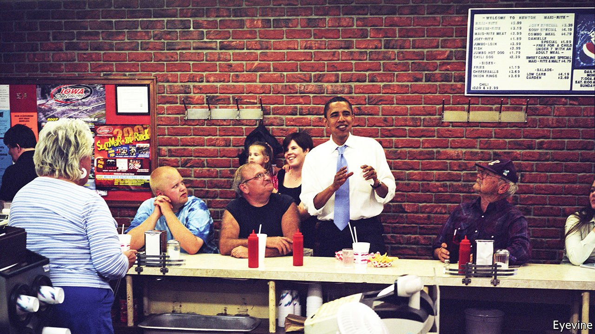

###### World in a dish

# Regional foods can contain multitudes of memories 

##### The Maid-Rite sandwich, popular in Iowa, is a prime example 

 

> May 14th 2022 

THE SANDWICH goes by several names, including “canteen”, “tavern” and, most descriptively, “loose meat”. First sold in Muscatine, Iowa, nearly a century ago, it is now popular across the state. Like a hamburger, a Maid-Rite—as the dish is known at Dan’s Sandwich Shop in Newton, Iowa—is made from ground beef. But instead of a patty flipped off a grill, diners get a scoop of loose, pebbly, well-done meat dug out of a cooking trough and dumped onto a bun, typically topped with mustard, ketchup and pickles.

Mike Brown, the restaurant’s proprietor since last year, proudly notes that he cuts the beef fresh every day, adding nothing, not even salt. (Before him Dan Holtcamp ran the place for half a century with his wife, Pam, and bequeathed it his name.) To non-Iowans, the sandwich can seem a perplexingly austere creation. It offers neither the compact, car-friendly convenience of a burger—the meat in a Maid-Rite, being loose, tends to spill out—nor the saucy comfort of a Sloppy Joe. But it says much about the charm and persistence of regional cuisine.


If a Maid-Rite were merely a disintegrating, suboptimal burger, Iowans would have long stopped eating them. They do not lack for choice; like most small American towns, Newton abounds in familiar burger-slinging franchises. Yet Mr Brown estimates that on most days, he cuts and cooks up to 150 pounds (68kg) of beef, enough for a few hundred sandwiches: not bad for a town of 15,000 people.

Asked why the Maid-Rite has not found a wider market, Mr Brown says “the right person” hasn’t come along to champion it. That may not be the whole story; the sandwich is probably too bland and beefy for an increasingly multicultural America. But as a general comment on regional foods that are handed down through generations of locals, his rationale stands.

They are as much the product of savvy marketing, an affable restaurateur or chance—“the right person” in the right place and time—as of recipes or terroir. Meat, bread and cheese are not unique to Philadelphia, but the cheesesteak is. Someone experimented, people liked it, and a regional food was born. Other, less serendipitous dishes perish with their creators, not always because they are inferior.

If they endure, regional foods become artefacts of habit and memory. When out-of-towners sit down at Dan’s lunch counter and eat a Maid-Rite, as Barack Obama once did (pictured), they indulge in something new and exotic. They may find it delicious or unremarkable, but unless they return to rural Iowa, they may not eat another.

But a local who eats a Maid-Rite is not just eating beef on bread. He is ordering what he ate with his father after Little League games, what his mother brought home from work when she was too tired to cook, or what he longed for in the army. She is eating what she ate with her friends after school or on prom night. Regional food does not have to be superior or even comprehensible to outsiders to help devotees, wherever they are, deepen their connections to the past, and to themselves. ■

