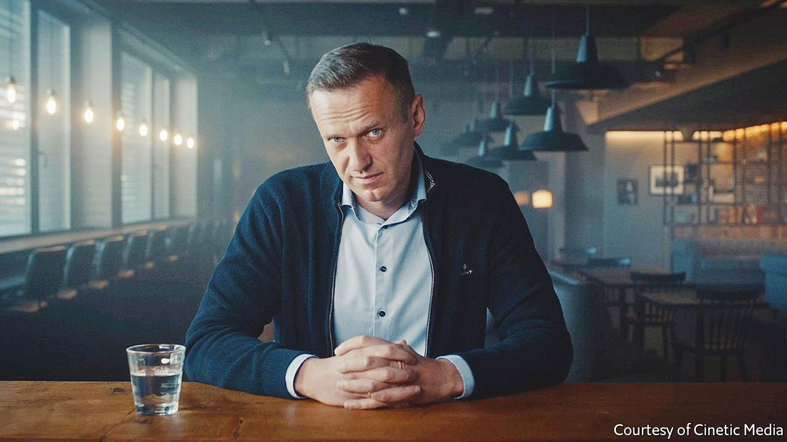

###### Back Story

# “Navalny”, “Tango with Putin” and the editor in the Kremlin 

##### Tyranny is the enemy of storytelling, as two profiles in courage demonstrate 

 

> May 14th 2022 

“LET’S MAKE a thriller,” Alexei Navalny tells Daniel Roher, and the Canadian film-maker tries to oblige. “Navalny” has many of the genre’s key elements—a hero, villains, skulduggery—but runs into an obstacle. “Tango with Putin”, a documentary by Vera Krichevskaya about Dozhd (also known as TV Rain), a gutsy Russian news channel, faces the same problem. It lies not in the directors’ craft, still less in the merits of their subjects, but something deeper: the throttling of narrative in a dictatorship.

His eyes are a reproach. Piercingly blue, they peer from the screen as Mr Navalny exhorts his compatriots not to give up. Mr Roher filmed the Russian opposition leader as he recovered from a poisoning in Siberia in 2020 (old footage shows Yulia, his indomitable wife, struggling to get into his hospital room, lest his assailants finish the job). Recuperating in Germany, the patient links up with Christo Grozev, whom he describes as a “very kind Bulgarian nerd”; the investigator uses data from the dark web to track down the failed assassins.


Mr Navalny is a social-media maestro—barred from campaigning in other ways, he has had to be—and some viewers may already know of the phone calls he made to the goons who allegedly tried to kill him. The sequence is still gripping. One falls for his impersonation of a Kremlin official and spills the details of the botched hit, including the smearing of Novichok in Mr Navalny’s underwear. “He’s a dead man,” the team pityingly conclude of the unwitting informant.

If “Navalny” elucidates the workings, and incompetence, of Vladimir Putin’s death squad, the source of its subject’s amazing courage remains something of a mystery. By contrast, “Tango with Putin” (also called “F@ck This Job”) shows how bravery can be nurtured by circumstance.

When Natalia Sindeeva launched Dozhd in 2010, she envisaged an upbeat lifestyle channel, not a crusading news outlet. By her own account, she previously had more interest in partying than in politics: the news imbued her with principles, rather than the other way round, beginning with a bombing at a Moscow airport in 2011. A four-way split screen—a repeated device in Ms Krichevskaya’s film—contrasts Dozhd’s coverage of the aftermath with the tranquillising pap being aired by state-controlled channels.

Another motif is Dozhd’s journalists calling in from the back of police vans. As the repression worsens, reporting becomes riskier, from the rigged Russian elections and protests of 2011-12, to the crisis in Ukraine and eruption of war in the Donbas region in 2013-14. The channel becomes a beacon of integrity less by design than by observing elementary journalistic principles. To be good, in this telling, is simply to obey your conscience. (Mr Navalny turns up in this film, too, giving advice on lighting for an interview.)

These documentaries chart different genealogies of heroism, seemingly innate in Mr Navalny’s case, accidental in Ms Sindeeva’s. Yet their outlines overlap. Both dramas are powered by exceptional, against-the-odds defiance of a crushing system. Ultimately, in both, that system bends and flattens the story arc.

Totalitarianism, noted George Orwell, forces storytellers to falsify facts and feelings. In a tyranny, he concluded, literature is doomed. In Mr Putin’s Russia, censorship is tightening anew. The squeeze is not just on the stories Russians can watch and read. It extends to the stories they can live—and thus, the tyrant hopes, even imagine.

In these films, the authoritarian ratchet is inexorable. Dozhd endures harrumphs from the Kremlin, then cyber-attacks, boycotts by cable providers, eviction from its studio, harassment and police raids. For his part, Mr Navalny is assaulted and imprisoned before being poisoned. “I’m not scared of anything,” he says when, in a classic act of Russian valour, he flies back from Germany to Moscow. “And I ask you not to be scared either.” This is the climax of “Navalny”.

Russia’s rulers have other ideas. Like most despots, they are philistines as well as brutes. But they understand the rudiments of narrative. They know a drama needs a denouement—in which the hero vanquishes the villain, or goes down in a blaze of glory—and see to it that there won’t be one. In the film, Mr Roher speculates that Mr Navalny may now be murdered; instead he is detained on arrival at the airport, then dispatched to a penal colony. Dozhd, meanwhile, is driven off the air. Their stories flatline in the bureaucratic vice of the police state. It is hard to make a thriller when someone else is writing the ending.

Read more from Back Story, our column on culture: (Apr 30th) (Apr 16th) (Apr 2nd)

