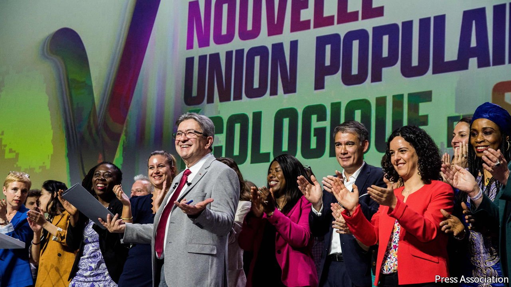

###### Mélenchon dreaming

# A new alliance boosts the left ahead of France’s parliamentary elections 

##### But its firebrand leader is unlikely to become prime minister 

 

> May 14th 2022 

IN A POLITICAL takeover that upends the past half-century’s political order, the radical French left has swallowed the centre-left. Jean-Luc Mélenchon, a 70-year-old firebrand with a gift for oratory and a fondness for Latin American autocrats, launched on May 7th an electoral alliance ahead of next month’s parliamentary elections. Snappily named the “New Popular, Environmental and Social Union”, or NUPES, its main purpose is captured in his election poster: “Mélenchon, prime minister”. To the dismay of old-time moderates, the Socialists and Greens (as well as the Communists) have officially signed up.

Mr Mélenchon has pulled off this coup thanks to his 22% of the vote, and third-place finish, in the first round of last month’s presidential election. The anti- NATO Eurosceptic, who is against arming Ukraine, vastly outperformed all other left-wing candidates, including those of the Greens (4.6%), Communists (2.3%) and the once-mainstream Socialists (just 1.8%). This has enabled Mr Mélenchon more or less to dictate terms. His party’s candidates will stand in 328 of France’s 577 constituencies; the Socialists in just 70.


The terms of the alliance include pledges to lower the pension age from 62 years to 60, impose rent controls and price controls on basic goods, put unionists on company boards and bring back the wealth tax. The pro-nuclear Communists have accepted its anti-nuclear stance. The centrepiece, though, is “disobedience” of the European Union’s rules on deficits, competition and farm support, among others. A former Socialist senator, Mr Mélenchon quit the party in 2008 partly due to his Euroscepticism. He once published a book about “the German poison”, in which he called Angela Merkel’s Germany “a monster”. To win over the pro-European Socialists, the joint agreement speaks of their promise to “derogate” from certain rules rather than to “disobey” them. But nobody is fooled as to whose version would ultimately prevail.

Mr Mélenchon’s deal has raised hopes in some quarters on the left that it could now take over the National Assembly at elections on June 12th and 19th. If so, this would not only block almost all of President Emmanuel Macron’s planned reforms for his second term but also undo those he has implemented. “Everything is becoming possible” ran the front page of Libération, a left-leaning newspaper. Thomas Piketty, a French economist, welcomed “the return of social and fiscal justice”, noting that this left-wing alliance is less ambitious than the one that came to power in 1936 (under Léon Blum) or 1981 (under François Mitterrand). On his blog on May 10th, Mr Mélenchon referred jauntily to Mr Macron’s (as yet unidentified) new prime minister as “my predecessor”.

The pact has stunned many on the centre-left, however. François Hollande, a Socialist former president, called it “unacceptable” and the new alliance unelectable. Ten years ago his party held the presidency, both houses of parliament, and a majority of regions and big cities. This agreement gives them just two constituencies in the whole of Paris, and—pointedly—not even Mr Hollande’s former constituency in Corrèze. Bernard Cazeneuve, Mr Hollande’s former prime minister, quit the party in sorrow.

Can Mr Mélenchon really grab the prime ministership? He certainly has momentum. Young voters are drawn to his strong green policies. He has become the second-most popular politician in France, according to one poll. Yet under the country’s two-round, first-past-the-post voting system, he will struggle if voters on the right swing behind Macron-backed candidates in second-round run-offs. A new poll suggests that Mr Mélenchon could secure 135-165 seats, which would make his alliance the second-biggest force in parliament. But it still projects 310-350 seats for Mr Macron’s coalition of centrist parties, a comfortable presidential majority. ■

