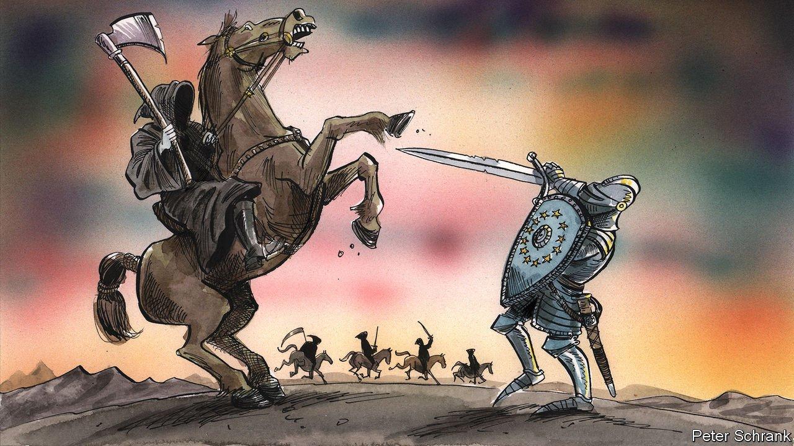

###### Charlemagne

# Europe’s handling of war on its doorstep breaks a decade-long streak of fumbled crises 

##### It is fifth time lucky for the EU 

 

> May 14th 2022 

IT TOOK FOUR horsemen to mete out God’s apocalyptic punishment. The biblical wrath conveyed by two of them will sound familiar to Europeans worn down by disease and now war in Ukraine. But a mere quartet of steeds would not have sufficed to deliver the calamities the EU has had to contend with in the past decade or so. No fewer than five crises have befallen the continent in that time: in addition to covid-19 and fighting on its doorstep, Europe has been visited by the protracted euro-zone slump, soon followed by a migration emergency and then Brexit. Any normal polity would be worn down by living in near-perpetual crisis mode for so long—not least since the episodes rarely showed the EU at its best. It is only the war in Ukraine that the bloc has handled remotely deftly. Is it possible that the EU has learned how to avoid turning problems into existential dramas?

Crisis holds a special place in the hearts of believers in the European project. Jean Monnet, one of the EU’s founding fathers and the nearest thing Brussels has to a patron saint, thought the continent’s political arrangements would be “forged in crises, and will be the sum of the solutions adopted for those crises”. Like most religious parables, this is not wholly true. The bloc’s most notable shunts towards ever-closer union, from the euro to the single market by way of open borders, were agreed on without the spectre of impending meltdown. But crises help to disrupt the status quo. The temporary chaos they bring about allows new ideas to emerge. Apply enough pressure—and in Europe that can mean the prospect of the entire edifice of the EU collapsing—and what was politically unthinkable yesterday becomes inevitable tomorrow.


Thus it was that the euro-zone crisis resulted in once- verboten sovereign bail-outs and a souped-up central bank. In 2015 a surge of migrants crossing the Mediterranean prompted the EU to recruit its own gun-toting officers to patrol its external borders. The economic rout brought by covid-19 saw the creation of a jointly guaranteed recovery fund of the sort even the protracted euro-zone mess had not made possible. In each instance the lurch to “more Europe” came after new circumstances made business-as-usual unpalatable. In the corridors of Brussels Eurocrats bemoaned the crisis of the day, all the while knowing it represented an opportunity to deepen integration. In what other circumstances than an all-night summit could leaders breach their own red lines and agree some federalising leap in the hope of being released to their hotel rooms?

If a trend can be spotted, it is of Europe dealing with crises rather better over time. Nobody these days boasts about how the euro was saved, ruing instead the many missed opportunities to avert a meltdown in the first place. The migrant surge in 2015 was no better: squabbles over how to treat refugees from war-torn countries showed Europe at its most divided and unkind. Brexit was, relatively speaking, a triumph of EU co-ordination. No doubt preserving a unified Brit-bashing front reduced the risk of other countries leaving—but at the expense of a still noxious relationship with an important neighbour. Europe’s covid-19 response is touted as a success in Brussels, yet many citizens will not forget the delays in the arrival of vaccines the EU was asked to buy for them.

For the current batch of EU leaders and bureaucrats who are handling Ukraine, in other words, the bar is low. On the whole they have done a creditable job. Wave upon wave of sanctions have hurt Russia enough for it to squeal. Weapons, some of them paid for with EU money, have found their way east, along with cash to keep the government in Kyiv going. Refugees were welcomed with open arms. Ukraine’s electricity grid was hurriedly plugged in to Europe’s to free it from Russia’s—a fiddly operation that would normally have taken a year but was pulled off in a fortnight. America has pitched in lots, too, as has Britain. But Europe has little to blush about thus far.

Why the improvement? The nature of the situation is part of it. War is the very thing the European project was designed to make impossible. Its resurgence nearby has helped to forge unity. Nor does armed conflict lend itself to kicking the can down the road, a habitual European sin. By all accounts the EU’s institutions have done a good job of paving the road for national capitals to approve sanctions. That every package has been a slog—a sixth one, focused on Russian oil, was being hammered out as The Economist went to press—shows that Brussels is pushing as hard as the EU’s various member-states are willing to go. Could Europe have done more? Certainly, but it could also have done less.

Apocalypse later

A striking feature of this crisis is the lack of a grand federalising scheme of the sort predicted by Monnet, which helped stem previous calamities. A plan to repeat the joint borrowing of the post-covid stimulus was floated by France’s President Emmanuel Macron in March, but has gone nowhere. His call on May 9th to revise the EU’s founding treaties, for example to get rid of national vetoes that have slowed down sanctions, has been greeted coolly. Mr Macron thinks the EU should strive for “strategic autonomy”, but if any institution gets a refresh as a result of this crisis it is likelier to be NATO, which Sweden and Finland are now set to join.

All that may change as the war unfolds. Grand, crisis-defying schemes are usually concocted by the EU’s dominant duo, Germany and France. Both have been on the back foot over Ukraine. Neither is trusted in eastern European capitals when it comes to dealing with Russia. Both Olaf Scholz in Berlin and Mr Macron in Paris have had plenty on their plates domestically. Maybe as they regain their European footing a bold new apocalypse-defying plan of the sort Monnet would have cheered will be on the cards. Some would see that as a sign of further progress in the crafting of the union. The real breakthrough, in fact, would be if the EU could handle crises without needing to rewire itself every time. ■

Read more from Charlemagne, our columnist on European politics: (May 7th) (Apr 30th)

 (Apr 23rd)

Read more of our recent coverage of the 

