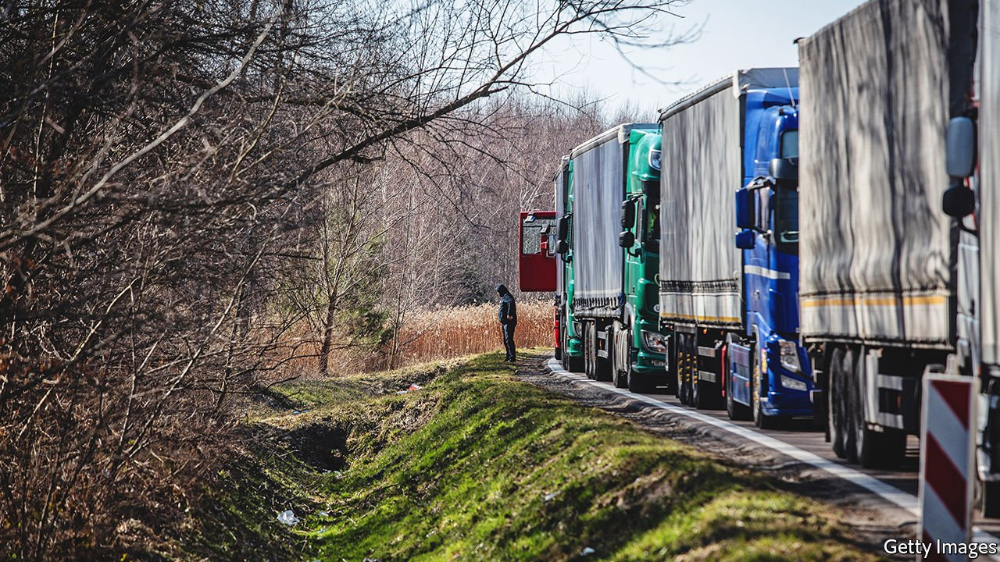
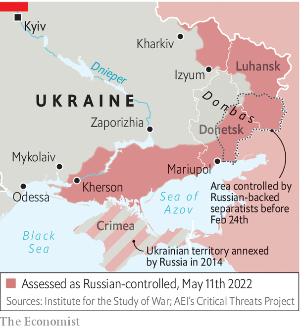

###### No ports amid the storm

# It will be hard for Ukraine’s economy to sustain a long war 

##### The suspension of all maritime exports is a critical blow 

 

> May 14th 2022 

FOR SOMEONE trying to run an economy in the middle of , Serhiy Marchenko is oddly upbeat. The Russians may have occupied or blockaded his country’s main ports and forced the shutdown of most of its businesses, but Ukraine’s finance minister radiates calm. “The situation is very difficult, I am not going to minimise that,” he says over a latte in a slick café near his ministry. “But we can manage it.” When an air-raid siren interrupts the interview, he simply ignores it.

Reasons not to panic are quite numerous. Ukraine went into the war in good shape, with its economy growing at an annualised quarter-on-quarter pace of almost 7%; strong prices for its exports of grain, iron and steel; a well-regulated banking industry and a government deficit of less than 3% of GDP last year. Its debt stood at just under 50% of GDP, a number that many finance ministers can only dream of. An impressively digitised tax and benefits system means that revenues are still coming in smoothly from the parts of the economy that are still functioning. Pensions and government salaries are all still being paid, even in areas that are now under Russian occupation, thanks to resilient digital systems and a surprisingly . Most businesses, for now, are still paying their employees, even if they cannot operate as normal, or at all. Amazingly, payroll taxes are down by only 1%, the minister says.


But it isn’t easy. The World Bank has predicted that Ukraine’s GDP will shrink by perhaps 45% in 2022. (“Our estimate is 44%,” Mr Marchenko grimaces.) And both estimates are, of course, hugely uncertain. Customs revenues, a significant part of the government’s tax take, have crashed to around a quarter of their pre-war level thanks to lower imports and the suspension of many duties. Military salaries are another big burden. It all adds up to a financing gap of around $5bn every month, he says. That is roughly 5% of Ukraine’s depleted GDP for every month that the war goes on.

How to fill that? In part, Mr Marchenko says, by having the central bank print more money. In part, too, by issuing war bonds, on which the government currently is paying around 11% interest, which is less than the inflation rate. But the main source will need to be foreign. And that, the finance minister says, is how he spends most of his day, lobbying  for help. America is where he has the highest hopes. On April 28th President Joe Biden said he was asking Congress to authorise a further $33bn in new funds for Ukraine, since a previous facility is almost exhausted. The House of Representatives has voted to raise the amount to $40bn. Most of the money will be for arms, but at least $8.5bn is for economic support. “It’s good news, but what will the American package look like, and when will it arrive? We don’t know,” says the minister.

 


The IMF has helped as well. It has encouraged America and other countries to take over part of Ukraine’s allocation of special drawing rights at the fund, in effect channelling hard currency to the government in Kyiv. But the end result of all these appeals is that, for the second quarter of this year, Ukraine has so far totted up grants totalling only about $4.5bn, against a fiscal shortfall of $15bn.

This is not sustainable, admits Mr Marchenko, who fears that if the war lasts more than another “three or four months”, painful measures will be needed, involving huge tax rises and swingeing spending cuts. The real fear is that what has become in recent years a fairly market-driven, freewheeling economy might see a wave of nationalisations, undoing years of hard-fought progress.

An even more immediate problem is already, literally, sprouting. Across the country, the sowing season for this year’s crop of wheat, barley, sunflowers (for oil) and other grains and staples has been completed. Astonishingly, roughly 80% of the usual crop has gone into the ground, sometimes planted by brave farmers wearing bulletproof vests. But what to do with it? Harvesting should be no great problem, since the frontlines have been pushed back and Russia looks unlikely to make further gains. The hard part is shipping the stuff out of the country.

The presence of the Russian navy in the Black Sea, as well as the defensive deployment of mines by Ukraine’s navy, means that Odessa, Ukraine’s principal port, is shut down completely. The same goes for its second and third ports, located nearby. Berdyansk and Mariupol, the fourth and fifth, are under Russian control. Nor can much grain be stored; the country’s grain silos are mostly full of the recently harvested winter crop, which would normally have been sent abroad by now.

Mustafa Nayyem, a former journalist and protester turned Ukraine’s deputy infrastructure minister, is in charge of solving the problem. If the grain cannot get out by sea, it will have to travel by road and rail, via Poland, Romania and Hungary. But problems abound, he says. The roads cannot handle that much heavy traffic; the alternative ports have limited spare capacity.

Worst of all, crossing Ukraine’s frontiers with the EU is arduous. Customs and phytosanitary checks are already causing 10km tailbacks at entry points. The club’s rules say that, since Ukraine is not a member, only a limited number of its lorries can enter. Bureaucracy is gumming up the works, and unless they are unblocked Ukraine, Europe and indeed the world will face severe food shortages after the harvest in September. “We need every country in Europe to allow free access to our trucks,” says the minister. “They don’t seem to understand the sheer amount of wheat that is about to hit them.” ■


