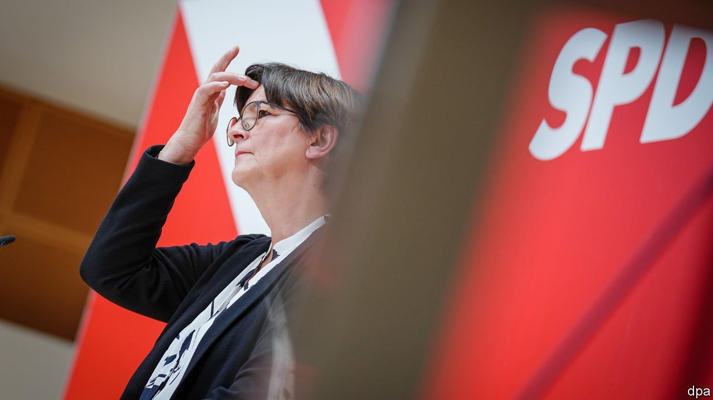
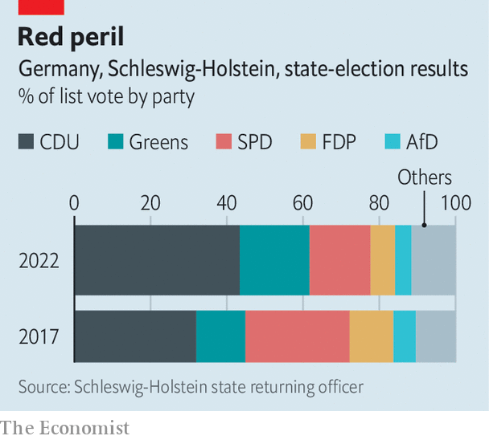

###### A portent or a blip?

# The Social Democrats suffer crushing defeat in Schleswig-Holstein 

##### Will it be repeated in crucial elections in North Rhine-Westphalia? 

 

> May 14th 2022 

“OF COURSE THE result is bitter,” said Saskia Esken, putting it mildly after the cataclysmic defeat of her Social Democratic Party (SPD) at a state election in Schleswig-Holstein on May 8th. Yet the co-chair of the party insisted that despite the worst score in its history in a place that was once a stronghold, the SPD can still win the vote that really counts, in North Rhine-Westphalia (NRW), Germany’s most populous state, on May 15th.

The centre-right Christian Democratic Union (CDU) of Daniel Günther, the incumbent state premier, won 43.4% of the vote in Schleswig-Holstein, up more than 11 percentage points on the previous election. The SPD got only 16%, down about the same amount. The Free Democrats, who are in coalition with the SPD at the national level, also had a poor night. But the worst reverse was suffered by the far-right AfD, which was kicked out of a state parliament for the first time in its history (which admittedly dates back only nine years), as it failed to meet the 5% threshold for gaining any seats. It was a happier day for the Green Party, also in the ruling national coalition, with 18.3%, a gain of 5.4 points.


The CDU had one great advantage: polls show that Mr Günther is the country’s most popular state premier. The 48-year-old is very different from Friedrich Merz, the spiky and conservative national leader of the CDU. Mr Günther is a centrist who was nicknamed Genosse (comrade) Günther because he once said he understood CDU politicians in eastern Germany who are co-operating with the far-left Linke party. He has governed his state in coalition with both the free-market FDP and the Greens. He did not back Mr Merz’s campaign to become national leader of the CDU in 2018 (when he failed) or 2021 (when he won). So a big success for Mr Günther does not necessarily indicate that Mr Merz is doing well.

 


Still, the impressive win in Schleswig-Holstein undoubtedly gives the CDU a dollop of precious momentum as it heads into the eagerly watched NRW vote at the weekend. With its 18m inhabitants (over a fifth of Germany’s total population), NRW is home to 37 of Germany’s top 100 companies. Its poll is sometimes called the “little federal election”; with a high proportion of immigrants and a mix of thriving and struggling districts, it is seen as a miniature Germany. Whoever can run NRW has a good shot at running the country.

North Rhine-Westphalia used to be the heartland of the SPD, which governed there continuously for 39 years, from 1966 until 2005. Since then it has been a swing state. In 2017 the CDU’s Armin Laschet beat the SPD’s Hannelore Kraft, the incumbent. But Mr Laschet stepped down as state premier last year after his resounding defeat in the general election, in which he was the CDU’s candidate for the chancellorship. He picked Hendrik Wüst, his transport minister, as his successor. A lawyer by training, Mr Wüst is closer to Mr Merz’s conservative camp than is Genosse Günther.

Mr Wüst is now neck-and-neck with Thomas Kutschaty, the largely unknown SPD candidate whose main claim to fame is that he is a former state justice minister. Mr Kutschaty is betting on support from Olaf Scholz, the chancellor, but that strategy might backfire. Mr Scholz’s popularity has slumped in recent weeks because of his hesitant response to Russia’s invasion of Ukraine. In a poll last month in Der Spiegel, a weekly, fully 65% of those surveyed said they thought Mr Scholz was not a strong leader.

If Mr Wüst can pull off a win for the CDU, he will probably remain in coalition with the FDP. But if that combination does not yield a majority, he will need to persuade the Greens, who are forecast to get around 18% of the vote, to join his government, too. They might prefer to join forces with the SPD, in which case Mr Wüst could lose his job even if the CDU gets more votes than any other party.

Mr Wüst’s political career is of course at stake on May 15th. But Mr Merz, who himself hails from NRW, badly needs a second win. The CDU lost a state election in Saarland at the end of March. The CDU’s leader recently visited Kyiv to meet Volodymyr Zelensky, Ukraine’s president, hoping to gain an advantage over Mr Scholz, who has yet to visit the Ukrainian capital. Mr Merz received non-stop coverage in the media during his visit, but also a lot of criticism. The trip, most pundits reckoned, was an obvious attempt to score points off Mr Scholz ahead of the two state elections rather than, as he claimed, a show of solidarity with Ukrainians. ■

