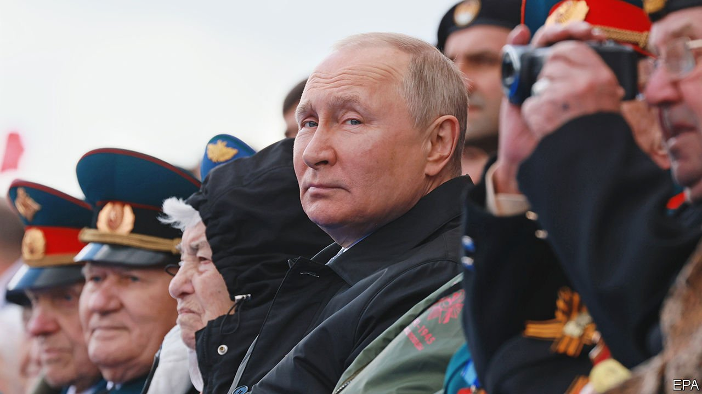
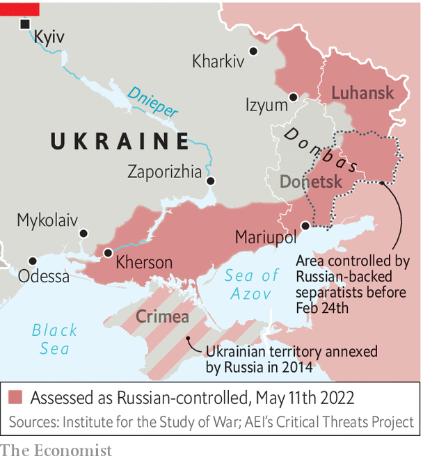

###### Putin’s parade

# What Russia’s Victory Day celebrations say about the war in Ukraine 

##### The absences and omissions were the most notable part of the festivities 

 

> May 14th 2022 

THE RULE of Vladimir Putin, a former KGB operative turned dictator, rests on lies, violence and militarism. And on May 9th, the day marking the Soviet Union’s victory in the second world war, all three of those traits were paraded on Moscow’s Red Square. Mr Putin has long hijacked the victory over Nazi Germany and built it into something resembling a religious cult to serve his regime. Now he is invoking it as he fights his war against Ukraine and anyone inside Russia who stands in his way. As Ben Wallace, the British defence secretary, said in a speech of his own on the same day, Mr Putin and his generals “are now mirroring the fascism and tyranny of 77 years ago…resplendent in their manicured parade uniforms, weighted down by the gold braid and glistening medals.”

Just as the Nazis justified their unprovoked attacks on Poland in 1939 and the Soviet Union in 1941 by claiming to be acting in pre-emptive self-defence, so did Mr Putin claim in his speech at the parade that Russia had launched a pre-emptive strike against Ukraine and NATO. “An absolutely unacceptable threat to us was steadily being created right on our borders…[the invasion] was forced, timely and the only correct decision.”


The parade was more notable for its absences and omissions than for its pageantry. The reduced number of troops marching in Red Square showed the lack of spare capacity. The usual airforce flypast was scrapped. Ostensibly that was because of low clouds, but some intelligence sources suggested it was really because of security concerns. A low-flying military plane being shot down by a Stinger missile over Red Square would not have made good publicity for the regime. Such concerns would not be outlandish. A series of mysterious fires and explosions have struck strategic sites across Russia in recent weeks. The latest occurred on May 1st at a military plant in Perm in the Urals, where propellant for Grad and Smerch missiles is made.

Also missing from the parade was Valery Gerasimov, the chief of the general staff. Russia’s top soldier was spotted on May 1st near Izyum, the site of the fiercest fighting in eastern Ukraine, and has not been seen since. Ukrainian intelligence sources believe he was wounded there. But perhaps the most notable absence from the Victory Day parade was the victory itself. After more than two months of fighting even Mariupol, a port city that has been pounded by every conventional weapon imaginable, is not entirely in Russia’s hands.

Having lost more men and equipment in two months than the Soviet Union lost in the ten years of its war in Afghanistan, Mr Putin, an ageing dictator, cut a defensive and frustrated figure, as though trying to make excuses for what may well rank as the biggest military blunder in Russia’s history. His final “For Russia! For Victory! Hurray!” seemed strangely downbeat.

But this does not mean Mr Putin will be stopping soon. As he laid flowers on a series of war memorials and firework displays lit the skies over Russian cities, the skies over cities across Ukraine were lit up by Russian missiles. Although Russia now controls the majority of the eastern Donbas region, its offensive to take the rest of it is proceeding slowly. A Ukrainian counter-offensive around Kharkiv has almost pushed Russian forces back over the border there, showing that Russia’s grip on its newly acquired territory is precarious.

 


Ukrainian forces, newly confident, are also hoping to liberate Kherson province, where the invaders are stealing grain and shipping it back to Russia. Russian forces are also trying to impose the ruble as the local currency. Yet Russia’s hold is so shaky that Russian collaborators are said to be asking the Kremlin to annex the territory without attempting a referendum of the sort that was used to justify the annexation of Crimea in 2014.

Dmytro Kuleba, Ukraine’s foreign minister, says that Ukraine’s vision of victory has now changed from pushing Russia back to its pre-war positions to liberating all of its territory, including areas seized in 2014. To do so will require a lot more manpower and equipment than Ukraine currently has. Mr Putin’s plan is to dig in, wear out Ukraine militarily and strangle it economically, by blockading its ports.

To sustain a long war, Mr Putin could yet declare martial law to justify a wider mobilisation. This would not only produce more soldiers to fight in Ukraine, but could also be a tool for even more repression. But how far Mr Putin goes and how long he can sustain his offensive depends not only on the strength of the Ukrainian army and the resolve of its allies, but on Mr Putin’s situation at home. As Oleksiy Danilov, Ukraine’s national security adviser, told The Economist, without instability in Russia, it will be hard for Ukraine to succeed.

Mr Putin has met fierce resistance in Ukraine; but he has so far been much more successful in his offensive against Russia, demoralising its elite, silencing any criticism and isolating the country from the world. A degree of resistance to the war has continued. In the run up to May 9th the Russian security services pre-emptively detained a number of anti-war activists. On the day itself, some 125 people were detained for carrying signs like “No to New War” or “My Grandfather Fought Against Fascism”. In another act of defiance, two editors of Lenta.ru, a pro-Kremlin news website, took over their own home page with the headlines “Vladimir Putin lied about Russia’s plans in Ukraine”, “The Russian army turned out to be an army of thieves and looters” and “Russia abandons the dead bodies of its troops in Ukraine.”

Yet the Russian elite has remained pliant, and much of the population is cowed. “The passive silence of the median Russian voter and the conformism of the elite is the main resource in this war,” says Kirill Rogov, a political analyst. The technocratic elite, once deemed liberal, is paralysed by fear of reprisals. As Petr Akopov, a Kremlin propagandist, wrote this week, “Offshore oligarchs and thieving officials, incompetent generals and cowardly Russophobes, ‘showbiz stars’—we now have to purge ourselves of all these. Without [purification] we cannot win. Not in Ukraine, but in that battle for Russia that has just begun.” ■

