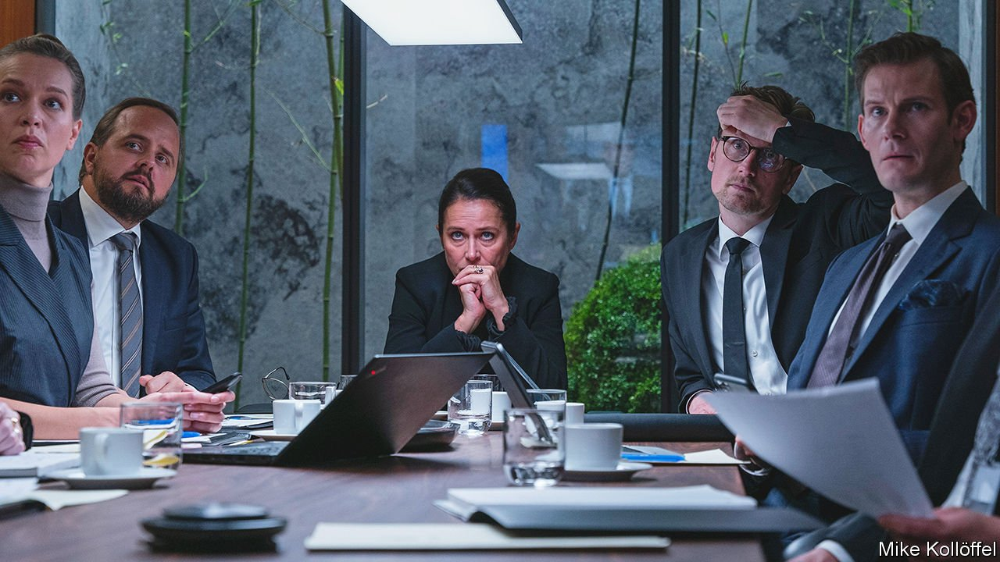

###### Coping in Copenhagen

# “Borgen” returns after a decade to a pessimistic Europe 

##### A new season of the beloved Danish political series has a darker tone 

 

> May 14th 2022 

THE DANISH TV series “Borgen” introduced Europe’s madly intricate coalition politics to viewers in simpler lands such as America and Britain. The show’s first three seasons, which aired in 2010-13, followed Birgitte Nyborg (played by Sidse Babett Knudsen), leader of the fictional Moderates, as she became Denmark’s first female prime minister, then resigned and founded a new party. Striking compromises and pursuing liberal values, Nyborg was a heroine for her time. American Democrats wishing for Danish-style health care (or at least hygge and cardamom buns) fell in love. Soon Denmark had a real female prime minister, Helle Thorning-Schmidt.

Nine years later “Borgen” is back, and its fourth season shows how Denmark and Europe have changed. Nyborg is now foreign minister in a government in which the leaders of the main parties are women (as in most Nordic countries). This has not rendered politics less vicious. She is exasperated by the radicalism of today’s youth, notably her own son. In a side plot, the white head of news at the national broadcaster and a non-white anchor, both women, get into a feud over political correctness.


The more pervasive change is in global politics. The season’s main plot imagines oil discovered off Greenland. This pits two of Nyborg’s principles against each other: indigenous self-determination and fighting climate change. Russia, China and America get involved to pursue their strategic interests. A bossy American secretary of state is a familiar stereotype of European film. But the Chinese ambassador who scolds a Nordic minister in aggressive “Wolf Warrior” style is new.

Like today’s Europe, the season has an overarching tone of pessimism. A decade ago it portrayed a messy but enviable Denmark, where responsible politics meant bickering and back-stabbing to achieve social goals. Now those goals seem out of view. The earlier seasons’ fantasies of Denmark and Europe’s global relevance are harder to sustain. In the Obama era, Nyborg was a role model for the frustrated centre-left because, in an impasse, she always asked, “What are my options?” Since then her options, like Europe’s, have narrowed.

