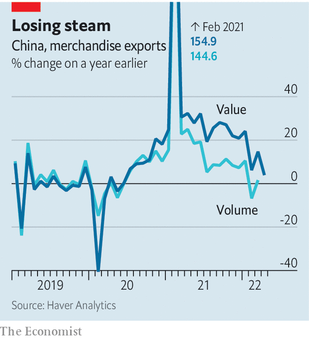

###### A slow train from China

# China’s extraordinary export boom comes to an end 

##### Covid-related supply bottlenecks meet slowing foreign demand 

 

> May 14th 2022 

LAST MONTH a yellow-striped freight train rumbled into Budapest carrying solar-power equipment, air-conditioning kit and other bits and pieces. It had travelled for 16 days, all the way from Shandong, a province in eastern China. As part of China’s Belt and Road Initiative, freight trains now serve more than 50 cities in Europe and Asia from Shandong. They are called “Qilu” trains, a nod to the ancient Qi and Lu kingdoms that flowered in that part of China in the Confucian era.

China’s exports, whether by rail, road, sea or air, have made rapid progress in the past two years. They rose by almost 30% in dollar terms in 2021. Over 5,000 Qilu trains have left the station since 2018. But in April, China’s export growth slowed to a desultory chug. In dollar terms, exports were only 3.9% higher than a year earlier.


Even that modest increase was something of a miracle. It came despite China’s increasingly surreal battle against covid-19, which has locked down Shanghai, one of the country’s biggest trade hubs, and imposed onerous restrictions on mobility elsewhere. According to Nomura, a bank, stringent limits remain in 41 cities, accounting for almost 30% of GDP. Towns have been so anxious to avoid outbreaks that officials have sealed lorry drivers into their cabs while they wait to pick up cargo at motorway checkpoints. These kinds of precautions have also gummed up international trade. In mid-April, 506 vessels were waiting outside Shanghai’s port, according to Windward, a shipping-analytics firm, compared with 260 in February.

 


Optimists had hoped that China’s export machine could weather occasional outbreaks of the Omicron variant. Workers, they pointed out, could isolate themselves on the job, living where they work in a so-called “closed loop”. But no modern factory is entirely self-contained; every “closed” loop must remain open to its suppliers. And if any loop in the supply chain succumbs to the virus, it can disrupt production in all of them. Tesla’s car production in Shanghai has, for example, been hampered by a shortage of wiring harnesses from a virus-hit supplier, according to Reuters, a news agency.

To increase trade by any amount in these conditions is impressive. But the headline 3.9% expansion reported by China’s customs agency on May 9th was more nominal than real. More detailed statistics, published later in the month, are likely to show that the price of China’s exports rose by perhaps 8% or more in April, compared with a year earlier, according to UBS, a bank. If so, the volume of China’s exports must have shrunk last month.

These price increases have raised fears that a locked-down China will exacerbate inflation in its trading partners, particularly America. The alarm is often exaggerated. Goods made (in whole or in part) in China made up less than 2% of American personal consumer spending in 2017, according to economists at the Federal Reserve Bank of San Francisco. China’s covid-related bottlenecks could have larger ripple effects, say by allowing rival manufacturers to raise their prices. Most American inflation, however, is made in America.

Indeed, China’s exports may be more a victim of America’s woes than a cause of them. America’s slowdown is contributing to weaker demand for China’s goods on top of self-inflicted disruptions to their supply. Surveys of purchasing managers have revealed falling export orders every month so far this year. And China’s official statistics showed declining exports last month of the computers and household appliances that were in such high demand when the West too was locking itself down.

Not everything is slowing, however. China’s imports from Russia have  since Vladimir Putin’s invasion of Ukraine, as sanctions have hindered Russia’s access to Western markets. The offerings included 50 carriage-loads of barley, carried to Shandong province on a Qilu train. ■

For more expert analysis of the biggest stories in economics, business and markets, , our weekly newsletter.

