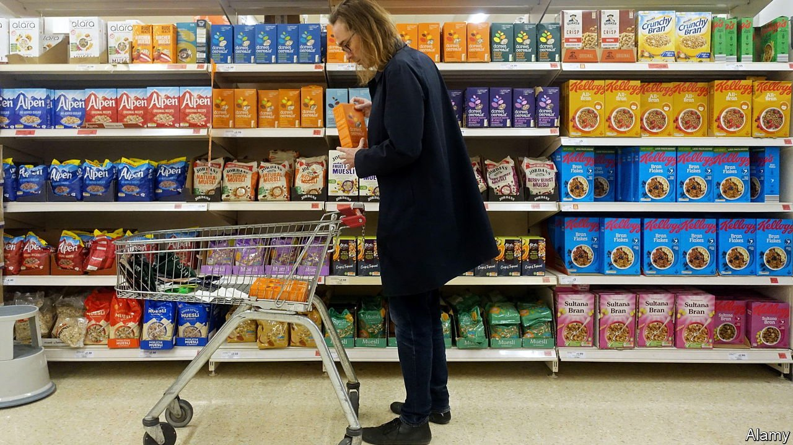
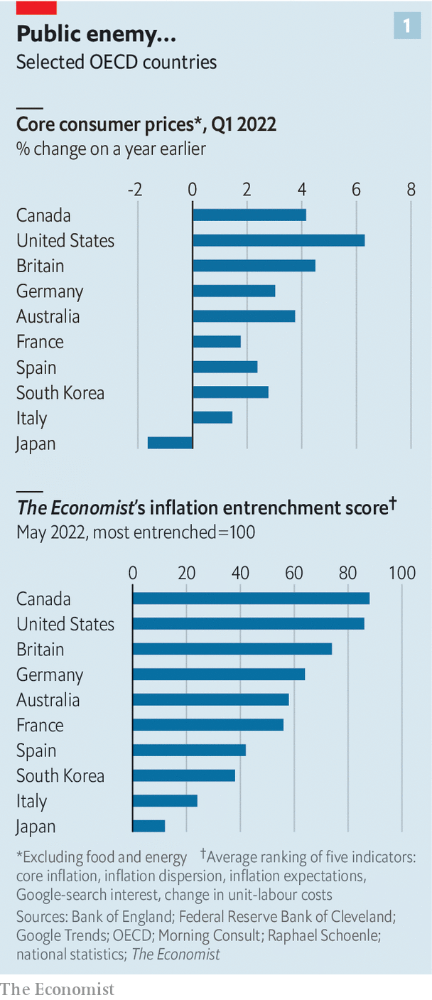
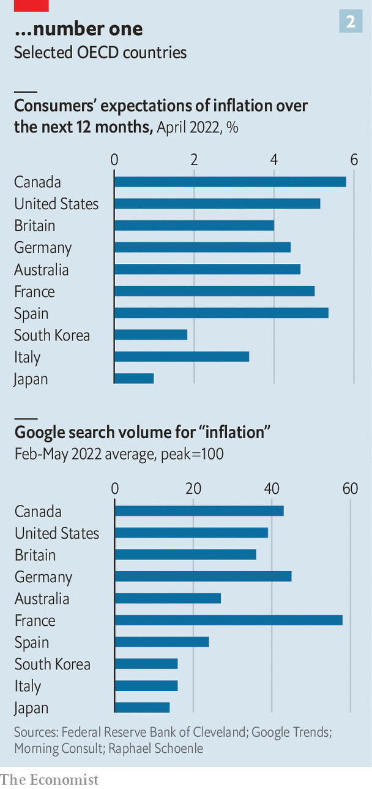

###### Baked in

# Even outside America, inflation is starting to look entrenched 

##### Five indicators suggest Anglophone countries are suffering the most 

 

> May 14th 2022 

INFLATION DOMINATES the American  to an extent not seen since the 1980s, when prices were last rising at the current pace. Much like complaining about the weather or last night’s basketball play-offs, moaning about  has become a conversation starter. According to figures published on May 11th, consumer prices rose by 8.3% in April, compared with the previous year. A day earlier, President Joe Biden called fighting inflation his “top domestic priority”. Newspapers are publishing four times as many stories mentioning inflation as they did a year ago; several polls suggest that Americans believe inflation is a bigger problem for their country than the war in Ukraine. But America is not alone. Inflation is also becoming baked into everyday life in other parts of the rich world.

The Economist has gathered data on five indicators across ten big economies—”core” inflation, which excludes food and energy prices; the dispersion in inflation rates for the sub-components of the consumer-price index; labour costs; inflation expectations; and Google searches for inflation. To gauge where inflation has become most pervasive, we rank each country according to how it fares on each measure, and then combine these ranks to form an “inflation entrenchment” score.


Continental Europe, so far at least, seems to have escaped the worst of the scourge. Inflation is leaving barely a trace on . But it is entwining itself around Anglophone economies. Canada is faring slightly worse even than America.  has a big problem on its hands (see chart).

 


A few factors explain the differences. Total fiscal stimulus across Anglophone countries in 2020-21 was about 40% more generous than in other rich places, according to our estimates. It was also more focused on handouts to households (such as stimulus cheques). That may have further stoked demand. Monetary policy in the euro area and Japan was already ultra-loose before the pandemic, limiting the amount of extra stimulus central banks could provide. Britain’s inflation may also reflect an idiosyncratic factor: Brexit. It turns out that breaking with your largest trading partner causes costs to rise.

The simplest component of our ranking is the rate of core inflation. This measure gives a better sense of underlying price pressure. Among our ten countries, America leads the pack (though core inflation is above average pretty much everywhere).

A second measure, of dispersion, helps capture how broadly based price pressures are. Headline inflation being driven by one or two items—say, the cost of a restaurant meal—is less worrisome than if the price of everything is going up quickly. We divide a country’s consumer-goods basket into as many as 16 components, then calculate the share where the inflation rate exceeds 2%. In Japan just a quarter cross that threshold. But in Australia more than two-thirds do. JPMorgan Chase, a bank, breaks down Britain’s consumer-price index into 85 components, and finds that inflation rates for 69% of them are running above their 1997-2019 averages.

Inflation could also spiral if workers demand higher wages to compensate them for rising prices (and firms raise their prices in turn). Unit labour costs, which measure the relationship between what workers are paid and the value of what they produce, are rising far faster than their long-run average in many countries. On May 5th America’s statisticians revealed that these rose by 7% in the first quarter, compared with a year ago, up from a pre-pandemic average of around 2%. Michael Saunders of the Bank of England has noted that with pay deals being struck at up to 5% a year, but productivity growth of only around 1%, Britain’s unit-labour-cost growth is probably “well above the pace consistent with the inflation target [of 2%]”.

 


Our last two measures assess households’ expectations. The higher these remain, the more likely it is that inflation becomes embedded. One proprietary data set, provided to The Economist by researchers at the Federal Reserve Bank of Cleveland, Morning Consult, a consultancy, and Raphael Schoenle of Brandeis University, is a rare reliable cross-country gauge of public inflation expectations. In May 2021 a respondent in the median rich country thought inflation over the next 12 months would be 2.3%. Now they expect a rate of 4.5%; Canadians, an even higher 6%. A measure of Google searches also suggests the subject is weighing on people’s minds. Britons now search more frequently for “inflation” than they do for Taylor Swift. ■

For more expert analysis of the biggest stories in economics, business and markets, , our weekly newsletter.

