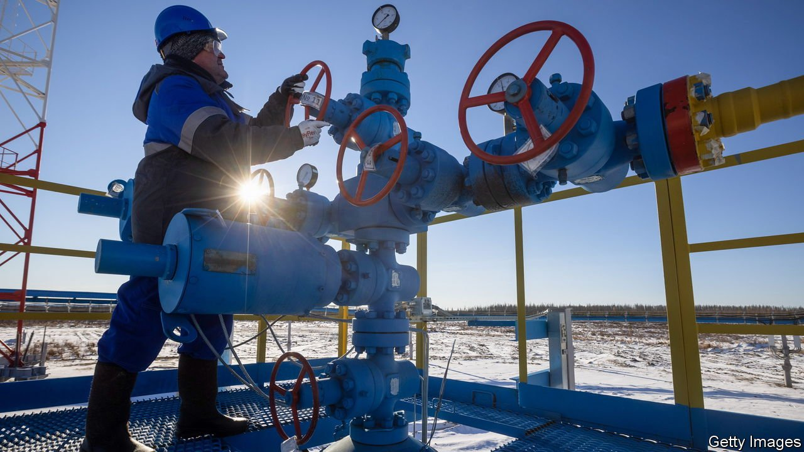
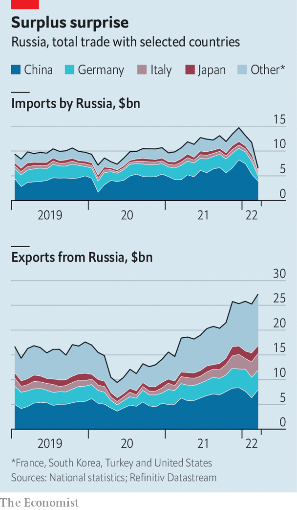

###### Bearing up

# Russia is on track for a record trade surplus 

##### Imports have collapsed, but exports are holding up 

 

> May 13th 2022 

WITHIN DAYS of Vladimir Putin’s invasion of Ukraine, Russia’s financial system seemed on the verge of collapse. The West imposed a range of financial sanctions, notably on the Russian central bank’s foreign-exchange reserves, that sent the rouble plunging and led citizens to withdraw cash frantically. Then the central bank raised interest rates, imposed capital controls and injected liquidity into the banking system, and some of these misfortunes reversed. Although a chunk of Russia’s currency reserves remains frozen, the country still generates about $1bn a day from its energy exports.

Russia has stopped publishing detailed monthly trade statistics. But figures from its trading partners can be used to work out what is going on. They suggest that, as imports slide and exports hold up, Russia is running a record trade surplus.

 


On May 9th China reported that its goods exports to Russia fell by over a quarter in April, compared with a year earlier, while its imports from Russia rose by more than 56%. Germany reported a 62% monthly drop in exports to Russia in March, and its imports fell by 3%. Adding up such flows across eight of Russia’s biggest trading partners, we estimate that Russian imports have fallen by about 44% since the invasion of Ukraine, while its exports have risen by roughly 8%.


Imports have collapsed partly because sanctions on the Russian central bank and the expulsion of some lenders from the SWIFT interbank messaging network have made it harder for consumers and firms to buy Western goods. Elina Ribakova of the Institute of International Finance (IIF), a bankers’ group, says that regulatory uncertainty was also a big factor at first, as Western firms were unsure which Russian banks came under sanctions. Logistical disruptions, including decisions by Western firms to suspend deliveries to Russia, mattered, too. The early depreciation of the rouble also dampened Russian demand for imports, says Claus Vistesen of Pantheon Macroeconomics, a consultancy.

Russia’s exports, meanwhile, have held up surprisingly well, including those directed to the West. Sanctions permit the sale of oil and gas to most of the world to continue uninterrupted. And a spike in energy prices has boosted revenues further.

As a result, analysts expect Russia’s trade surplus to hit record highs in the coming months. The IIF reckons that in 2022 the current-account surplus, which includes trade and some financial flows, could come in at $250bn (15% of last year’s GDP), more than double the $120bn recorded in 2021. That sanctions have boosted Russia’s trade surplus, and thus helped finance the war, is disappointing, says Mr Vistesen. Ms Ribakova reckons that the efficacy of financial sanctions may have reached its limits. A decision to tighten trade sanctions must come next.

But such measures could take time to take effect. Even if the EU enacts its proposal to ban Russian oil, the embargo would be phased in so slowly that the bloc’s oil imports from Russia would fall by just 19% this year, says Liam Peach of Capital Economics, a consultancy. The full impact of these sanctions would be felt only at the start of 2023—by which point Mr Putin will have amassed billions to fund his war. ■

For more expert analysis of the biggest stories in economics, business and markets, , our weekly newsletter.

